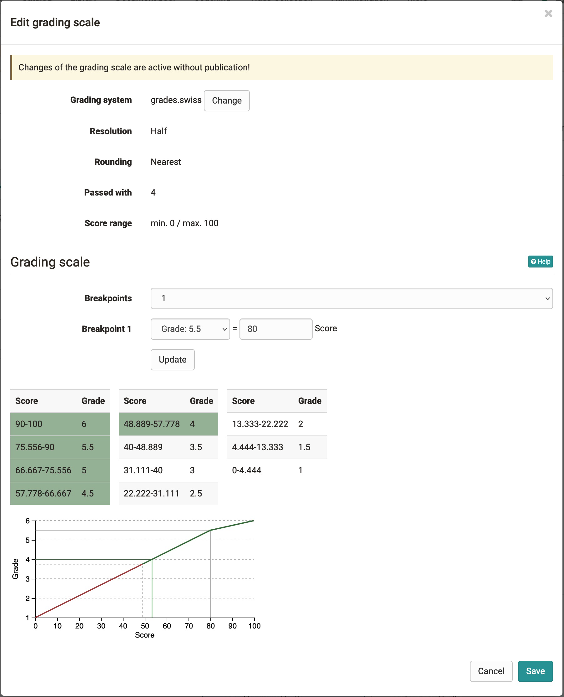

# Translate points into rating or grades {: #rating_grades}

:octicons-tag-24: Release 16.2

If an assessment course element such as a test, an assignment, etc. is assigned points, the points can also be translated into grades.

Course owners can activate the function in the course editor and configure it there. 

## Configuring a course element for rating

!!! Prerequisites

    Module Levels/Grading activated on your system.
    One or more staffs have been created. 

1. **Switch on Levels/Grading** 
Go to the course editor and select the course element for which you want to activate the grading. In the "Assessment" tab you can set up the details 
(for tests, in the "Test Configuration" tab). Make sure that "Assign points" is also activated and activate "Assessment with grading/marks".

2. **Select Assignment** 
You can choose between manual and automatic assignment. With manual assignment, the coach must manually trigger the assignment and make it visible to the user.

3. **Choose and edit grading scale** 
Define the minimum and maximum points (save) and click on "Edit rating scale". A settings window opens. Here you can select a rating system and further customize rating scale.

    {class=shadow}

4. **Save**

[To the top of the page ^](#rating_grades)

---

## Reading the grade scale boundaries {: #grade_boundaries}

In the grading scale, each grade or level is assigned a point range with a "from" and a "to" value. The "Score" column shows this range, the "Rating" column shows the corresponding grade.

With automatically calculated scales, the "to" value of one level can be identical to the "from" value of the next higher level. The same score value then appears in two consecutive rows. In this case the following applies:

!!! info "How to read the boundary value"

    The boundary value always belongs to the higher level. The "from" value of a level is therefore inclusive, the "to" value exclusive (the "to" value already counts towards the next higher level).

**Example** (Swiss grading system, achievable score 0 to 5):

| Score | Rating |
| ----- | ------ |
| 3.25 to 3.75 | 4.5 |
| 3.75 to 4.25 | 5 |

A result of exactly 3.75 points gives the grade 5 and not the grade 4.5, because the boundary value counts towards the higher level. A result of 3.74 points, on the other hand, gives the grade 4.5.

[To the top of the page ^](#rating_grades)

---

## Points and grading in the grading tool
The grading scale is also reflected in the assessment tool.

* **Tab Overview of a course element**:  
Ratings have been added to the key figures for grading. You can see the normal distribution and important settings.

* **Tab Participants of a course element:** 
In the evaluation tool, the rating are now shown in a separate column behind the score. If set to manual, you can also take over rating manually here.

To adjust the grading scale later or to assign new rating, click on the button "Adjust Rating Scale". 

[To the top of the page ^](#rating_grades)