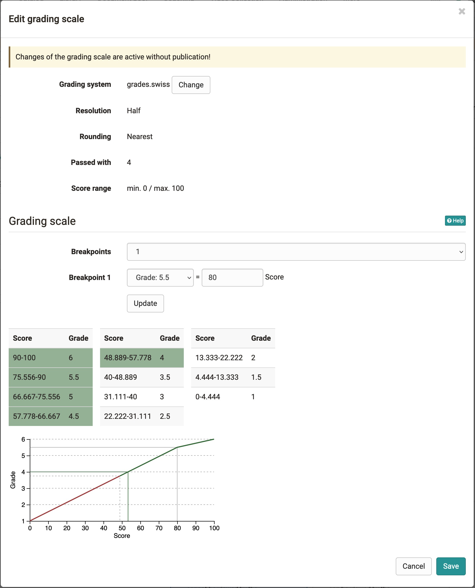

# Levels/Grading {: #rating_grades}

:octicons-tag-16:{ title="from Release 16.2" }

If an assessment course element, such as a test, a task, etc., is assigned points, the points can also be translated into grades. 

Course owners can activate the function in the course editor and configure it there. 

## Configuring a course element for levels and grades

!!! info "Prerequisite"

    The Levels/Grading module has been activated by the OpenOlat administrators, and at least one rating system has been created.

1. **Activate Levels/Grading for a course element**  
Go to the course editor and select the course element for which the levels should be activated. In the "Assessment" tab you can set up the details 
(for tests, in the "Test configuration" tab). Make sure that "Assign points" is also activated, and activate "Levels/Grading".
2. **Select assignment** 
You can choose between manual and automatic assignment. With manual assignment, the coach must trigger the assignment manually and make it visible to the participants. 

3. **Select and customize the rating scale** 
Define the minimum and maximum points (save) and click "Edit rating scale". A settings window opens. Here you can select a rating system and further customize the rating scale.

    {class="shadow"}

4. **Save**

[To the top of the page ^](#rating_grades)

---

## Reading the grade scale boundaries {: #grade_boundaries}

In the grading scale, each grade or level is assigned a point range with a "from" value and a "to" value. The "Score" column shows this range, the "Grade" column shows the corresponding grade.

With automatically calculated scales, the "to" value of a level can be identical to the "from" value of the next higher level. The same score value then appears in two consecutive rows. In this case the following applies:

!!! info "How to read the boundary value"

    The boundary value always belongs to the higher level. The "from" value of a level is therefore included, the "to" value excluded (the "to" value already counts towards the next higher level).

**Example** (Swiss grading system, achievable score 0 to 5):

| Score | Grade |
| ----- | ----- |
| 3.25 to 3.75 | 4.5 |
| 3.75 to 4.25 | 5 |

A result of exactly 3.75 points results in the grade 5 and not the grade 4.5, because the boundary value counts towards the higher level. A result of 3.74 points, on the other hand, results in the grade 4.5.

[To the top of the page ^](#rating_grades)

---

## Grades in the assessment tool

The levels and grade scale is also reflected in the assessment tool. 

* **Tab "Overview" of a course element**:  
The key figures for the assessment have been extended with grades. You see the normal distribution and important settings.

* **Tab "Participants" of a course element:** 
In the assessment tool, the grades are shown in a separate column after the score. (If the column is displayed -> gear button.) If set to manual, you can also apply grades manually here.

To adjust the grading scale afterwards or to assign new grades, click the "Customize rating scale" button at the top. 

[To the top of the page ^](#rating_grades)
