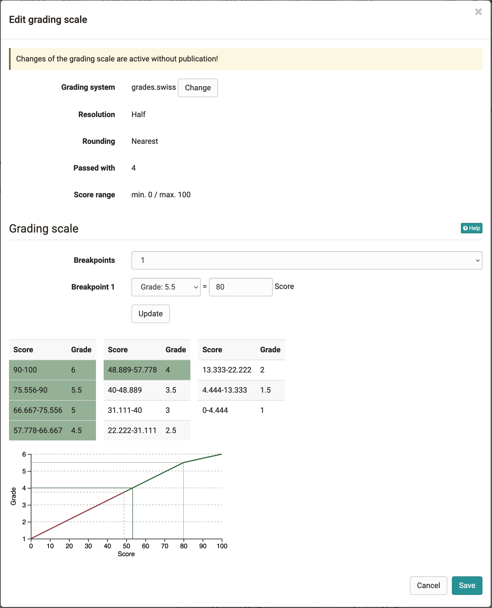

# Levels/Grading {: #rating_grades}

[:octicons-tag-16:{ title="from Release 16.2 (OO-6009)" }](https://track.frentix.com/issue/OO-6009)

If an assessable course element such as a test or a task awards points, OpenOlat can also convert these points into grades.

Levels/Grading complements the assessment: without levels/grading, the assessment of a course element consists of points and, if applicable, "Passed". With levels/grading, the grade is added, and the rating system determines whether the score counts as passed. The difference between assessment, correction and levels/grading is explained under [Assessment, correction and levels/grading](../area_modules/Coaching_Assessment_Orders.md#assessment_terms).

Course owners can activate the function in the course editor and configure it there.

## Configuring a course element for levels and grades

!!! tip "Prerequisite"

    The Levels/Grading module has been activated by the OpenOlat administrators, and at least one rating system has been created.

1. **Activate Levels/Grading for a course element** 
Go to the course editor and select the course element for which the levels should be activated. In the "Assessment" tab you can set up the details
(for tests, in the "Test configuration" tab). Make sure that "Score granted" is also activated, and activate "Levels/Grading".
2. **Select assignment** 
You can choose between manual and automatic assignment. With the assignment "Manually by coach", the coach triggers the assignment and makes it visible to the participants. The open cases are collected by the coaching under [Assessment orders](../area_modules/Coaching_Assessment_Orders.md#tab_open_classifications_scores) in the tab "Open levels/gradings". Coaches without ownership assign there as long as the option "assign Levels/Grading" is switched on. The option is switched on by default. In learning path courses, course owners switch it off or on under `Course > Administration > Settings > Tab "Assessment"` in the [section Assessment rights](Course_Settings_Assessment.md#section_assessment_rights); conventional courses do not have this section. With the assignment "Automatically on score change" OpenOlat assigns the grade itself.

3. **Select and customize the rating scale** 
Define the minimum and maximum points (save) and click "Edit rating scale". A settings window opens. Here you can select a rating system and further customize the rating scale. Changes of the rating scale take effect immediately, even without publishing the course.

    { class="shadow lightbox" title="Dialog Edit rating scale" }

4. **Save**

[To the top of the page ^](#rating_grades)

---

## Reading the rating scale boundaries {: #grade_boundaries}

In the rating scale, each grade or level is assigned a point range with a "from" value and a "to" value. The "Score" column shows this range, the "Grade" column shows the corresponding grade.

With automatically calculated scales, the "to" value of a level can be identical to the "from" value of the next higher level. The same score value then appears in two consecutive rows. In this case the following applies:

!!! info "How to read the boundary value"

    The boundary value always belongs to the higher level. The "from" value of a level is therefore included, the "to" value excluded (the "to" value already counts towards the next higher level).

**Example** (rating system grades.swiss, achievable score 0 to 5):

| Score | Grade |
| ----- | ----- |
| 3.25 to 3.75 | 4.5 |
| 3.75 to 4.25 | 5 |

A result of exactly 3.75 points results in the grade 5 and not the grade 4.5, because the boundary value counts towards the higher level. A result of 3.74 points, on the other hand, results in the grade 4.5.

[To the top of the page ^](#rating_grades)

---

## Grades in the assessment tool [:octicons-tag-16:{ title="from Release 16.2 (OO-6008)" }](https://track.frentix.com/issue/OO-6008)

The rating scale is also reflected in the assessment tool.

* **Tab "Overview" of a course element**: 
The key figures of the assessment also contain the grades, plus the normal distribution and important settings.

* **Tab "Participants" of a course element**: 
The grades are shown in a separate column after the score. If required, show the column using the gear icon. If the assignment is set to "Manually by coach", you assign the grades here.

To adjust the rating scale afterwards or to assign new grades, click the button "Adjust rating scale" at the top.

[To the top of the page ^](#rating_grades)

---

## Further information {: #further_information}

**Mentioned on this page** 
[Coaching - Assessment orders >](../area_modules/Coaching_Assessment_Orders.md) 
[Course Settings - Tab Assessment >](Course_Settings_Assessment.md)

**Further reading** 
[Assessment tool - overview >](Assessment_tool_overview.md) 
[The assessment form >](The_assessment_form.md) 
[Tests at course level >](Tests_at_course_level.md)

[To the top of the page ^](#rating_grades)
