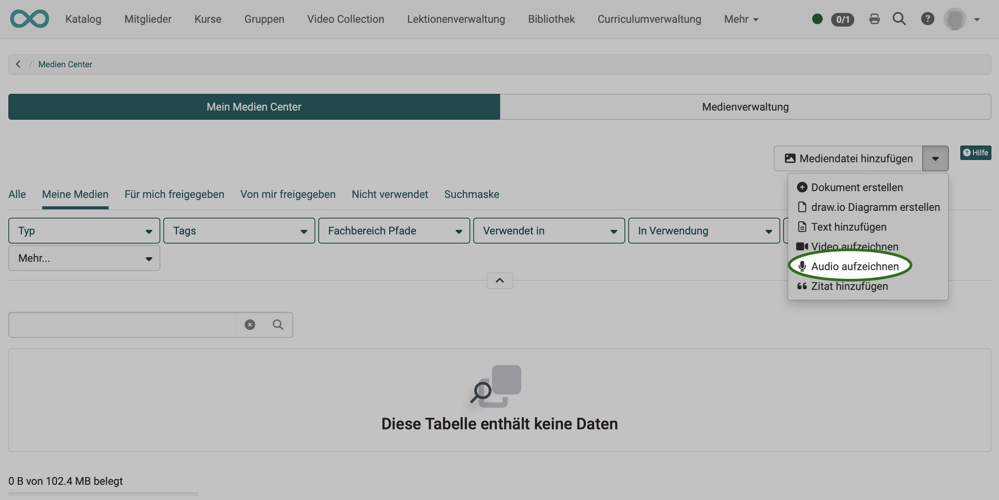
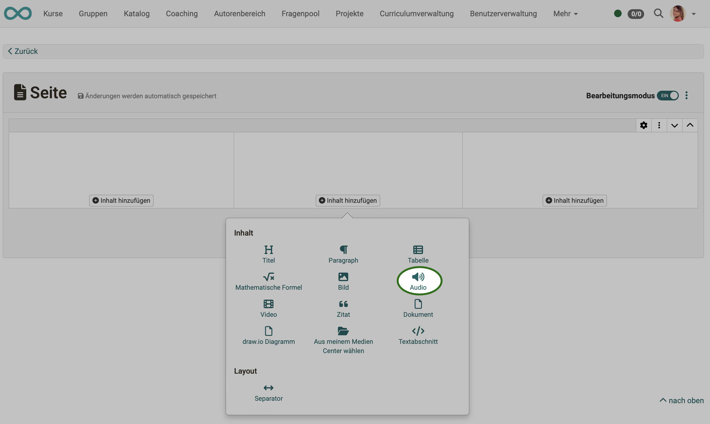
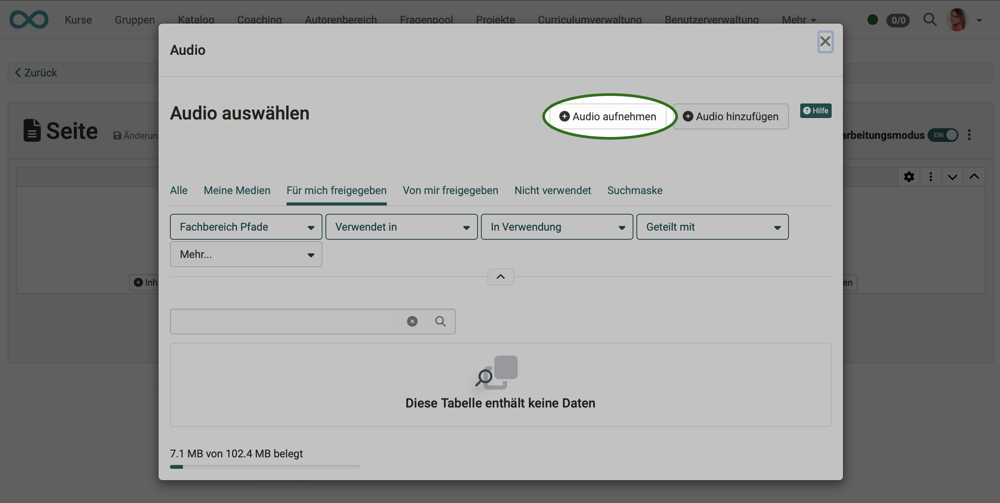
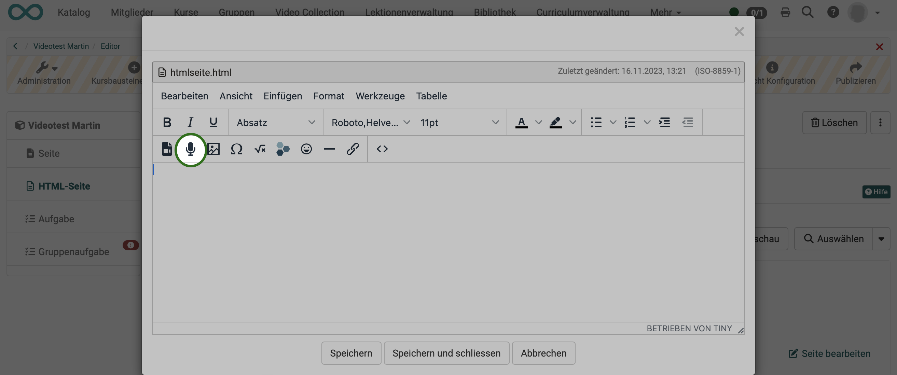
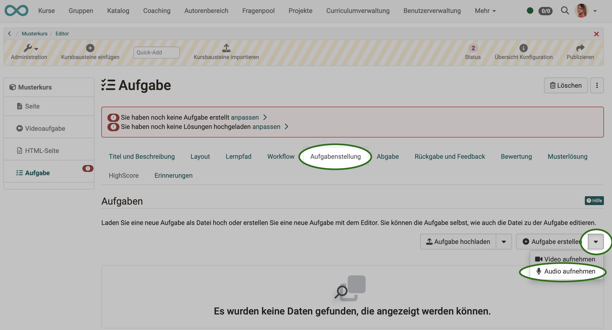
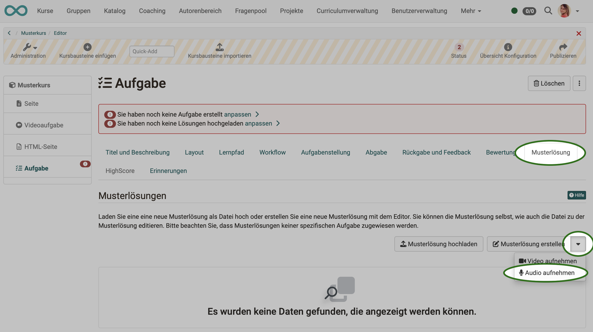
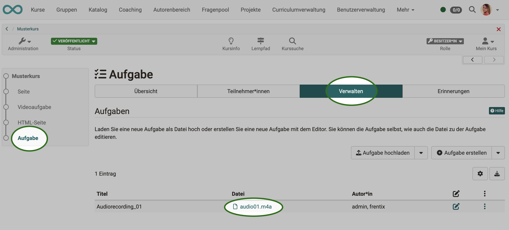
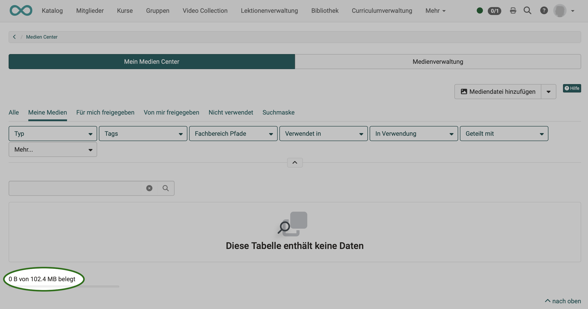
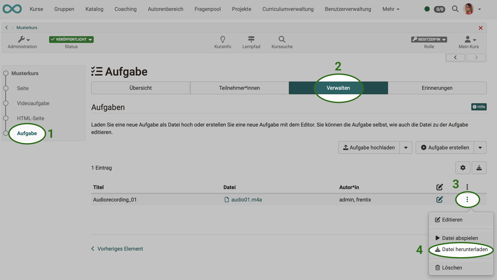
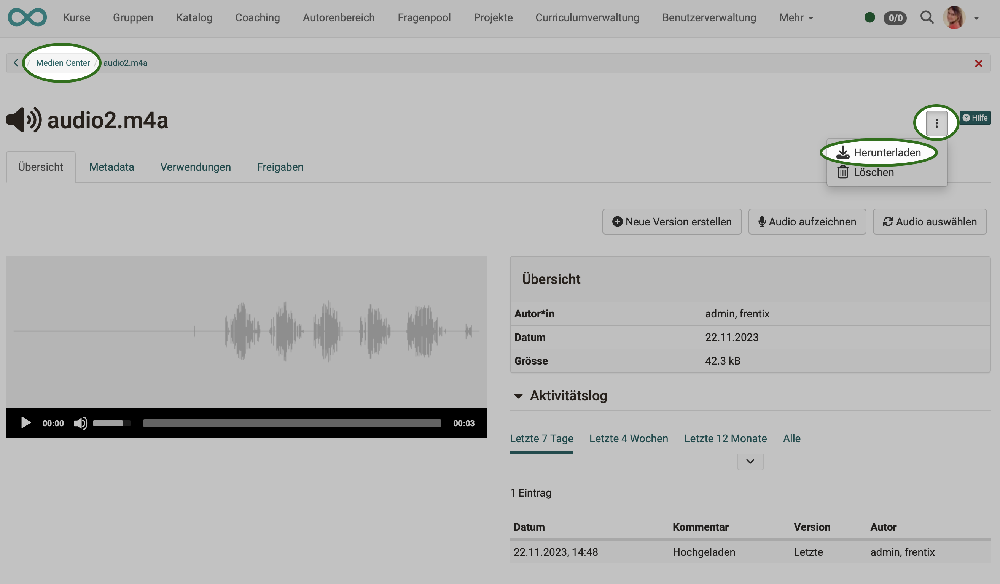

# Audio aufnehmen

## Voraussetzungen

* Wenn in OpenOlat Audios aufgenommen werden sollen, muss zunächst ein Mikrofon verfügbar sein. Es muss grundsätzlich im Device aktiviert worden sein.

* Damit das Mikrofon auch in OpenOlat für Aufnahmen genutzt werden kann, muss es für OpenOlat frei gegeben sein. 

* Auf der Gegenseite muss in OpenOlat die **Möglichkeit zu Audioaufnahmen** durch den/die Administrator:in aktiviert worden sein: 
**Administration > Module > Audio-/Videoaufnahmen**

## Wo können in OpenOlat Audios aufgenommen werden?

### Aufnahme im Medien Center
 
Öffnen Sie das **persönliche Menü** durch Klick auf das kleine Bild oder Dreieck rechts oben.
Öffnen Sie darin dann das Medien Center.

Unter den Möglichkeiten zum Hinzufügen neuer Mediendateien befindet sich auch **"Audio aufzeichnen"**.

{ class=" shadow lightbox" }

### Aufnahme im Kursbaustein Seite

Im Kursbaustein Seite kann innerhalb eines Layout-Elements auch ein Audio eingefügt werden. 

{ class=" shadow lightbox" }

Hat man sich dafür entschieden, erscheint ein Popup zur Auswahl eines vorhandenen Audios. Im Popup befindet sich zusätzlich ein Button zur Aufnahme eines eigenen Audios.

{ class=" shadow lightbox" }

### Aufnahme im Kursbaustein HTML-Seite

Der in OpenOlat verwendete HTML-Editor (Tiny) wird auch für das Einfügen und Aufzeichnen von Audios verwendet. Die Option zum Aufzeichnen eines Audios befindet sich unter den Werkzeugen, die auch zum Einfügen bereits vorhandener Medien verwendet werden.  

{ class=" shadow lightbox" }

!!! Note "Hinweis"

    Im HTML-Editor sind Audioaufnahmen zwar prinzipiell möglich, an manchen Stellen werden bei Aufruf des Editors aber aus verschiedenen Gründen nicht alle Bearbeitungsmöglichkeiten angeboten. Es kann also sein, dass beim Aufruf des HTML-Editors die Option zum Aufzeichnen eines Audios angeboten wird, bei einem Aufruf von anderer Stelle aus nicht. 

### Aufnahme im Kursbaustein Aufgabe

Die Möglichkeit zu Videoaufnahmen in einer Aufgabe ist in den Workflow eingebettet. Sie finden die Recording-Funktion im Arbeitsschritt, wo das Video als Aufgabenstellung oder Musterlösung eingefügt werden soll.

{ class=" shadow lightbox" }

{ class=" shadow lightbox" }

Für Videoaufnahmen, die im Kursbaustein "Aufgabe" aufgezeichnet werden, besteht aktuell keine Möglichkeit zur Speicherung und Verlinkung im Medien Center.

### Aufnahme im Kursbaustein Gruppenaufgabe

Die Audioaufnahme im Kursbaustein "Gruppenaufgabe" funktioniert wie im Kursbaustein "Aufgabe".

## Wo werden die Audioaufnahmen gespeichert?

**Innerhalb eines Kursbausteins aufgenommene Audios** werden auch bei diesem Kursbaustein gespeichert. 
Die Aufnahmen sind nicht im Autorenbereich, Ablageordner oder im Medien Center aufgeführt (Ausnahme: Kursbaustein Seite).

{ class=" shadow lightbox" }

Wird dagegen die **Audioaufnahme im Medien Center** gestartet, wird das Audio auch im Medien Center gespeichert.

## In welchem Format und welcher Qualität werden Aufnahmen gespeichert?

In OpenOlat gemachte Audioaufnahmen werden immer als **m4a-Dateien** gespeichert. Dies ist dadurch begründet, dass nur das m4a-Format von allen Browsern unterstützt wird.

Die Aufnahmequalität ist vorgegeben (mono, 44 kHz).

Administrator:innen können eine lokale Audio-Konvertierung aktivieren unter 
**Administration > Module > Audio/Video-Aufnahmen > Tab Aufnahmekonfiguration** 
(Siehe auch den [Artikel im Administrations-Handbuch.](https://docs.openolat.org/de/manual_admin/administration/Modules_Audio_Video_Recording/#enable-audio-recording))

## Wieviel Speicherplatz steht für meine Audios zur Verfügung?

Bsp.: Medien Center 
In der linken unteren Ecke sehen Sie den verfügbaren Speicherplatz (für das gesamte Medien Center) und wieviel davon bereits belegt ist. Der verfügbare Platz kann von den Administrator:innen bestimmt werden.

{ class=" shadow lightbox" }

## Wie lassen sich Audiaufnahmen exportieren?

### Download aus dem Kursbaustein Aufgabe und Gruppenaufgabe

Sowohl Audioaufnahmen aus Aufgabenstellung als auch Audioaufnahmen in der Musterlösung können direkt im Kursbaustein heruntergeladen werden. Verwenden Sie dazu die Option unter den 3 Punkten am Ende einer Zeile. 

{ class=" shadow lightbox" }

### Download aus dem Medien Center

Wählen und öffnen Sie im Medien Center das gewünschte Video. Unter dem Button mit den 3 Punkten finden Sie die Option zum Herunterladen. 

{ class=" shadow lightbox" }

!!! Note "Hinweis"

    Ein Audio, das innerhalb eines Kursbausteins aufgenommen wurde, wird **nicht** im Ablageordner des Kurses abgelegt.
