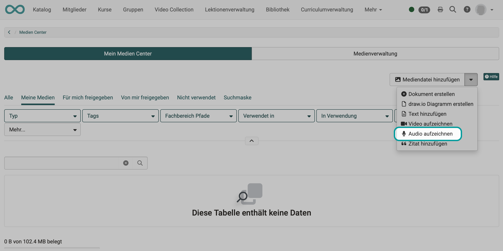
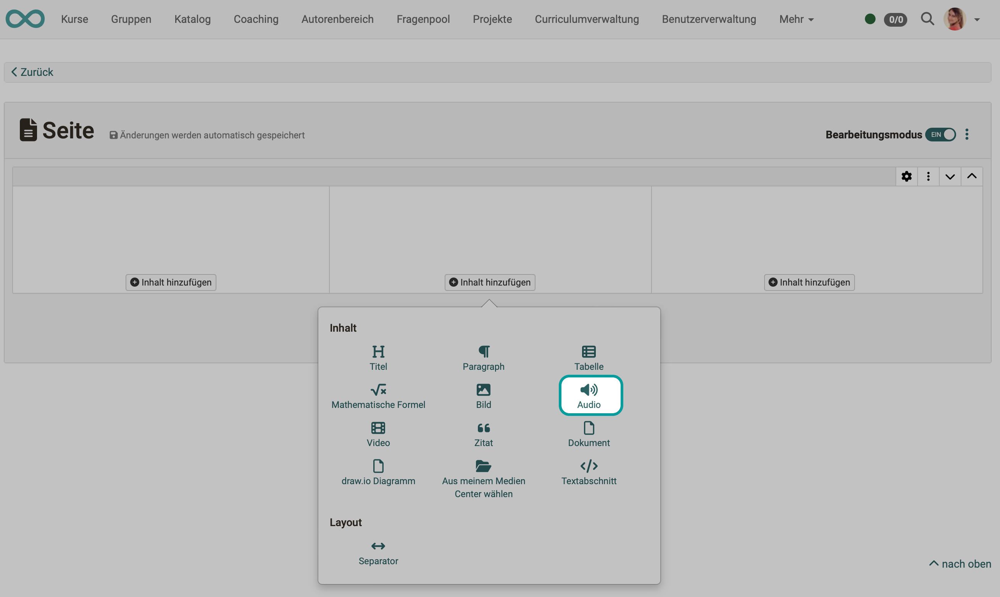
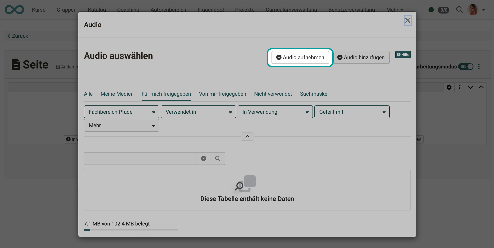
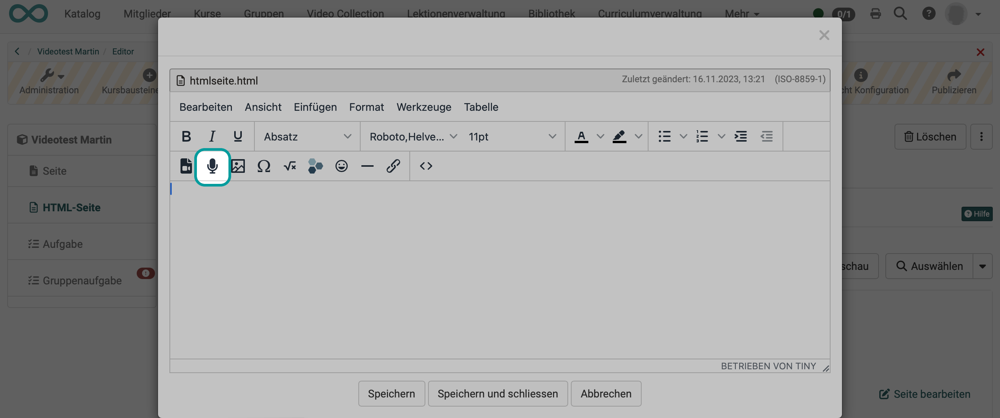
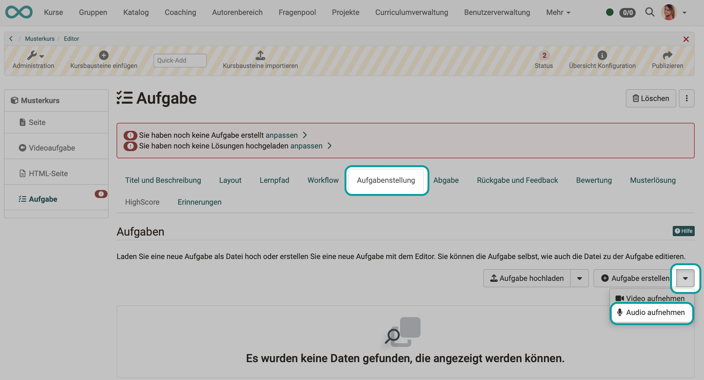
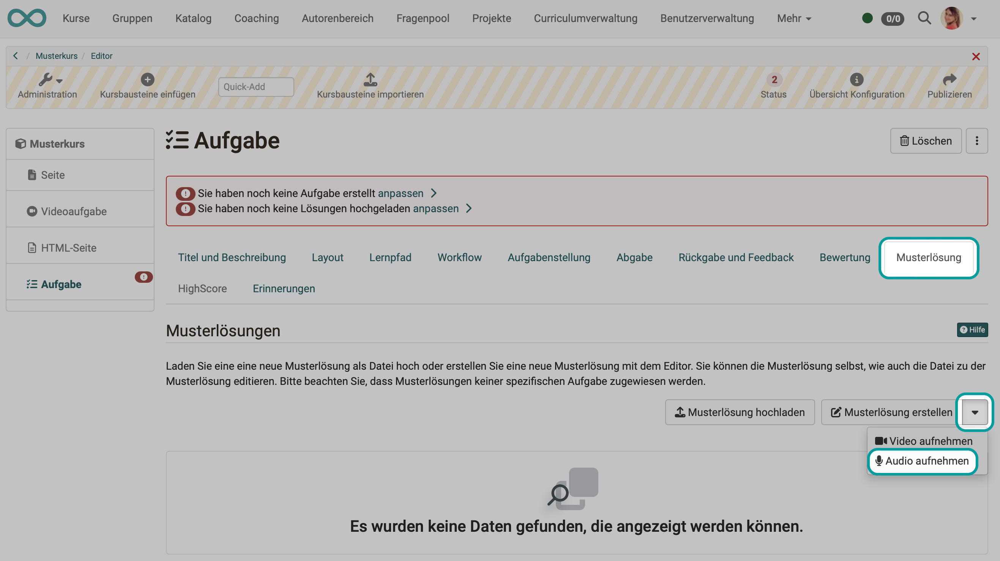
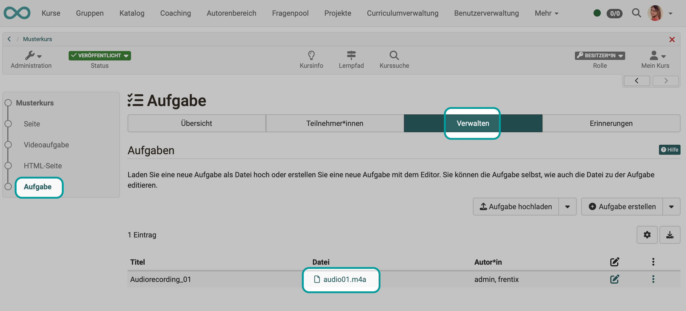
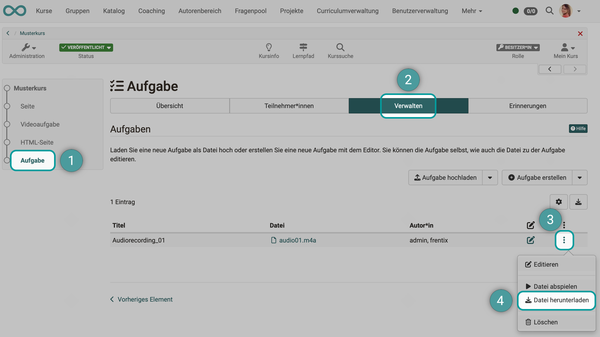
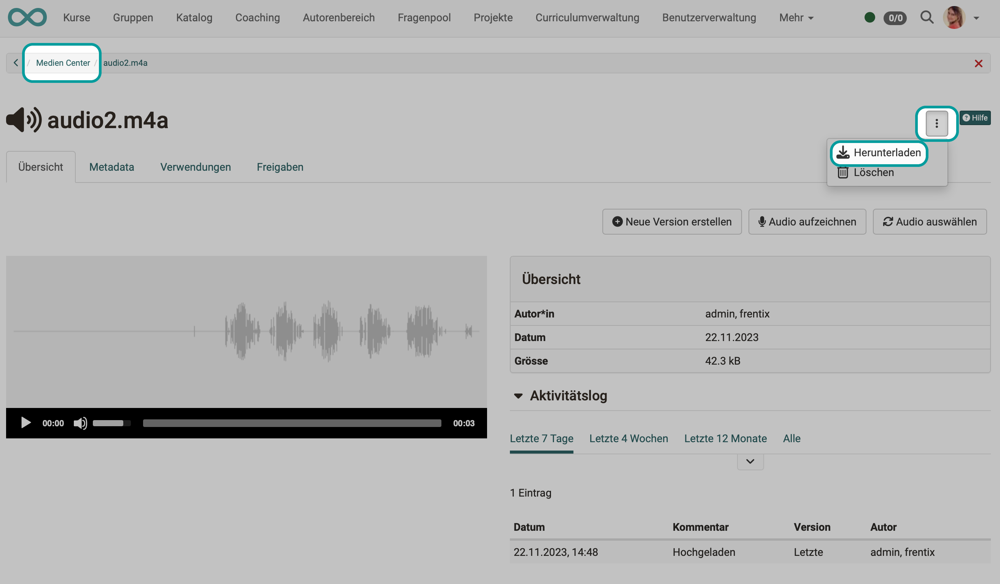

# Audio recording

## Requirements

* If audio is to be recorded in OpenOlat, a microphone must first be available. It must always be activated in the device.

* The microphone must be enabled for OpenOlat so that it can also be used for recordings in OpenOlat.

* *Only MacOS:* In browsers other than Safari, the general permission to use the microphone must be granted. 
  Set this permission on the Mac under  
  **System Settings -> Privacy & Security -> Microphone**  
  for the browser(s) you use for OpenOlat.

* On the other side, the **possibility to record audio** must have been activated in OpenOlat by the administrator: 
**Administration > Module > Audio/Video recordings**

## Where can audios be recorded in OpenOlat

### Recordings in the Media Center

Open the **personal menu** by clicking on the small image or the triangle at the top right.
Open the Media Center there.

Among the possibilities to add new media files, there is also the possibility to **"Record audio"**.

{ class=" shadow lightbox" }

### Recordings in the course element page

Audio can also be inserted within a layout element in the course element "Page".

{ class=" shadow lightbox" }

Once you have decided on this, a pop-up appears to select an existing audio. The pop-up also contains a button for recording your own audio.

{ class=" shadow lightbox" }

### Recordings in the course element "HTML page"

The HTML editor (Tiny) used in OpenOlat is also used for inserting and recording audio. The option to record audio is located under the tools that are also used to insert existing media.

{ class=" shadow lightbox" }

!!! Note "Note"

    In principle, audio recordings are possible in the HTML editor, but in some places not all editing options are offered when the editor is called up for various reasons. It is therefore possible that the option to record audio is offered when the HTML editor is called up, but not when it is called up from another location.

### Recordings in the course element "Task"

The option to record videos in a task is embedded in the workflow. You will find the recording function in the step where the video is to be inserted as a task or sample solution.

{ class=" shadow lightbox" }

{ class=" shadow lightbox" }

For video recordings that are recorded in the course element "Task", there is currently no option for saving and linking in the Media Center.

### Recordings in the course element "Group task"

The audio recording in the course element "Group task" works in the same way as in the course element "Task".

## Where are the audio recordings saved?

**Audios** recorded within a course element are also saved with this course element. 
The recordings are not listed in the author area, storage folder or in the Media Center (exception: course element page).

{ class=" shadow lightbox" }

However, if the **Audio recording is started in the Media Center**, the audio is also saved in the Media Center.

## In what format and quality are recordings saved?

Audio recordings made in OpenOlat are always saved as **m4a files**. This is due to the fact that only the m4a format is supported by all browsers.

The recording quality is preset (mono, 44 kHz).

Administrators can activate local audio conversion under 
**Administration > Module > Audio/Video recordings > Tab "Recording configuration** 
(See also: [Admin Manual](../../manual_admin/administration/Modules_Audio_Video_Recording.md).)

## How much storage space is available for my audios?

### Download from the course element Task and Group task

Both audio recordings from the task and audio recordings in the sample solution can be downloaded directly in the course element. To do this, use the option under the 3 dots at the end of a line.

{ class=" shadow lightbox" }

### Download from Media Center

Select and open the desired video in the Media Center. Under the button with the 3 dots you will find the option to download.

{ class=" shadow lightbox" }

!!! Note "Note"

    An audio that was recorded within a course element is **not** stored in the course storage folder.