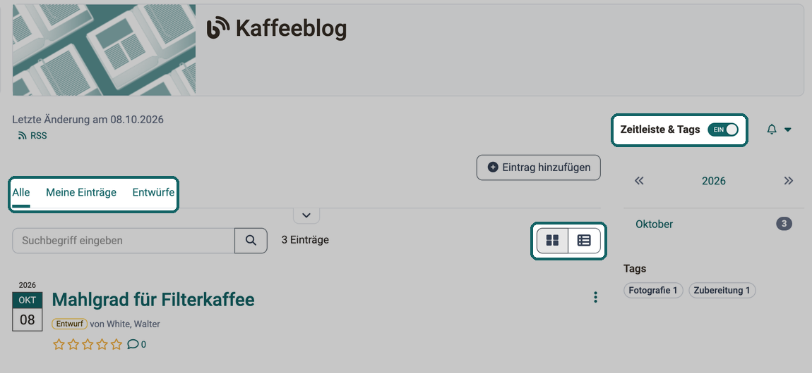
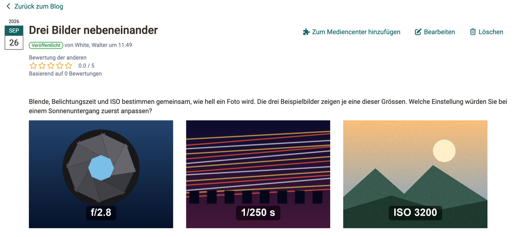
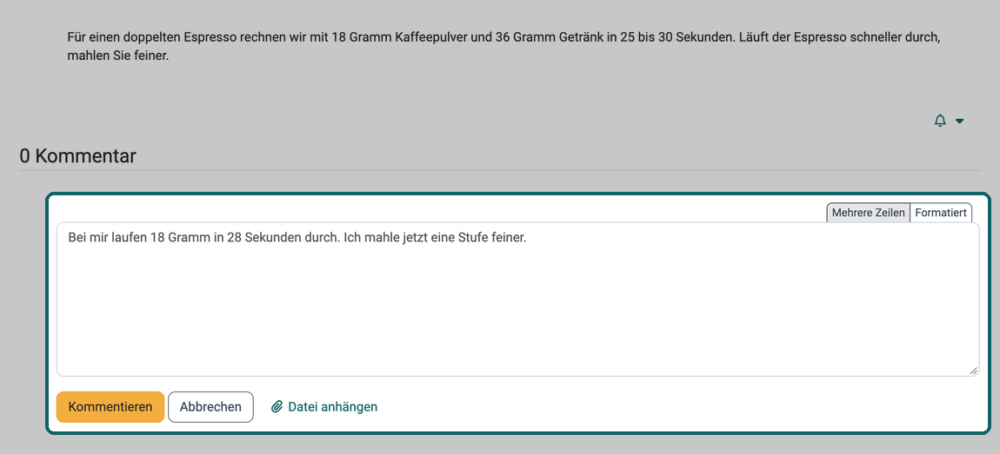
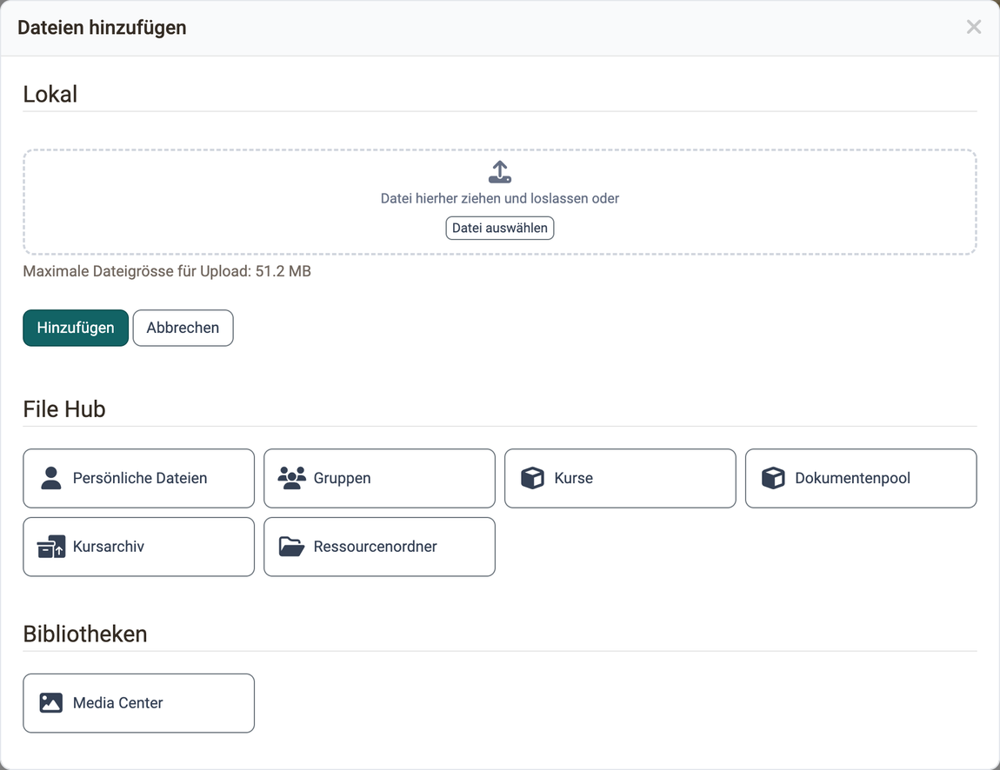
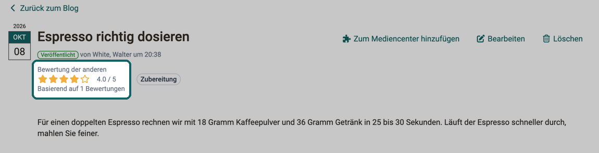

# Bloggen {: #blog_blogging}

Ist in einem veröffentlichten Kurs ein Blog enthalten, können Betreuer:innen und Kursteilnehmer:innen mit diesem Blog arbeiten (bloggen). Der Begriff "bloggen" meint das Nutzen, Verwenden, Einsetzen eines erstellten und konfigurierten Blogs.

!!! note "Quick Links"

    Sie können als Kursteilnehmer:in oder Betreuer:in 

    * [Beiträge aufrufen und lesen](#blog_blogging_read_posts)
    * [Beiträge hinzufügen und editieren](#blog_blogging_add_posts)
    * [Beiträge löschen](#blog_blogging_delete_posts)
    * [Beiträge kommentieren](#blog_blogging_comment_posts)
    * [Beiträge bewerten](#blog_blogging_assess_posts)
    * [einen Blog moderieren](#blog_blogging_moderate)
    * [Beiträge abonnieren](#blog_blogging_abo)
    * [Beiträge im Media Center ablegen](#blog_blogging_media_center)

## Beiträge aufrufen und lesen {: #blog_blogging_read_posts}

Zum Aufrufen eines Blogs klicken Sie einfach links im Kursmenü auf den entsprechenden Kursbaustein. Anschliessend wählen Sie den Beitrag, der Sie interessiert.

Zum Umschalten zwischen "Listenansicht" und "Tabellenansicht" verwenden Sie die Buttons rechts über der Liste.

Mit dem Schalter "Zeitleiste & Tags" blenden Sie rechts neben der Liste zusätzlich eine Zeitleiste und die Tags der Einträge ein und aus.

Über der Liste stehen Filter zur Verfügung, um die angezeigten Beiträge einzuschränken: "Alle", "Meine Einträge" und "Entwürfe".

!!! info "Wichtig"

    Haben Sie nur Leserechte auf den Blog (z.B. als Betreuer:in ohne Schreibrecht oder als Kursteilnehmer:in, die/der keine eigenen Beiträge erstellen darf), steht Ihnen nur der Filter "Alle" zur Verfügung [:octicons-tag-16:{ title="ab Release 20.3.0 (OO-9220)" }](https://track.frentix.com/issue/OO-9220){:target="_blank"}.

{ class="shadow lightbox" title="Blog in der Kursansicht · 2026.10.08" }

!!! note "Hinweis"

    Es besteht auch die Möglichkeit, eine Blog-Lernressource "stand alone" (ohne Einbindung in einen Kurs) zu nutzen. In diesem Fall könnte die Blog-Lernressource nach der Veröffentlichung z.B. via Link in einer Mail oder im Katalog aufgerufen werden. Denken Sie auch daran, dass Sie in Mails einen Link direkt auf einen bestimmten Kursbaustein innerhalb eines Kurses (z.B. den Blog) verschicken können.    

[Zum Seitenanfang ^](#blog_blogging)

## Beiträge hinzufügen und editieren {: #blog_blogging_add_posts}

!!! tip "Voraussetzung"

    Damit Sie als Kursteilnehmer:in oder Betreuer:in nicht nur kommentieren und bewerten, sondern auch eigene Beiträge schreiben können, muss dies von dem/der Kursbesitzer:in entsprechend erlaubt worden sein. (Siehe [Blog konfigurieren](../learningresources/Blog_Configuration.de.md)) 
    Beachten Sie ausserdem, dass per Link eingefügte **externe** Blogs nicht bearbeitet werden können.

Fügen Sie einen eigenen Beitrag hinzu, indem Sie den Button "Eintrag hinzufügen" verwenden. Zum erneuten Öffnen und Editieren wählen Sie die Option unter den 3 Punkten, bzw. klicken Sie in der Listenansicht auf den Titel. In der Kursansicht finden Sie bei jedem Ihrer Beiträge einen Link "Bearbeiten".

Beim Hinzufügen und Editieren füllen Sie folgende Felder aus.

#### Titel {: #entry_title}

Geben Sie einen Titel ein, der den Blogeintrag beschreibt. Dieses Feld ist obligatorisch.

#### Tags {: #entry_tags}

Optional ordnen Sie dem Eintrag Tags zu. Sie wählen ein vorhandenes Tag oder legen ein neues an. Mit dem Schalter "Zeitleiste & Tags" erscheinen die Tags neben der Liste der Einträge.

#### Inhalt {: #entry_content}

Der Inhalt ist der eigentliche Blogeintrag. Dieses Feld sollte also unbedingt ausgefüllt werden. Formatierungen und Bilder sind erlaubt. Dafür wechseln Sie oben rechts am Feld von "Mehrere Zeilen" auf "Formatiert". Sie schreiben den Inhalt im selben HTML-Editor wie im Kursbaustein "HTML-Seite", hier aber ohne das Menü "Tabelle". Wie Sie mehrere Bilder nebeneinander anordnen, beschreibt der Abschnitt [Mehrere Bilder nebeneinander](Course_Element_HTML_Page.de.md#images_side_by_side).

{ class="shadow lightbox" title="Veröffentlichter Blogeintrag" }

#### Zusammenfassung {: #entry_summary}

Die Zusammenfassung ist fakultativ und wird als Vorschau eines Artikels oder Eintrags verwendet. Es kann sich somit auch um eine kurze Einleitung handeln.

#### Audio- oder Videodatei {: #entry_media_file}

Optional hängen Sie dem Eintrag eine Datei in den Formaten MP3, MP4, M4V, M4A oder AAC an. Bei einem Video füllt OpenOlat "Breite" und "Höhe" beim Hochladen mit den Angaben aus der Datei vor.

#### Datum und Zeit der Veröffentlichung {: #entry_publication_date}

Das Datum und die Zeit der Veröffentlichung werden dafür verwendet, den Eintrag für andere Teilnehmende sichtbar zu machen oder zu verbergen. Liegt der Zeitpunkt der Veröffentlichung in der Vergangenheit, so wird der Eintrag sichtbar. Liegt er hingegen in der Zukunft, so handelt es sich um eine geplante Veröffentlichung des Eintrags.

Sie können den Eintrag durch Klicken auf "Veröffentlichen" für andere zugänglich machen (ab dem angegebenen Datum). Wenn Sie an Ihrem Eintrag zu einem späteren Zeitpunkt weiterschreiben wollen, klicken Sie auf "Entwurf speichern". "Abbrechen" verwirft Ihre Änderungen und schliesst das Formularfenster. In der Liste der Einträge zeigt eine farbige Markierung den Status: "Entwurf" in Gelb, "Geplant" in Blau für eine Veröffentlichung in der Zukunft und "Veröffentlicht" in Grün. Veröffentlichte Einträge sind für andere sichtbar.

Sie können den neuen Eintrag entweder direkt veröffentlichen, das Datum der Veröffentlichung wählen oder den Eintrag als Entwurf speichern.
[Zum Seitenanfang ^](#blog_blogging)

## Beiträge löschen {: #blog_blogging_delete_posts}

Zu jedem Blogbeitrag erscheint ein Button "Löschen", wenn Sie dazu berechtigt sind (weil Sie der/die Autor:in sind oder Moderator:in/Kursbesitzer:in).

In der Tabellenansicht ist eine Massenaktion zum Löschen mehrerer Beiträge verfügbar. Selektieren Sie dazu die Checkboxen der ersten Spalte. Verschiedene Filter und die Suchfunktion unterstützen die Suche bestimmter Beiträge.

[Zum Seitenanfang ^](#blog_blogging)

## Beiträge kommentieren {: #blog_blogging_comment_posts}

Die Kursmitglieder können Blogbeiträge mit einem Text kommentieren. An Kommentare können auch Dateien angehängt und hochgeladen werden.

Um einen Kommentar zu verfassen oder bestehende Kommentare zu lesen, klicken Sie in die Kommentarzeile. Es öffnet sich ein kleiner Texteditor. Mit Klick auf den Button "Kommentieren" schicken Sie den Kommentar ab.

{ class="shadow lightbox" title="Kommentare unter einem Blogbeitrag · 2026.10.08" }

Mit "Datei anhängen" hängen Sie Ihrem Kommentar eine Datei an. Im Dialog "Dateien hinzufügen" laden Sie unter "Lokal" eine Datei von Ihrem Rechner hoch oder wählen eine Datei aus dem "File Hub" oder aus dem "Media Center".

{ class="shadow lightbox" title="Dialog Dateien hinzufügen · 2026.10.08" }

[Zum Seitenanfang ^](#blog_blogging)

## Beiträge bewerten {: #blog_blogging_assess_posts}

Zur Bewertung können Kursmitglieder für Beiträge 1-5 Sterne vergeben.  
Im Normalzustand sehen Sie die Bewertungen der anderen Lesenden angezeigt. Sobald Sie Ihre Maus über die Sterne bewegen, können Sie Ihre eigene Bewertung ergänzen. 

{ class="shadow lightbox" title="Blogbeitrag in der Kursansicht · 2026.10.08" }

[Zum Seitenanfang ^](#blog_blogging)

## Einen Blog moderieren {: #blog_blogging_moderate}

Unter dem Moderieren eines Blogs versteht man das Lenken oder ein lenkendes Eingreifen in eine Kommunikation. In einem Blog heisst das, dass eine Person überprüft, ob die Beiträge angemessen sind oder korrigiert, bzw. eventuell sogar gelöscht werden müssen. Moderator:innen eines OpenOlat-Blogs haben die Rechte alle Einträge zu lesen, zu kommentieren, zu editieren, zu löschen und neue Einträge zu erstellen. Zudem können Moderator:innen auch den Titel und die Beschreibung des ganzen Feeds anpassen.

Die Aufgabe des/der Moderator:in kann auf jeden Fall von Kursbesitzer:innen übernommen werden. Das Moderatorenrecht kann aber auch an Betreuer:innen oder gezielt bestimmte Personen vergeben werden. (Siehe [Blog konfigurieren](../learningresources/Blog_Configuration.de.md))

!!! info "Wichtig"

    Sind Blogeinträge importiert worden, können sie nur von Moderator:innen, Besitzer:innen oder Betreuer:innen gelöscht werden. (Als Ersteller:innen der Beiträge sind dort weiterhin die ursprünglichen Autor:innen angezeigt.)

[Zum Seitenanfang ^](#blog_blogging)

## Beiträge abonnieren {: #blog_blogging_abo}

Abonnieren Sie den RSS-Feed des Blogs, um keine neuen Einträge zu verpassen. Eine Anleitung dazu finden Sie hier: [Abonnements einrichten (Video-Einführung)](https://www.youtube.com/embed/h9gOqt7TR7Q)

Wenn Sie benachrichtigt werden möchten, sobald irgendein neuer Beitrag eingefügt wird, abonnieren Sie den Blog als Ganzes. Dazu dient das Glockensymbol "Abonnieren" rechts über der Liste der Einträge.
Wenn Sie nur benachrichtigt werden möchten, sobald ein Kommentar zu einem Blogeintrag abgegeben wird, können Sie auch ein solches Abo wählen.

Wenn Sie den Link zum Blog weitergeben möchten, finden Sie den Link links über der Beitragsliste unter "RSS".

Möchten Sie den direkten Link zu einem einzelnen Beitrag weitergeben, können Sie sich die URL aus Ihrem Browserfenster kopieren. Dort wird der Direktlink angezeigt.

[Zum Seitenanfang ^](#blog_blogging)

## Beiträge im Media Center ablegen {: #blog_blogging_media_center}

Als Ersteller:in können Sie Ihre Blogbeiträge auch im Media Center ablegen. An Ihren eigenen Beiträgen erscheint dafür der Button "Zum Mediencenter hinzufügen".

[Zum Seitenanfang ^](#blog_blogging)

## Weiterführende Informationen {: #further_information}

**Auf dieser Seite erwähnt** 
[Blog konfigurieren >](../learningresources/Blog_Configuration.de.md) 
[Kursbaustein "HTML-Seite" >](../learningresources/Course_Element_HTML_Page.de.md)

**Weiterführend** 
[Blog erstellen >](../learningresources/Blog_Create.de.md) 
[Wie erstelle ich einen Blog? >](../../manual_how-to/blog/blog.de.md)

**youtube** 
[Abonnements einrichten](<https://www.youtube.com/embed/h9gOqt7TR7Q>)

[Zum Seitenanfang ^](#blog_blogging)

