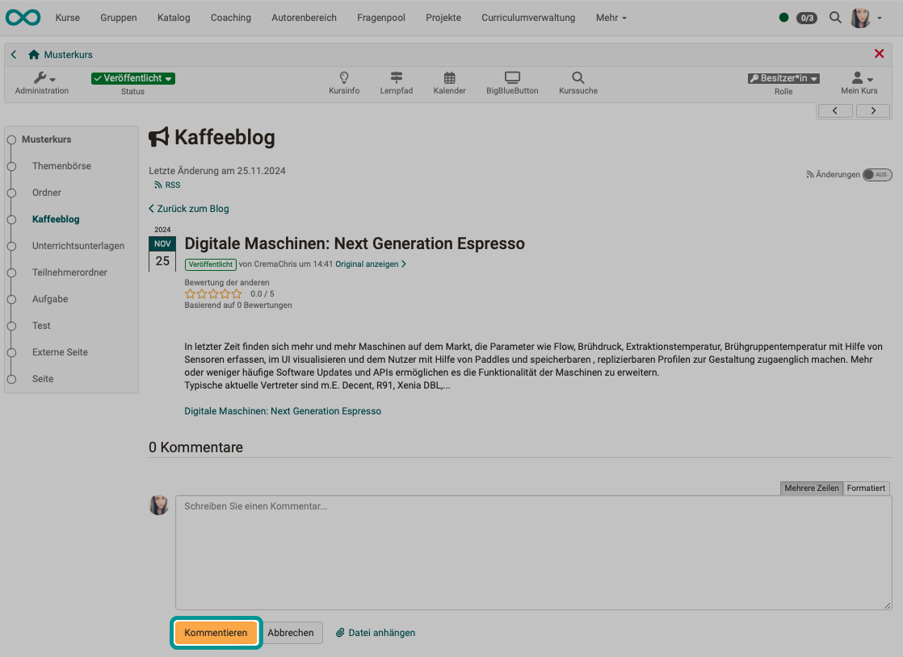
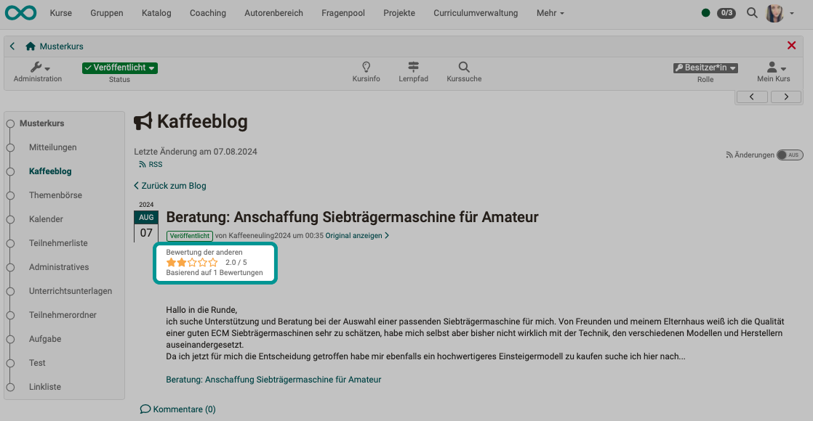

# Bloggen {: #blog_blogging}

Ist in einem veröffentlichten Kurs ein Blog enthalten, können Betreuer:innen und Kursteilnehmer:innen mit diesem Blog arbeiten (bloggen). Der Begriff "bloggen" meint das Nutzen, Verwenden, Einsetzen eines erstellten und konfigurierten Blogs.

!!! note "Quick Links"

    Sie können als Kursteilnehmer:in oder Betreuer:in 

    * [Beiträge aufrufen und lesen](#blog_blogging_read_posts)
    * [Beiträge hinzufügen und editieren](#blog_blogging_add_posts)
    * [Beiträge löschen](#blog_blogging_delete_posts)
    * [Beiträge kommentieren](#blog_blogging_comment_posts)
    * [Beiträge bewerten](#blog_blogging_assess_posts)
    * [einen Blog moderieren](#blog_blogging_moderate)
    * [Beiträge abonnieren](#blog_blogging_abo)
    * [Beiträge im Media Center ablegen](#blog_blogging_media_center)

## Beiträge aufrufen und lesen {: #blog_blogging_read_posts}

Zum Aufrufen eines Blogs klicken Sie einfach links im Kursmenü auf den entsprechenden Kursbaustein. Anschliessend wählen Sie den Beitrag, der Sie interessiert.

Zum Umschalten zwischen ausführlicher und kompakter Listenansicht verwenden Sie die Buttons rechts oben über der Liste.

Mit dem Toggle-Button darüber können Sie sich zusätzlich eine Zeitleiste und Tags ein- und ausblenden.

{ class="shadow lightbox" }

!!! info "Hinweis"

    Es besteht auch die Möglichkeit, eine Blog-Lernressource "stand alone" (ohne Einbindung in einen Kurs) zu nutzen. In diesem Fall könnte die Blog-Lernressource nach der Veröffentlichung z.B. via Link in einer Mail oder im Katalog aufgerufen werden. Denken Sie auch daran, dass Sie in Mails einen Link direkt auf einen bestimmten Kursbaustein innerhalb eines Kurses (z.B. den Blog) verschicken können.    

[zum Seitenanfang ^](#blog_blogging)

## Beiträge hinzufügen und editieren {: #blog_blogging_add_posts}

!!! info "Voraussetzung"

    Damit Sie als Kursteilnehmer:in oder Betreuer:in nicht nur kommentieren und bewerten, sondern auch eigene Beiträge schreiben können, muss dies von dem/der Kursbesitzer:in entsprechend erlaubt worden sein. (Siehe [Blog konfigurieren](../learningresources/Blog_Configuration.de.md)) 
    Beachten Sie ausserdem, dass per Link eingefügte **externe** Blogs nicht bearbeitet werden können.

Fügen Sie einen eigenen Beitrag hinzu, indem Sie den Button "Eintrag hinzufügen" verwenden. 

**Titel:** Geben Sie einen Titel ein, der den Blogeintrag beschreibt. Dieses Feld ist obligatorisch.

**Beschreibung:** Die Beschreibung ist fakultativ und wird als Vorschau eines Artikels oder Eintrags verwendet. Es kann sich somit auch um eine kurze Einleitung oder Zusammenfassung handeln.

**Inhalt:** Der Inhalt ist der eigentliche Blogeintrag. Dieses Feld sollte also unbedingt ausgefüllt werden. Formatierungen und Bilder sind erlaubt.

**Datum und Zeit der Veröffentlichung:** Das Datum und die Zeit der Veröffentlichung werden dafür verwendet, den Eintrag für andere Benutzer sichtbar zu machen oder zu verbergen. Liegt der Zeitpunkt der Veröffentlichung in der Vergangenheit, so wird der Eintrag sichtbar. Liegt er hingegen in der Zukunft, so handelt es sich um eine geplante Veröffentlichung des Eintrags.

Sie können den Eintrag durch Klicken auf "Veröffentlichen" für andere zugänglich machen (ab dem angegebenen Datum). Wenn Sie an Ihrem Eintrag zu einem späteren Zeitpunkt weiterschreiben wollen, klicken Sie auf "Entwurf speichern". "Abbrechen" verwirft Ihre Änderungen und schliesst das Formularfenster. Entwürfe erscheinen in der Liste der Einträge gelb hinterlegt. Geplante Veröffentlichungen sind grün gekennzeichnet. Alle anderen Einträge sind öffentlich und für andere sichtbar.

Sie können den neuen Eintrag entweder direkt veröffentlichen, das Datum der Veröffentlichung wählen oder den Eintrag als Entwurf speichern.

Zum erneuten Öffnen und Editieren wählen Sie die Option unter den 3 Punkten, bzw. klicken Sie in der Listenansicht auf den Titel. Im Kursrun finden Sie bei jedem Ihrer Beiträge einen Link "Bearbeiten".

[zum Seitenanfang ^](#blog_blogging)

## Beiträge löschen {: #blog_blogging_delete_posts}

Zu jedem Blogbeitrag erscheint ein Button "Löschen", wenn Sie dazu berechtigt sind (weil Sie der/die Autor:in sind oder Moderator:in/Kursbesitzer:in).

In der kompakten Tabellenansicht ist eine Massenaktion zum Löschen mehrerer Beiträge verfügbar. Selektieren Sie dazu die Checkboxen der ersten Spalte. Verschiedene Filter und die Suchfunktion unterstützen die Suche bestimmter Beiträge.

[zum Seitenanfang ^](#blog_blogging)

## Beiträge kommentieren {: #blog_blogging_comment_posts}

Die Kursmitglieder können Blogbeiträge mit einem Text kommentieren. Ab Release 19.1 können an Kommentare auch Dateien angehängt und hochgeladen werden.

Um einen Kommentar zu verfassen oder bestehende Kommentare zu lesen, klicken Sie in die Kommentarzeile. Es öffnet sich ein kleiner Texteditor. Mit Klick auf den Button "Kommentieren" schicken Sie den Kommentar ab.

{ class="shadow lightbox" }

Sie können Ihrem Kommentar auch eine Datei anhängen. Dazu können Sie eine Datei neu hochladen oder aus Ihrem File Hub eine Datei auswählen.

{ class="shadow lightbox" }

[zum Seitenanfang ^](#blog_blogging)

## Beiträge bewerten {: #blog_blogging_assess_posts}

Zur Bewertung können Kursmitglieder für Beiträge 1-5 Sterne vergeben.  
Im Normalzustand sehen Sie die Bewertungen der anderen Blogleser:innen angezeigt. Sobald Sie Ihre Maus über die Sterne bewegen, können Sie Ihre eigene Bewertung ergänzen. 

{ class="shadow lightbox" }

[zum Seitenanfang ^](#blog_blogging)

## Einen Blog moderieren {: #blog_blogging_moderate}

Unter dem Moderieren eines Blogs versteht man das Lenken oder ein lenkendes Eingreifen in eine Kommunikation. In einem Blog heisst das, dass eine Person überprüft, ob die Beiträge angemessen sind oder korrigiert, bzw. eventuell sogar gelöscht werden müssen. Moderator:innen eines OpenOlat-Blogs haben die Rechte alle Einträge zu lesen, zu kommentieren, zu editieren, zu löschen und neue Einträge zu erstellen. Zudem können Moderator:innen auch den Titel und die Beschreibung des ganzen Feeds anpassen.

Die Aufgabe des/der Moderator:in kann auf jeden Fall von Kursbesitzer:innen übernommen werden. Das Moderatorenrecht kann aber auch an Betreuer:innen oder gezielt bestimmte Personen vergeben werden. (Siehe [Blog konfigurieren](../learningresources/Blog_Configuration.de.md))

[zum Seitenanfang ^](#blog_blogging)

## Beiträge abonnieren {: #blog_blogging_abo}

Abonnieren Sie den RSS-Feed des Blogs, um keine neuen Einträge zu verpassen. Eine Anleitung dazu finden Sie hier: [Abonnements einrichten (Video-Einführung)](https://www.youtube.com/embed/h9gOqt7TR7Q)

Wenn Sie den Link zum Blog weitergeben möchten, finden Sie den Link links über der Beitragsliste im Icon "RSS-Feed".

Möchten Sie den direkten Link zu einem einzelnen Beitrag weitergeben, können Sie sich die URL aus Ihrem Browserfenster kopieren. Ab Release 19.0.2 wird dort der Direktlink angezeigt. 

[zum Seitenanfang ^](#blog_blogging)

## Beiträge im Media Center ablegen {: #blog_blogging_media_center}

Als Ersteller:in können Sie Ihre Blogbeiträge auch im Media Center ablegen. An den Beiträgen, zu denen Sie dieses Recht haben, wird ein entsprechender Button angezeigt.

[zum Seitenanfang ^](#blog_blogging)

## Weitere Informationen

[Blog erstellen (als Kursbesitzer:in/Autor:in)](../learningresources/Blog_Create.de.md) 
[Schritt-für-Schritt-Anleitung: Wie erstelle ich einen Blog?](../../manual_how-to/blog/blog.de.md) 
[Blog konfigurieren (als Kursbesitzer:in/Autor:in)](../learningresources/Blog_Configuration.de.md) 
[Abonnements einrichten (Video-Einführung)](https://www.youtube.com/embed/h9gOqt7TR7Q) 

