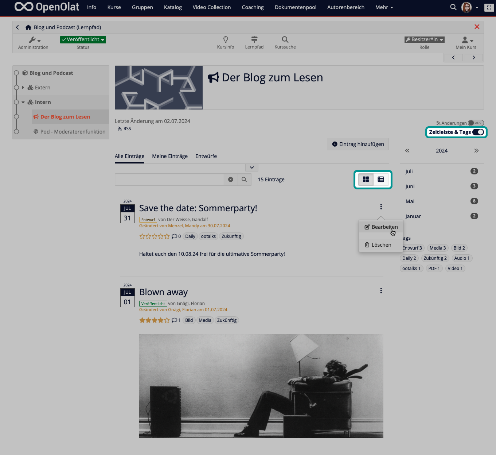
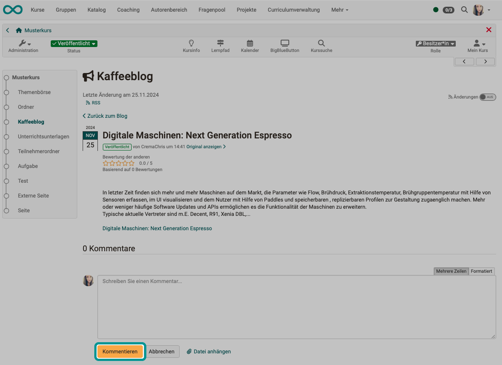
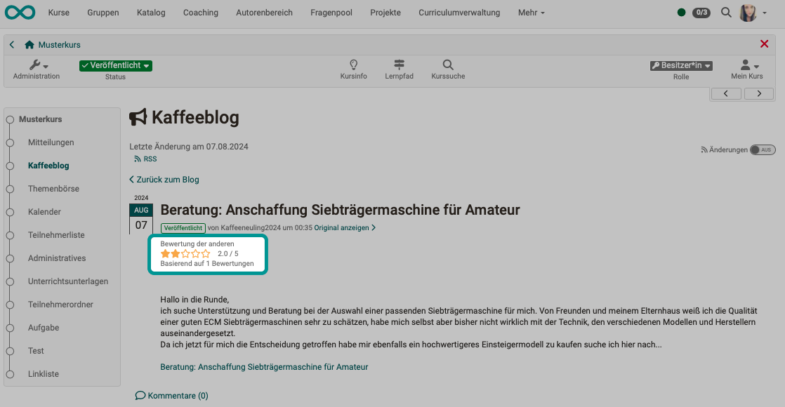

# Blogging {: #blog_blogging}

If a published course contains a blog, tutors and course participants can work with this blog (blogging). The term "blogging" refers to the use, utilization and deployment of a created and configured blog.

!!! note "Quick Links"

    As a course participant or coach, you can 

    * [View and read posts](#blog_blogging_read_posts)
    * [Add and edit posts](#blog_blogging_add_posts)
    * [Delete posts](#blog_blogging_delete_posts)
    * [Comment on posts](#blog_blogging_comment_posts)
    * [Assess posts](#blog_blogging_assess_posts)
    * [Moderate a blog](#blog_blogging_moderate)
    * [Subscribe to posts](#blog_blogging_abo)
    * [Store contributions in the Media Center](#blog_blogging_media_center)

## View and read posts {: #blog_blogging_read_posts}

To access a blog, simply click on the corresponding course element in the course menu on the left. Then select the post that interests you.

To switch between detailed and compact list view, use the buttons at the top right above the list.

You can also use the toggle button above to show and hide a timeline and tags.

{ class="shadow lightbox" }

!!! info "Note"

    It is also possible to use a blog learning resource "stand alone" (without integration into a course). In this case, the blog learning resource could be accessed after publication, e.g. via a link in an email or in the catalog. Also remember that you can send a link in emails directly to a specific course element within a course (e.g. the blog).    

[To the top of the page ^](#blog_blogging)

## Add and edit posts {: #blog_blogging_add_posts}

!!! info "Requirements"

    In order for you as a course participant or coach not only to comment and rate, but also to write your own contributions, it must first be permitted by the course owner. (See also [Blog Configuration](../learningresources/Blog_Configuration.md)) 
    Please also note that **external** blogs inserted via a link cannot be edited.

Add your own entry by using the "Add entry" button. 

**Title:** Enter a title that describes the blog entry. This field is mandatory.

**Description:** The description is optional and is used as a preview of an article or entry. It can therefore also be a short introduction or summary.

**Content:** The content is the actual blog entry. This field should therefore be filled in. Formatting and images are permitted.

**Date and time of publication:** The date and time of publication are used to make the entry visible to other users or to hide it. If the time of publication is in the past, the entry will be visible. However, if it is in the future, it is a planned publication of the entry.

You can make the entry accessible to others by clicking on "Publish" (from the date specified). If you want to continue working on your entry at a later date, click on "Save draft". "Cancel" discards your changes and closes the form window. Drafts are highlighted in yellow in the list of entries. Planned publications are highlighted in green. All other entries are public and visible to others.

You can either publish the new entry directly, select the date of publication or save the entry as a draft.

To reopen and edit, select the option under the 3 dots or click on the title in the list view. In the course run, you will find an "Edit" link for each of your contributions.

[To the top of the page ^](#blog_blogging)

## Delete posts {: #blog_blogging_delete_posts}

A "Delete" button appears for each blog post if you are authorized to do so (because you are the author or moderator/course owner).

In the compact table view, a mass action is available for deleting multiple posts. To do this, select the checkboxes in the first column. Various filters and the search function support the search for specific posts.

[To the top of the page ^](#blog_blogging)

## Comment on posts {: #blog_blogging_comment_posts}

Course members can comment on blog posts with a text. As of release 19.1, files can also be attached to comments and uploaded.

To write a comment or read existing comments, click on the "Comments" link. A small text editor will open. 

{ class="shadow lightbox" }

You can also attach a file to your comment. To do this, you can upload a new file or select a file from your File Hub.

{ class=“shadow lightbox” }

[To the top of the page ^](#blog_blogging)

## Assess posts {: #blog_blogging_assess_posts}

Course members can award 1-5 stars for the assessment of contributions.  
In the normal state, you will see the ratings of other blog readers. As soon as you move your mouse over the stars, you can add your own rating. 

{ class="shadow lightbox" }

[To the top of the page ^](#blog_blogging)

## Moderating a blog {: #blog_blogging_moderate}

Moderating a blog means directing or intervening in communication. In a blog, this means that a person checks whether the posts are appropriate or whether they need to be corrected or possibly even deleted. Moderators of an OpenOlat blog have the rights to read, comment, edit, delete and create new entries. Moderators can also customize the title and description of the entire feed. 

The role of moderator can be taken on by course owners in any case. However, the right to act as moderator can also be assigned to coaches or specific persons. (See also [Blog configuration](../learningresources/Blog_Configuration.md))

!!! note "Note"

    If blog entries have been imported, they can only be deleted by moderators, owners or supervisors. (The original authors are still displayed as the creators of the posts).

[To the top of the page ^](#blog_blogging)

## Subscribe to posts {: #blog_blogging_abo}

Subscribe to the blog's RSS feed to make sure you don't miss any new entries. You can find instructions here: [Set up subscriptions (video instrucions)](https://www.youtube.com/embed/h9gOqt7TR7Q) (German)

If you would like to pass on the link to the blog, you will find the link on the left above the list of posts in the "RSS feed" icon.

If you would like to pass on the direct link to an individual post, you can copy the URL from your browser window. From release 19.0.2, the direct link will be displayed there. You can then transfer your blog post from there to your e-Portfolio, for example.

[To the top of the page ^](#blog_blogging)

## Store posts in the Media Center {: #blog_blogging_media_center}

As a coach or owner, you can also store your blog posts in the Media Center. A corresponding button is displayed on the posts for which you have this right.

[To the top of the page ^](#blog_blogging)

## Further information

[Create a blog (as course owner/author)](../learningresources/Blog_Create.md) 
[Step by step instruction: How do I create a blog?](../../manual_how-to/blog/blog.md) 
[Configure a blog (as course owner/author)](../learningresources/Blog_Configuration.md) 
[Set up subscriptions (video introduction, German)](https://www.youtube.com/embed/h9gOqt7TR7Q) 

