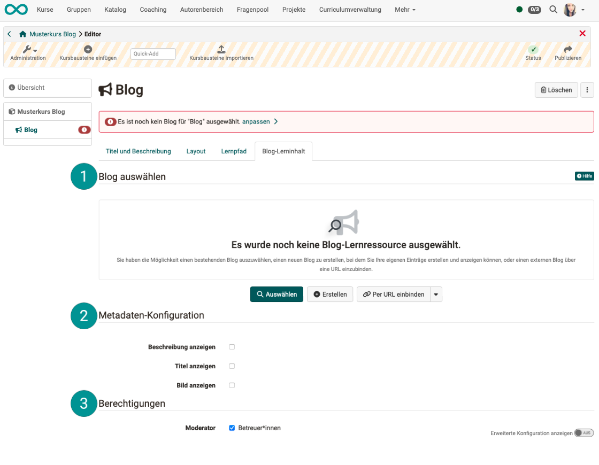
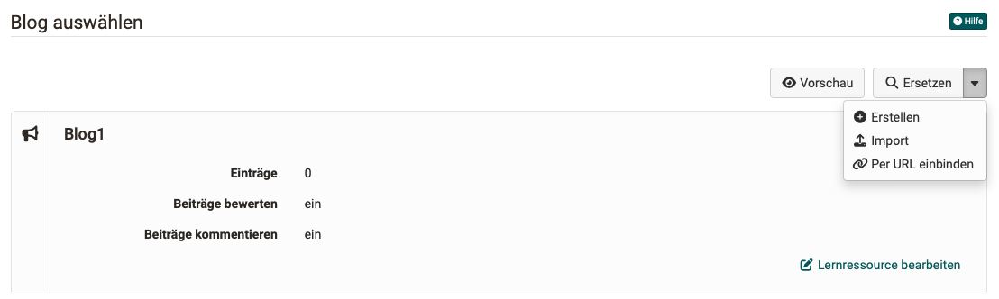
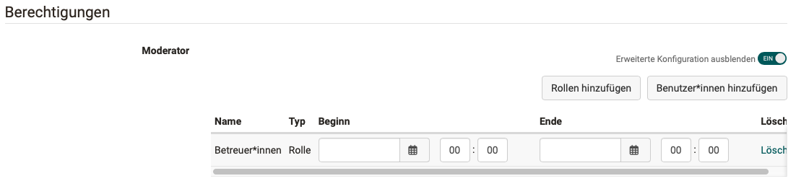
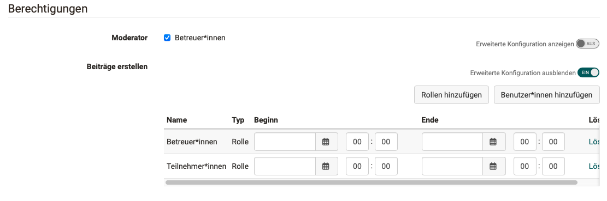
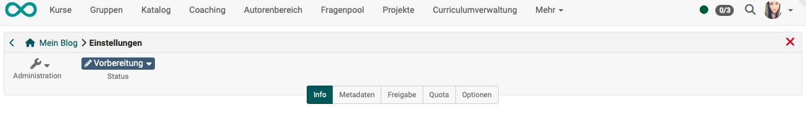

# Blog konfigurieren {: #blog_configuration}

Die Konfiguration eines Blogs geschieht an zwei Orten: **im Kursbaustein** und **in der Lernressource**.

## Konfiguration im Kursbaustein "Blog" {: #blog_configuration_course_element}

Nachdem Sie im Kurseditor einen Kursbaustein "Blog" eingefügt haben, finden Sie die Konfigurationen zu Lernressource und Berechtigungen im **Tab "Blog-Lerninhalt"** des Kursbausteins. 

Die Einstellungen zur Darstellung sind je nach Kurstyp in den Tabs "Sichtbarkeit" und "Zugang" (herkömmliche Kurse) bzw. "Layout" und "Lernpfad" (Lernpfad-Kurse) möglich.

{ class="shadow lightbox" }

###  Blog auswählen

Wurde noch keine Blog-Lernressource eingefügt, besteht die Auswahl zwischen

* eine im Autorenberreich vorhandene Blog-Lernressource auswählen
* eine Blog-Lernressource neu erstellen
* einen externen Blog verlinken
* einen als Datei vorhandenen Blog importieren

Ist einmal eine Lernressource eingefügt, wird der Button "Ersetzen" angezeigt, um die Lernressource austauschen zu können. Ausserdem können Sie von hier aus die Blog-Lernressource auch direkt bearbeiten.

{ class="shadow lightbox" }

!!! info ""

    Die Wahl eines existierenden Blogs bietet sich an, wenn Sie bereits unabhängig von OpenOlat einen Blog führen oder einen bekannten Blog als Inhalt oder Diskussionsgrundlage in Ihren OpenOlat-Kurs einbinden wollen. In diesem Fall können Sie keine eigenen Blogbeiträge erstellen, aber die externen Beiträge können mit Sternchen bewertet und kommentiert werden.

    Wenn Sie sich für eine Art des Blogs (Einträge selber erstellen oder externen Blog einbinden) entschieden haben, können Sie dies später nicht mehr ändern.

###  Metadaten-Konfiguration

Hier kann bestimmt werden, ob die in der Blog-**Lernressource** unter **Administration > Einstellungen > Tab Info** gemachten Angaben übernommen und angezeigt werden.

###  Berechtigungen

**Moderator:in** 
Auf Ebene des Kursbaustein kann bestimmt werden, ob neben dem/der Kursbesitzer:in auch Betreuer:innen die [Moderatorenrolle](../learningresources/Blog_Blogging.de.md#blog_blogging_moderate) übernehmen dürfen. Da die gleiche Lernressource in verschiedenen Kursen und Kursbausteinen verwendet werden kann, kann so die Lernresource im einen Kurs mit Moderatorenrecht für Betreuer:innen und im anderen Kurs ohne Moderatorenrecht für Betreuer:innen konfiguriert werden.

Schalten Sie den Toggle-Button "Erweiterte Konfiguration anzeigen" ein, besteht die Möglichkeit, die Moderatorenrolle auf bestimmte Zeiträume zu begrenzen. Ausserdem können Sie hier auch gezielt bestimmte Einzelpersonen (unabhängig von deren Rolle) als Moderator:in bestimmen.

{ class="shadow lightbox" }

**Beiträge erstellen** 

Hier wird definiert welche Personengruppen des Kurses Blogbeiträge erstellen dürfen. Neben den Kursbesitzer:innen können das alle Betreuer:innen und alle Teilnehmenden sein.

!!! info "Hinweis"

    Wird ein externer Blog eingebunden, können Sie in OpenOlat keinen Einfluss darauf nehmen, wer Einträge erstellen darf. Die Berechtigungsoptionen zu "Beiträge erstellen" werden deshalb in diesem Fall nicht angezeigt.

Schalten Sie den Toggle-Button "Erweiterte Konfiguration anzeigen" ein, besteht auch hier die Möglichkeit, das Recht zum Erstellen von Beiträgen auf bestimmte Zeiträume zu begrenzen. 

{ class="shadow lightbox" }

## Konfiguration der Lernressource "Blog" {: #blog_configuration_learningresource}

Zur Konfiguration der Blog-Lernressource können Sie

* die Lernressource im Autorenbereich auswählen oder 
* direkt aus dem Blog-Kursbaustein im Tab "Blog-Lerninhalt" auf "Lernressource bearbeiten" klicken.

Wählen Sie dann **Administration > Einstellungen**. In den hier angezeigten Tabs konfigurieren Sie die Blog-Lernressource. Die hier gemachten Einstellungen werden in alle Kurse bzw. Kursbausteine übernommen, in denen Sie die Blog-Lernressource einbinden.

{ class="shadow lightbox" }

**Info** 
Hier machen Sie Angaben über Titel, Beschreibung oder Titelbild der Blog-Lernressource.

**Metadaten** 
Optional machen Sie hier zusätzliche Angaben zur Klassifizierung der Lernressource, wie Fachbereich oder Sprache.

**Freigabe** 
Die Einstellungen zur Freigabe entsprechen denen anderer Lernressourcen:

* Verwendungszweck (Standard: Einbindung im Kurs, Alternative: eigenständige Lernressource)
* Direktlink (für direkten Zugriff zur Lernressource)
* Administrative Freigabe (in welchen Organisationseinheiten ist die Ressource verfügbar)
* Verwendungsrechte für andere Autor:innen (referenzieren, kopieren, exportieren)
* Indexierung für OER-Kataloge und Suchmaschinen
* sowie eine Freigabeübersicht (wer hat welche Rechte an dieser Lernressource)

**Quota** 
Hier können die Limiten gesetzt werden, welcher Speicherplatz maximal beanspruchen werden darf.

**Optionen** 
Sie können hier erlauben oder unterbinden, dass Blogbeiträge kommentiert und bewertet werden können.

## Weitere Informationen

[Blog erstellen](../learningresources/Blog_Create.de.md) 
[Schritt-für-Schritt-Anleitung: Wie erstelle ich einen Blog?](../../manual_how-to/blog/blog.de.md) 
[Bloggen](../learningresources/Blog_Blogging.de.md) 
[Kursbaustein Blog](../learningresources/Course_Element_Blog.de.md) 

