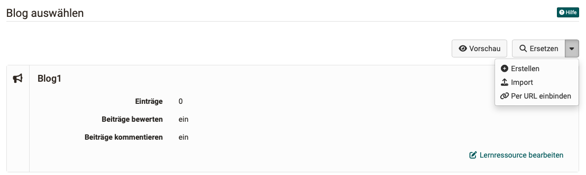
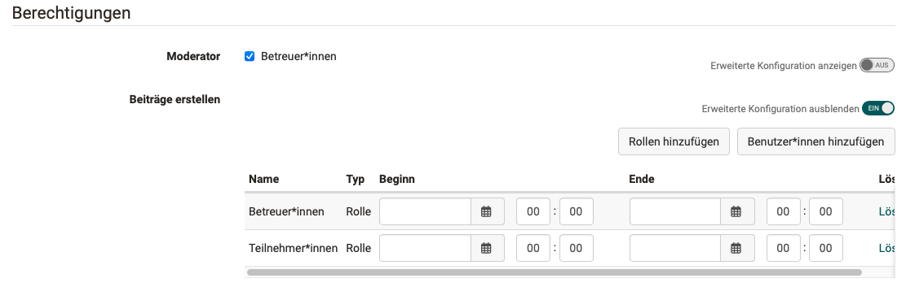

# Blog Configuration {: #blog_configuration}

The configuration of a blog takes place in two places: **in the course element** and **in the learning resource**.

## Configuration in the "Blog" course element {: #blog_configuration_course_element}

After you have inserted a course element "Blog" in the course editor, you will find the configurations for the learning resource and authorizations in the **"Blog learning content"** tab of the course element.

Depending on the course type, the display settings are possible in the tabs "Visibility" and "Access" (conventional courses) or "Layout" and "Learning path" (learning path courses).

{ class="shadow lightbox" }

###  Select blog

If no blog learning resource has been added yet, you can choose between

* Selecting an existing blog learning resource in the authoring area
* Creating a new blog learning resource
* Linking an external blog
* Importing an existing blog as a file

Once a learning resource has been inserted, the "Replace" button is displayed so that the learning resource can be replaced. You can also edit the blog learning resource directly from here.

{ class="shadow lightbox" }

!!! info ""

        You can choose an existing blog if you already run a blog independently of OpenOlat or if you want to integrate a well-known blog into your OpenOlat course as content or a basis for discussion. In this case, you cannot create your own blog posts, but the external posts can be starred and commented on.

        If you have decided on a type of blog (create entries yourself or integrate an external blog), you can no longer change this later.

###  Metadata configuration

Here you can determine whether the information entered in the blog **learning resource** under **Administration > Settings > Info tab** is adopted and displayed.

###  Notifications

**Moderator** 
At course element level, you can determine whether coaches can take on the [moderator role](../learningresources/Blog_Blogging.md#blogging--blog_blogging) in addition to the course owner. Since the same learning resource can be used in different courses and course elements, the learning resource can be configured with moderator rights for coaches in one course and without moderator rights for coaches in another course.

If you activate the toggle button "Show advanced configuration", you have the option of limiting the moderator role to certain time periods. You can also designate specific individuals (regardless of their role) as moderators.

{ class="shadow lightbox" }

**Create posts** 

This defines which groups of people in the course are allowed to create blog posts. In addition to the course owners, this can be all coaches and all participants.

!!! info "Note"

    If an external blog is integrated, you cannot influence who can create entries in OpenOlat. The authorization options for "Create posts" are therefore not displayed in this case.

If you activate the "Show advanced configuration" toggle button, you also have the option of limiting the right to create posts to certain time periods.

{ class="shadow lightbox" }

## Configuration of the "Blog" learning resource {: #blog_configuration_learningresource}

To configure the blog learning resource, you can

* select the learning resource in the authoring area or
* Click on "Edit learning resource" directly from the blog course element in the "Blog learning content" tab.

Then select **Administration > Settings**. Configure the blog learning resource in the tabs displayed here. The settings made here are applied to all courses or course elements in which you integrate the blog learning resource.

{ class=„shadow lightbox“ }

**Info** 
Here you enter the title, description or cover image of the blog learning resource.

**Metadata** 
Optionally, enter additional information on the classification of the learning resource, such as subject area or language.

**Sharing** 
The release settings correspond to those of other learning resources:

* Intended use (default: integration in the course, alternative: stand-alone learning resource)
* Direct link (for direct access to the learning resource)
* Administrative release (in which organizational units is the resource available)
* Usage rights for other authors (referencing, copying, exporting)
* Indexing for OER catalogs and search engines
* as well as a release overview (who has which rights to this learning resource)

**Quota** 
Here you can set the limits for the maximum storage space that may be used.

**Options** 
You can allow or prevent blog posts from being commented on and rated here.

## Further information

[Create blog](../learningresources/Blog_Create.md) 
[Step-by-step-instructions: How do I create a blog?](../../manual_how-to/blog/blog.md)
[Blogging](../learningresources/Blog_Blogging.md) 
[Course element blog](../learningresources//Course_Element_Blog.md)