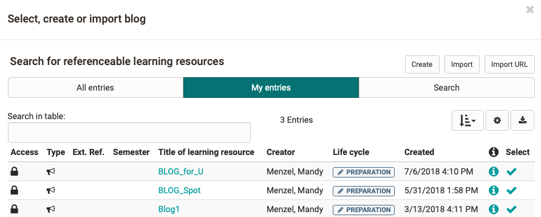
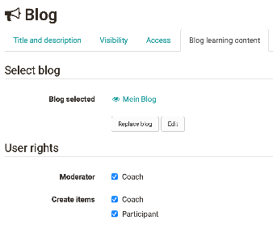
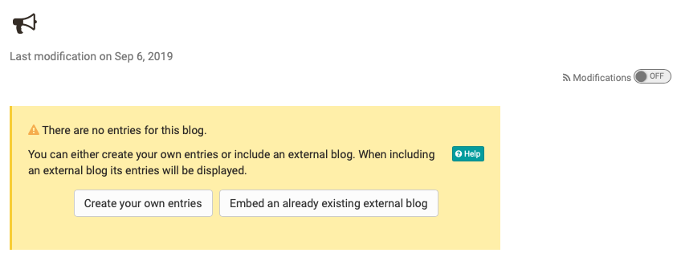

# Blog - Further Configurations

## Configuration in the course editor

### Tab: Blog learning content

In the "Blog learning content" tab, you can create a new blog, select an
existing OpenOlat blog, replace a blog associated with the course element,
import a blog, or edit an included blog.

In addition, you can set the user permissions in the tab.

### User rights

#### **Moderator**

Here you can configure whether all coaches are also allowed to moderate the
blog.

The moderating access allows to read, comment, edit, delete all entries and
create new entries. In addition, moderators can also customize the title and
description of the entire feed.

Afterwards, the blog can be further configured in the course run.

If an external blog is included, you cannot influence who is allowed to create
entries in OpenOlat.

In addition, depending on the course type, further settings are possible in
the Visibility + Access (conventional courses) or Learning Path (learning path
courses) tabs.

#### **Create posts**

Here you define which groups of people in the course are allowed to create
blog posts. In addition to the course owners, this can be all coaches and all
participants.

----

## Configuration of the blog in the course run

Close the course editor and the first time you open your new blog you will be
asked whether you want to integrate an existing external blog or create your
own entries in OpenOlat.

### Create entries yourself: OpenOlat internal blog

Click on "Create your own entries" if you or other course participants want to
create and edit blog entries directly in OpenOlat.

  
### Existing external blog

You can also use the Blog course element to include an external blog. When
editing the blog for the first time, select "Embed an already existing
external blog". In the "URL" field, enter the feed link of the external blog.
Usually this is a URL with the extension .xml. The entries of the external
blog are displayed in the course element. 

!!! warning "Attention"

    If you have decided on a type of blog (create entries yourself or integrate an external blog), you cannot change it later.

!!! info ""

    The choice of an existing blog is useful if you already run a blog independently of OpenOlat or if you want to integrate a well-known blog into your OpenOlat course as content or basis for discussion. In this case, you cannot create your own blog posts, but the external posts can be rated and commented with asterisks.

###  Subscribing to Blogs

Course participants can subscribe to a blog via RSS Feed to be informed as
soon as there are new entries. Scheduled (unpublished) blog entries will not
be considered in the notification.

  

