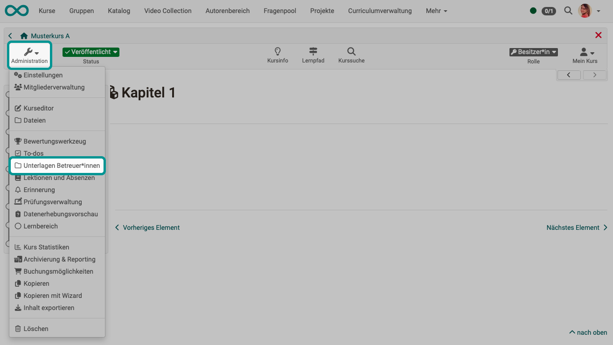

# Unterlagen Betreuer:innen {: #coach_files}

Für Betreuer:innen kann ein gemeinsamer Ordner zur Ablage von Dateien eingerichtet werden. Nur Betreuer:innen und Kursbesitzer:innen können auf diesen Ordner zugreifen.

{ class="shadow lightbox" }

Damit die Menüoption im Kurs unter "Administration" erscheint, muss zunächst im Kurs unter **"Administration" > "Einstellungen" > Tab "Optionen"** die Option "Unterlagen Betreuer:innen Ordner" aktiviert werden.

Als Ablageort kann im Tab Optionen ein bereits existierender Ordner des  
[Ablageordners](Storage_folder.de.md) des Kurses gewählt oder ein neuer Ordner speziell für die Betreuer:innen im Ablageordner generiert werden. 

Wird die Option "Automatisch generierter Ordner" gewählt, haben die Betreuer:innen im Gegensatz zu Kursbesitzer:innen keinen Zugriff auf andere Dateien oder Ordner, die sich im Ablageordner des Kurses befinden. Dagegen haben Kursbesitzer:innen, bzw. Personen mit Zugriff auf den Kurseditor, vollen Zugriff auf den Ablageordner und sehen auch die Dateien der Betreuer:innen im automatisch generierten Ordner "coachdocuments". Das bedeutet Kursbesitzer:innen haben immer Zugriff auf die Dateien des Betreuer:innen Ordners und können sie auch für die Verknüpfung mit bestimmten Kursbausteinen z.B. einer Einzelseite nutzen. Umgekehrt erhalten Betreuer:innen auch mit diesem Betreuer:innen Ordner keine Möglichkeit, Dateien in die Kursstruktur zu integrieren.

[Zum Seitenanfang ^](#coach_files)