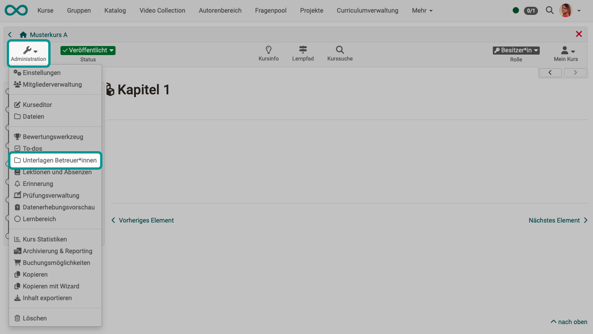

# Coach files {: #coach_files}

A shared folder can be set up for coaches to store files. Only coaches and course owners can access this folder.

{ class="shadow lightbox" }

In order for the menu option to appear in the course under "Administration", the option "Documents for coaches folder" must first be activated in the course under **"Administration" > "Settings" > "Options"** tab.

An existing folder of the [Storage folder](Storage_folder.md) of the course can be selected as the storage location in the Options tab or a new folder can be generated specifically for the coaches in the storage folder. 

If the "Automatically generated folder" option is selected, coaches, unlike course owners, do not have access to other files or folders located in the courses storage folder. On the other hand, course owners or people with access to the course editor have full access to the storage folder and can also see the coaches' files in the automatically generated "coachdocuments" folder. This means that course owners always have access to the files in the coach folder and can also use them to link to certain course elements, e.g. an individual page. Conversely, coaches do not have the option of integrating files into the course structure with this coach folder.

[To the top of the page ^](#coach_files)