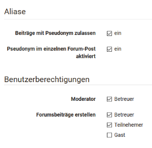
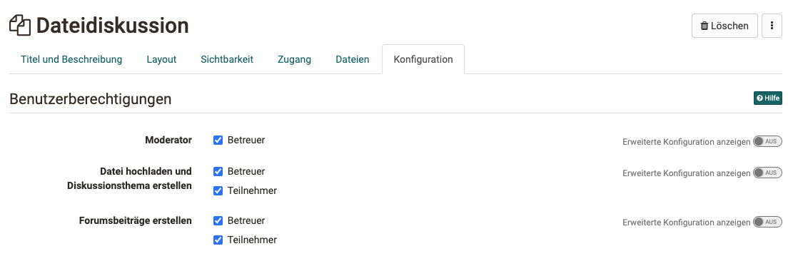
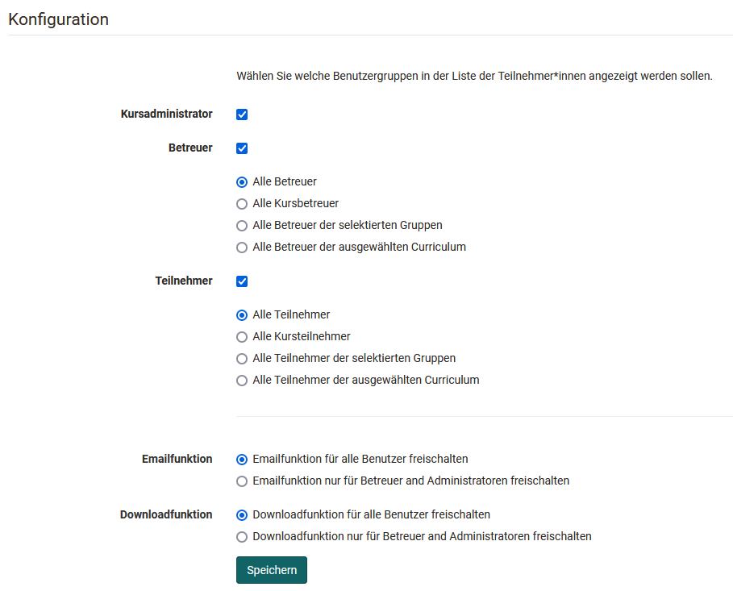

# Kommunikation und Kollaboration
Mehr Informationen zu [Virtuelle Klassenzimmer](../basic_concepts/Virtual_classrooms.de.md)

## Kursbaustein "Wiki" {: #wiki}
:fontawesome-solid-globe:

Verwenden Sie ein Wiki, um auf einfache Weise mit Teilnehmenden gemeinsam Inhalte zu erstellen. Ein Wiki kann für Gruppenarbeiten, als Dokumentationswerkzeug oder als Wissensbasis für Ihre Studien- oder Projektarbeit verwendet werden.

Mit dem Kursbaustein "Wiki" binden Sie eine Lernressource Wiki in Ihren Kurs ein. Klicken Sie im Tab "Wiki-Lerninhalt" auf "Wiki wählen, erstellen oder importieren", ordnen ein bereits erstelltes Wiki zu oder erstellen ein neues. Eine Schritt-für-Schritt-Anleitung zu Ihrem Wiki finden Sie im Kapitel "Wiki erstellen". Wenn Sie noch kein Wiki ausgewählt haben, erscheint beim Titel **Gewähltes Wiki** die Meldung _Kein Wiki ausgewählt_.

Wenn Sie schon ein Wiki hinzugefügt haben, erscheint dessen Name. Um die Zuordnung eines Wikis nachträglich zu ändern, klicken Sie im Tab "Wiki-Lerninhalt" auf "Wiki auswechseln" und wählen anschliessend ein anderes Wiki.

Im Tab "Wiki-Lerninhalt" konfigurieren Sie die Benutzerberechtigungen des Wikis. Hier können Sie einstellen, dass neben den Besitzer:innen auch Betreuer:innen und Teilnehmende Wiki-Artikel bearbeiten dürfen. Standardmässig haben alle Teilnehmenden Lese- und Schreibrechte in einem Wiki. Nur die Person, die die Seite erstellt hat, oder Personen, die beim Wiki als Besitzende eingetragen sind, dürfen Wiki-Seiten löschen.

Im Kapitel "Lernaktivitäten im Kurs" finden Sie unter dem Punkt "Wiki" Informationen dazu, wie die Wiki-Navigation angepasst werden kann, wie Sie neue Seiten erstellen und wie Sie die verschiedenen Versionen einer Seite betrachten können.

!!! warning "Achtung"

    Wenn Sie in Ihrer OpenOlat Instanz keinen Kursbaustein "Wiki" finden können, so wurde dies systemweit von einem Administrator ausgeschaltet.

## Kursbaustein "Forum" {: #forum}
:fontawesome-regular-comments:

Mit dem Kursbaustein "Forum" können Sie in Ihrem Kurs auf einfache Weise asynchrone Online-Diskussionen für unterschiedliche Zwecke ermöglichen. Beispielsweise können Teilnehmende Beiträge mit Fragen zum Inhalt des Kurses verfassen und gegenseitig beantworten oder Sie initiieren eine Fachdiskussion oder setzen spezifische forenbasierte Online-Methoden um. Im Kapitel "Lernaktivitäten im Kurs" finden Sie unter dem Punkt ["Forum"](../learningresources/Working_with_Forums.de.md) Informationen dazu, wie Forumsbeiträge erstellt und beantwortet werden. Standardmässig haben alle Teilnehmenden Lese- und Schreibrechte in einem Forum.

Sie können das Forum auch als Alternative für den Mitteilungsbaustein für Ankündigungen von Seiten der Kursautoren verwenden, besonders wenn Rückfragen von den Lernenden erwünscht sind.

!!! tip "Tipp"

    Empfehlen Sie den Teilnehmenden, das Forum zu abonnieren, um bei neuen Beiträgen benachrichtigt zu werden.

### Tab Konfiguration
Hier können die Benutzerberechtigungen des Forums eingestellt und definiert werden welche Kursrollen Forenbeiträge erstellen dürfen. Zur Wahl stehen Betreuer:innen, Teilnehmende und Gäste. Auch wird hier eingestellt, ob Betreuer:innen das Forum moderieren dürfen und ob in dem Forum pseudonymisierte Postings erlaubt sind. Bei pseudonymisierten Foren können sich die Beitragsersteller selbst ein Pseudonym auswählen. Ein einmal erstelltes Pseudonym bleibt im Forum immer aktiviert, kann aber je nach Bedarf geändert oder ausgeschaltet werden. Das Pseudonym kann von Teilnehmenden mit einem Passwort geschützt werden, damit nur diese Person dieses Pseudonym verwenden kann. Ohne Passwortschutz könnte dasselbe Pseudonym von mehreren Teilnehmenden verwendet werden. Weiter kann eingestellt werden, dass die Verwendung eines Pseudonyms standardmässig eingeschaltet ist. Wählen Sie dazu die Checkbox "Pseudonym im einzelnen Forum-Post aktiviert".

{ class="shadow lightbox" }

**Moderationsrechte**
Alle Kursbesitzer:innen und [Betreuer:innen](../basic_concepts/coach.de.md) verfügen über folgende weitere Moderationsrechte. Sie können:

  * Alle Forumsbeiträge editieren, löschen und Dateien anhängen.
  * Threads priorisieren (sticky): So erscheint das Diskussionsthema immer zuoberst auf der Liste.
  * Diskussionsthemen beenden: Antworten auf Beiträge zu diesem Diskussionsthema sind nicht mehr möglich.
  * Diskussionsthemen verbergen: Das Thema erscheint nicht mehr in der Liste der Diskussionsthemen.
  * Diskussionsthemen anzeigen: Verborgene Themen werden wieder angezeigt.
  * Personenfiltern nutzen: Auf der Forumsübersichtsseite können Forumsbeiträge einer einzelnen teilnehmenden Person angezeigt werden.
  * Foren archivieren: Forumsbeiträge (im MS Word-Format) und angefügte Dateien werden in eine ZIP-Datei verpackt und in Ihrem persönlichen Ordner gespeichert.

Personen mit Moderationsrechten können auch Forumsthemen oder einzelne Beiträge verschieben. Zum einen können die Beiträge in ein anderes Thema desselben Forums verschoben werden, zum anderen können ganze Forumsthemen oder Beiträge in ein anderes Forum verschoben werden. Dabei werden jeweils alle darunter liegenden Forumsbeiträge mit verschoben und sind anschliessend im Ursprungsforum nicht mehr sichtbar. Eine Verschiebung von Themen und Beiträgen in ein anderes Forum ist sowohl im selben Kurs als auch in andere Kurse möglich. Der verschobene Thread kann als neuen Diskussionsfaden angelegt werden. Im letzten Schritt der Verschiebung kann zudem ein E-Mail an alle vom Verschieben betroffenen Teilnehmenden geschickt werden, mit der Information, wohin das Forum nun verschoben wird.

!!! warning "Achtung"

    Forumsbeiträge können auch in Foren verschoben werden, in welchen der Ersteller des Beitrages keinen Zugriff hat.

Neben dem Kursbaustein "Forum" gibt es auch die Möglichkeit ein zentrales Forum für den gesamten Kurs in der [Kurs Toolbar](../learningresources/Using_Additional_Course_Features.de.md) anzeigen zu lassen. Das bietet sich häufig an, wenn der Kurs nur ein Forum umfasst, das permanent zur Verfügung stehen soll. Hier können jedoch keine weiteren Einstellungen wie Pseudonymisierung oder Vergabe von Moderationsrechten vorgenommen werden.

## Kursbaustein "Dateidiskussion" {: #file_dialog}

Der Kursbaustein Dateidiskussion kann als eine Kombination aus Forum und Ordner verstanden werden. Startpunkt ist jedoch anders als bei Foren immer ein hochgeladenes Dokument, das die Diskussionsbasis für die weitere, dem Dokument zugeordnete Forendiskussion bildet. 

Setzen Sie die Dateidiskussion beispielsweise ein, wenn Sie möchten, dass Ihre Lernenden sich gezielt zu einem Artikel, eine Grafik oder einen sonstigen Text äussern und die Inhalte diskutieren sollen. 

Sowohl bei geschlossenem Editor als auch bei geöffneten (im Tab "**Dateien**") ist es möglich, mit einem Klick auf "Datei hochladen", Dokumente in die Ablage der Dateidiskussion hochzuladen, die anschliessend von allen Teilnehmenden angesehen und heruntergeladen werden können. Das zugehörige Diskussionsforum wird automatisch erstellt und kann mit Klick auf "Anzeigen" aufgerufen werden. Durch die Auswahl der entsprechenden Spalten ist erkennbar wer wann welche Datei hochgeladen hat und wie der Diskussionsstand ist.

Wer neben den Kursbesitzer:innen noch welche Aktionen vornehmen kann, wird im Kurseditor in den Benutzerberechtigungen des Tabs "Konfiguration" definiert.

### Tab Konfiguration
Hier können die Benutzerberechtigungen des Bausteins eingestellt und definiert werden, welche Kursrollen Dateien hochladen und Diskussionsthemen erstellen dürfen. Zudem kann definiert werden, wer in den jeweiligen Diskussionsthemen Forumsbeiträge erstellen darf. Zur Wahl stehen Betreuer:innen und Teilnehmende. Auch wird hier eingestellt, ob Betreuer:innen die Dateidiskussion moderieren dürfen.

{ class="shadow lightbox" }

!!! warning "Achtung"

    Eine Diskussion kann erst beginnen, wenn eine entsprechende Datei hochgeladen wurde.

##  Kursbaustein "Teilnehmer:innen Ordner" {: #participant_folder}
:fontawesome-solid-inbox:

Der Kursbaustein "Teilnehmer:innen Ordner" ermöglicht einen Dateiaustausch zwischen einzelnen Teilnehmenden und Betreuenden. Dafür stehen zwei Ordner zur Verfügung. Zum einen ist dies der "Teilnehmer:innen Abgabeordner", über den Teilnehmende Dateien an Betreuer:innen abgeben können. Zum anderen der "Betreuer:innen Rückgabeordner", in welchem die Betreuer:innen Dateien an alle Teilnehmenden gleichzeitig oder individuell zurückgeben können. Im Prinzip verbergen sich hinter diesem Kursbaustein zwei Ordner, einmal mit Schreibberechtigung und einmal ohne, die jedoch nur für Betreuende und eine einzelne teilnehmende Person sichtbar sind.

!!! info "Hinweis"

    Eine ähnliche Konfiguration der Abgabe von Dateien und Dateirückgabe durch
    Betreuende kann auch mit dem [Kursbaustein "Aufgabe"](Course_Element_Task.de.md)
    umgesetzt werden, nur dass die Möglichkeiten des Aufgabenbausteins deutlich
    umfangreicher und komplexer sind und hier auch eine Bewertung bzw. Punktevergabe
    vorgenommen werden kann.

### Tab "Ordner Einstellungen"
In dem Tab "Ordner Einstellungen" im Kurseditor können Konfigurationen zum Abgabe- und Rückgabeordner vorgenommen werden. Standardmässig sind beide Ordner aktiviert und das Löschen und Überschreiben von Dateien ist den Teilnehmenden gestattet.

Ist der Teilnehmer:innen Abgabeordner aktiviert, können die Teilnehmenden Dateien hochladen oder direkt in OpenOlat erstellen. Wurden vom Administrator der OpenOlat Instanz weitere Dokumenteneditoren aktiviert, ist auch die Erstellung von weiteren Dateiformaten wie Word, Excel oder PowerPoint Dateien möglich.

Für den Teilnehmer:innen Abgabeordner können auch weitere Konfigurationen vorgenommen werden. So können das Löschen und Überschreiben deaktiviert werden. Dies bedeutet, dass die Teilnehmenden keine Dokumente mehr löschen können, sobald sie diese hochgeladen bzw. erstellt haben. Alle Dokumente bleiben zwingend im Abgabeordner. Weiter kann ein Zeitfenster für die Abgabe festgelegt werden. Die Abgabe ist nur in diesem Zeitraum möglich. Ausserhalb des Zeitraumes können Dokumente nur heruntergeladen werden.

Zudem kann die Anzahl Dokumente, welche abgegeben werden können, eingeschränkt werden. Sobald diese Zahl erreicht ist, stehen keine Schreibwerkzeuge mehr zur Verfügung. Das heisst, die Dokumente können nicht mehr verschoben, kopiert, gezippt oder entzippt werden. Sie können jedoch weiterhin gelöscht werden. Falls gewünscht kann auch nur der Abgabe- oder nur der Rückgabeordner aktiviert werden.

!!! warning "Achtung"

    Für den Teilnehmer:innen Ordner existiert wie für alle Upload Bereiche eine Speicherbegrenzung. Die vom Administrator eingestellte Begrenzungen für den Upload der Datei und die Begrenzung des gesamten Ordners wird angezeigt, wenn man versucht, eine Datei hochzuladen.

### Tab Template Einstellungen

Im Tab "Template Einstellungen" können sowohl für den Abgabe- als auch den Rückgabeordner Unterordner angelegt und so eine durchgehende Ordner-Struktur für alle Teilnehmenden angelegt werden. Zum Beispiel könnte ein Rückgabeordner einen Unterordner für inhaltliche Feedbacks und einen für ergänzende Dateien umfassen, oder ein Abgabeordner könnte eine gewisse gewünschte Struktur für die Abgaben widerspiegeln.

!!! warning "Achtung"

    Die hier angelegten Unterordner können später nicht umbenannt werden. Lediglich ein Löschen und Neuanlegen ist möglich. Im Kursrun werden beim Versuch diese Unterordner umzubenennen Kopien der Unterordner mit neuem Namen erstellt.

## Kursbaustein "Teilnehmerliste"  {: #participant_list}
:fontawesome-solid-users:

In der Teilnehmerliste können die Mitglieder des Kurses für alle sichtbar gemacht werden. Im Gegensatz zum Kurswerkzeug [Mitgliederverwaltung](../learningresources/Members_management.de.md), das nur für Besitzende sichtbar ist, werden mit dem Kursbaustein "Teilnehmerliste" alle Teilnehmenden des Kurses für alle Personen sichtbar, die den Kurs öffnen können. Die Mitglieder werden sortiert nach ihrer Kursrolle nach "Kursadministrator:innen", "Betreuer:innen" und "Teilnehmende" mit Foto nach ihrer "höchsten" Rolle aufgelistet. In der Konfiguration können Sie festlegen, welche Benutzergruppen in der Teilnehmerliste angezeigt werden sollen.

{ class="shadow lightbox" }
Durch die Verlinkung auf die OpenOlat-Visitenkarte sowie der Möglichkeit aus dem Kursbaustein heraus eine OpenOlat-Mail an jedes gewünschte Mitglied des Kurses zu schreiben, ermöglicht dieser Kursbaustein weitere Teilnehmende einfach und problemlos zu kontaktieren. Im Kurseditor können Sie festlegen, ob die E-Mailfunktion für alle Teilnehmenden oder nur für Besitzende und Betreuende verfügbar sein soll. Mails an einzelne oder mehrere Personen(-gruppen) werden in der Kursansicht über die Schaltfläche "E-Mail versenden" verschickt. Im Formular können nach Bedarf auch externe Mailadressen hinzugefügt werden.

Neben der Mailfunktion ist in der Kursansicht auch die Chatfunktion in der Teilnehmerliste verfügbar. Der Online-Status jeder teilnehmenden Person ist neben dem Namen sichtbar. Ein Klick darauf öffnet das Chatfenster (Instant Messenger).

Zum Schluss kann definiert werden, wer die Teilnehmerliste als Excel herunterladen oder als Übersicht ausdrucken darf. Wiederum wird unterschieden zwischen Betreuenden und Administrator:innen oder allen Teilnehmenden.

!!! info "Wichtig"

    In der Toolbar steht mit dem Werkzeug "Liste der Teilnehmer:innen" eine ähnliche Funktion zur Verfügung. Allerdings können hier keine weitere Konfigurationen vorgenommen werden.

## Weiterführende Informationen {: #further_information}

[Virtuelle Klassenzimmer >](../basic_concepts/Virtual_classrooms.de.md) 
[Arbeiten mit Foren >](Working_with_Forums.de.md) 
[Rolle Betreuer:in >](../basic_concepts/coach.de.md) 
[Einsatz weiterer Kursfunktionen der Toolbar >](Using_Additional_Course_Features.de.md) 
[Kursbaustein "Aufgabe" >](Course_Element_Task.de.md) 
[Mitgliederverwaltung >](Members_management.de.md)

[zum Seitenanfang ^](#kommunikation-und-kollaboration)

