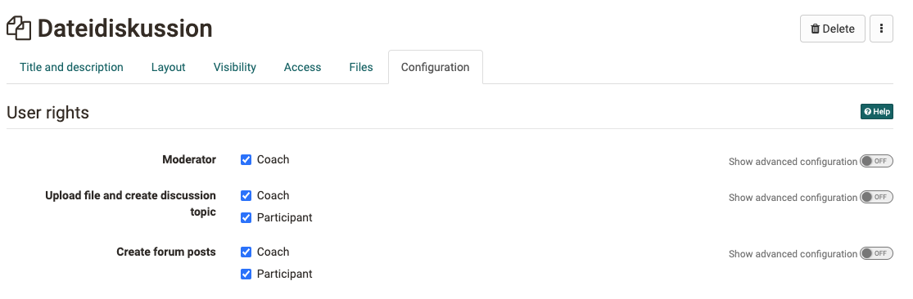

# Communication and Collaboration
Get more info on [Virtual classrooms](../basic_concepts/Virtual_classrooms.md)

## Course Element: Wiki {: #wiki}
:fontawesome-solid-globe:

Use a Wiki to easily create learning content together with participants. A Wiki is suitable for group work, as a documentation tool, or as a knowledge base for your studies or project work.

The course element "Wiki" helps you to embed a Wiki learning resource in your course. In the tab "Wiki learning content", click "Select, create or import Wiki" to assign a Wiki that already exists or to create a new one. The chapter ["Creating Wikis"](../resource_wiki/Four_Steps_to_Your_Wiki.md) describes this step by step. If you have not selected a Wiki yet, the title **Selected Wiki** shows the message _No Wiki selected_.

If you have already added a Wiki, its name appears. To change the assignment of a Wiki afterwards, click "Replace Wiki" in the tab "Wiki learning content" and then select another Wiki.

In the tab "Wiki learning content" you configure the user permissions of the Wiki. Here you can set that besides owners, coaches and participants may also edit Wiki articles. By default, all participants have read and write permission in a Wiki. Only the person who created the page, or persons registered as owners of the Wiki, may delete Wiki pages.

In the chapter "Learning Activities in Courses" you find under ["Wiki"](../learningresources/Course_Element_Wiki.md) information on how the Wiki navigation can be adapted, how you create new pages, and how you view the different versions of a page.

!!! warning "Attention"

    If you cannot find the "Wiki" course element in your OpenOlat instance, it was disabled system-wide by an administrator.

##  Course Element: Forum {: #forum}
:fontawesome-regular-comments:

With the course element "Forum" you can easily enable asynchronous online discussions for different purposes in your course. For example, participants can write posts with questions about the content of the course and answer each other, or you can initiate a technical discussion or implement specific forum-based online methods. In the chapter "Learning Activities in Courses" you find under ["Forum"](../learningresources/Working_with_Forums.md) information on how forum posts are created and answered. By default, all participants have read and write permission in a forum.

You can also use the forum as an alternative to the notification element for announcements from course authors, especially when questions from learners are welcome.

!!! tip "Tip"

    Advise participants to subscribe to the forum to be notified of new posts.

### Tab Configuration
Here you can set the user permissions of the forum and define which course roles are allowed to create forum posts. You can choose between coaches, participants and guests. You can also set whether coaches are allowed to moderate the forum and whether pseudonymized postings are allowed in the forum. In pseudonymized forums, the authors of a post can choose their own pseudonym. Once a pseudonym has been created, it always remains active in the forum, but can be changed or switched off as needed. The pseudonym can be protected by participants with a password, so that only this person can use this pseudonym. Without password protection, the same pseudonym could be used by several participants. Furthermore, it can be set that the use of a pseudonym is enabled by default. To do this, select the checkbox "Pseudonym activated in individual forum posts".

{ class="shadow lightbox" }

**Moderation rights**
All course owners and [coaches](../basic_concepts/coach.md) have the following additional moderation rights. They can:

  * Edit and delete all forum posts and attach files.
  * Prioritize threads (sticky): the discussion topic then always appears at the top of the list.
  * Close discussion topics: replies to posts on this discussion topic are no longer possible.
  * Hide discussion topics: the topic no longer appears in the list of discussion topics.
  * Show discussion topics: hidden topics are shown again.
  * Use the person filter: on the forum overview page, forum posts of a single participant can be displayed.
  * Archive forums: forum posts (in MS Word format) and attached files are packed into a ZIP file and saved in your personal folder.

People with moderation rights can also move forum topics or individual posts. On one hand, posts can be moved to another topic of the same forum; on the other hand, entire forum topics or posts can be moved to another forum. All underlying forum posts are moved along with them and are then no longer visible in the original forum. Moving topics and posts to another forum is possible both within the same course and to other courses. The moved thread can be created as a new discussion thread. In the last step of the move, an email can also be sent to all participants affected by the move, with information on where the forum is now moved to.

!!! warning "Attention"

    Forum posts can also be moved to forums the creator of the post has no access to.

Besides the course element "Forum", there is also the option to display a central forum for the entire course in the [course toolbar](../learningresources/Using_Additional_Course_Features.md). This is often useful when the course only has one forum that should be permanently available. No further settings such as pseudonymization or assignment of moderation rights can be made here.

## Course Element: File Dialog {: #file_dialog}

The course element File Dialog can be understood as a combination of forum and folder. Unlike with forums, the starting point is always an uploaded document, which forms the basis for discussion in the associated forum discussion.

Use the file dialog, for example, when you want your learners to comment specifically on an article, a graphic or another text, and discuss its content.

Whether the editor is closed or open (in the tab "**Files**"), you can click "Upload file" to upload documents to the file dialog's storage; participants can then view and download them. The associated discussion forum is created automatically and can be opened by clicking "Show". By selecting the relevant columns, you can see who uploaded which file when and what the discussion status is.

Who, besides the course owners, can take which actions is defined in the course editor in the user permissions of the tab "Configuration".

### Tab Configuration
Here you can set the user permissions of the element and define which course roles are allowed to upload files and create discussion topics. You can also define who may create forum posts in the respective discussion topics. You can choose between coaches and participants. It can also be set here whether coaches are allowed to moderate the file dialog.

{ class="shadow lightbox" }

!!! warning "Attention"

    A discussion can only start once a corresponding file has been uploaded.

##  Course Element: Participant folder {: #participant_folder}
:fontawesome-solid-inbox:

The course element "Participant folder" allows a file exchange between individual participants and coaches. Two folders are available for this. One is the "participant drop box", through which participants can submit files to coaches. The other is the "coach return box", in which coaches can return files to all participants at once or individually. In principle, this course element hides two folders, one with write permission and one without, which are visible only to coaches and a single participant.

!!! info "Note"

    A similar configuration for submitting and returning files by coaches can also be implemented with the [course element "Task"](Course_Element_Task.md), except that the task element offers considerably more comprehensive and complex options, and here also allows assessment or awarding of points.

### Tab "Folder settings"
In the tab "Folder settings" in the course editor, you can configure the drop box and the return box. By default, both folders are enabled, and participants are allowed to delete and overwrite files.

If the participant drop box is enabled, participants can upload files or create them directly in OpenOlat. If the administrator of the OpenOlat instance has activated further document editors, it is also possible to create other file formats such as Word, Excel or PowerPoint files.

Further configurations can also be made for the participant drop box. For example, delete and overwrite can be disabled. This means participants can no longer delete documents once they have uploaded or created them. All documents then remain in the drop box. A time window for submission can also be defined. Submission is then only possible within this period. Outside this period, documents can only be downloaded.

In addition, the number of documents that can be submitted can be limited. Once this number is reached, no writing tools are available anymore. This means the documents can no longer be moved, copied, zipped or unzipped. However, they can still be deleted. If desired, only the drop box or only the return box can be enabled.

!!! warning "Attention"

    As with all upload areas, a storage limit applies to the participant folder. The upload limit for the file, set by the administrator, and the limit for the entire folder are shown when you try to upload a file.

### Tab Template settings

In the tab "Template settings", subfolders can be created for both the drop box and the return box, creating a consistent folder structure for all participants. For example, a return box could include a subfolder for content feedback and one for supplementary files, or a drop box could reflect a certain desired structure for submissions.

!!! warning "Attention"

    Subfolders created here cannot be renamed later. Only deleting and recreating them is possible. In the course run, attempting to rename these subfolders creates copies of the subfolders under the new name.

##  Course Element: Participant list {: #participant_list}
:fontawesome-solid-users:

In the participant list, the members of the course can be made visible to everyone. Unlike the course tool [Member management](../learningresources/Members_management.md), which is only visible to owners, the course element "Participant list" makes all participants of the course visible to all persons who can open the course. Members are listed by their course role, sorted as "course administrators", "coaches" and "participants", with a photo, according to their "highest" role. In the configuration, you can define which user groups are displayed in the participant list.

{ class="shadow lightbox" }
By linking to the OpenOlat business card, and the option to send an OpenOlat mail to any desired member of the course directly from the course element, this course element makes it easy and straightforward to contact other participants. In the course editor, you can define whether the e-mail function is available for all participants, or only for owners and coaches. Mails to individual or multiple persons (groups) are sent from the course view via the "Send e-mail" button. External mail addresses can also be added to the form as needed.

Besides the mail function, the chat function is also available in the participant list in the course view. The online status of each participant is visible next to their name. Clicking it opens the chat window (instant messenger).

Finally, it can be defined who is allowed to download the participant list as Excel or print it as an overview. Again, a distinction is made between coaches and administrators, or all participants.

!!! info "Important"

    A similar function is available in the toolbar with the "List of participants" tool. However, no further configuration can be made here.

## Further information {: #further_information}

[Virtual classrooms >](../basic_concepts/Virtual_classrooms.md) 
[Working with forums >](Working_with_Forums.md) 
[Role: Coach >](../basic_concepts/coach.md) 
[Using additional course features in the toolbar >](Using_Additional_Course_Features.md) 
[Course element "Task" >](Course_Element_Task.md) 
[Member management >](Members_management.md)

[To the top of the page ^](#communication-and-collaboration)
