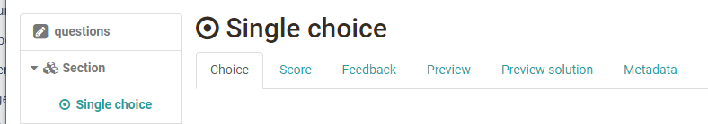
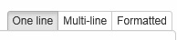
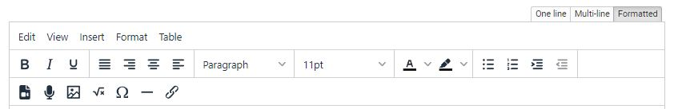
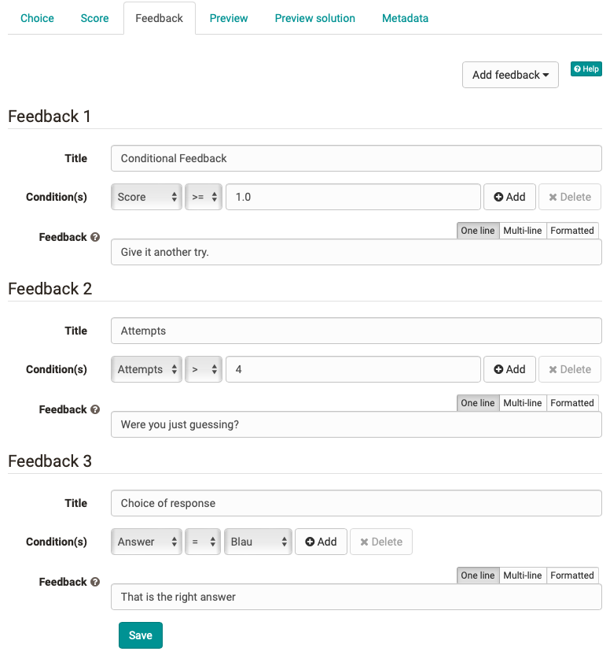

# Configure test questions

With each [question type](Test_question_types.md) you have the following tabs available: Name of the question type, Score, Feedback, Preview, and Preview Solution. In the following, the individual tabs for setting up a test question are explained in more detail.

{ class="shadow" }

## Tab Choice

In the first tab called "Choice" or the respective question type name, the actual question and the alternative answers are entered. Depending on the question type, more setup options are available. For example, you may define whether the answers will be displayed randomly. Furthermore, you can change formatting and other settings. For the question types Single and Multiple Choice, as well as KPrim, the tabs question type and Feedback contain three formatting options:

{ class="shadow" }

By default "One line" is chosen, which is for answers using only one line and no further formatting is necessary. Use the option "Multi-line" if answers consist of two or more lines and no further formatting is necessary. Use "Formatted" if the answer consists of images, videos, links, mathematic formulas or any other formatting which can be created in the html editor of OpenOlat.

{ class="shadow lightbox" }

## Tab Score {: #score}

In the tab "Score" you can define the number of attempts for a question, set the minimum and maximum score, and define how the question shall be rated.

The following settings are possible:

* **Limit number of attempts:**

    * **Yes**: Specify here how often the user may edit and save this question. The corresponding maximum number will then also be displayed during test editing. For example, if the number 1 is entered, the user can only edit and save the question once. Changes are then no longer possible. This is especially important if you are working with answer-specific feedback but do not want the user to be able to revise his answer based on this feedback during test editing.
    * **No**: The number of attempts is unlimited. In this case, the user can save and correct his answers as many times as he wants. However, you can still limit attempts to work on a specific section or the whole test.
    * **Inherit:** The number of attempts is taken form the level above.

* **Min. score:** For the question types single choice, multiple choice, hotspot, matrix and drag&drop, where it is possible to get a negative value, the minimum reachable score can be defined. Also for a negative total score the result can be set to 0 to avoid a negative score or a negative score can be tolerated. For all question types the default is set to 0.

* **Max. score:** Fill in the maximum score which can be reached in this question.

* **Method of assessment:** For most question types, the type of scoring can also be defined.  

    * If **"All correct answers"** is chosen, the score can only be reached when all answers are correct.
    * If **"Score per answer"** is chosen, you can datermine in the column _Points_ what score is given per answer. Negative points are also possible here. No matter what is inserted here, with the summation the maximum score cannot be exceeded.
    * **"Partial score"** can be set for multiple choice, hotspot, hottext, drag and drop, matrix, gap (text and numeric), gap with dropdown.In the calculation, a weighted score is added for each correctly selected answer, while a weighted score is subtracted for each incorrectly selected answer. (new in :octicons-tag-24: Release 18.1.)
    * For gap text and numerical input questions different **"Score per answer and alternatives"** can also be assigned and thus, for example, partial points can be stored for "half correct" answers.
    * The method of assessment cannot be chosen for Kprim, upload file, drawing or essay.

## Tab Feedback {: #feedback}

You can add different types of feedback to each question. e.g. hints to help with the answer, or provide the correct answer if certain conditions are met. This allows you to support the learner in a very effective way, especially with formative or self testing. Feedback and hints are mostly used with self tests, since you can push the learner towards the correct answer by providing helpful information. Such feedbacks are also helpful for self-learning tutorials.  

You can add and even combine the following types of feedback:

* **Hint:** The solution hint appears in the form of a question mark under the question. The user can click on the question mark and then receives the solution hint. This variant is suitable, for example, to provide additional links or texts, but not necessarily to provide the correct solution.  
* **Correct solution:** The solution is shown automatically, if the answer is wrong. _Special case essay, file upload and drawing question types: The solution will not be shown during the test. But this feedback option can be used to provide the sample solution, which is shown in the correction workflow (assessment tool) and in the results report._
* **Feedback for all correct answers:** The feedback appears only if all answers are correct. You could for example add a praise for the correct answer.
* **Feedback for wrong answer:** This feedback appears as soon as one answer is wrong. Example: In the case of a multiple choice or KPRIM question or an extensive gap text of 50 gaps, feedback is displayed as soon as at least one answer is incorrect. The feedback types allows you to signal the learner that he/she is on the right track, although not all answers have been answered correctly yet.
* **Conditional feedback:** This feedback variant offers a lot of potential for more individualized feedback. Depending on the question type you may define feedback which is dependent on the _score_, the _number of attempts_, or the _answer_ provided by the learner. Conditional feedback allows you to individualise feedback. The learner can be provided with a specific feedback to a specific answer. You can thus address common errors, for example. Depending on the criteria additional options may be available: such as equal to (=), not equal to (≠), or smaller/greater than (<, >). You can even combine criteria of conditional feedback.

  { class="shadow lightbox" }

Feedback typically requires a title and a feedback text. The title is optional, whereas the feedback text is mandatory if feedback shall be displayed. If the feedback text is missing, the feedback will not be shown, and the entry will be deleted, respectively. If no feedback is available, the learner is guided to the next question when clicking on "Submit answer".

For tests already in use, the stored feedback on the questions can still be edited, but it is not possible to add new feedback.

"Feedback for all correct answers" is not effective in a Multiple Choice question where no wrong, but not all correct answers are chosen.

At the [test level](Configure_tests.md), you can set the overall feedback of a test in the Test Editor in the "Feedback" tab. Under `Administration > Settings > Options`, the feedbacks for a test can generally be switched on or off.

## Preview

In the preview all questions are visible like the test participant will see them afterward. Here you can try if all configurations are correct (e.g. feedback).

## Preview solution

In the Preview solution the Model solution is shown. That is the correct solution which will also be shown in the result reporting. Especially for gap-text questions this preview can be helpful als the whole text with the solutions of every gap will be shown and can be read as fluent text. In the gap only the solution is inserted, but not the alternatives.

## Tab Metadata

Here you can store additional metadata for each question. In the "General" section, this includes information on the topic, subject area, language, type of test, etc.

In the area "Item analysis" the average processing time of the question, the difficulty, the selectivity, the required correction time, etc. can be specified.

In the "Technical" area, further information is displayed. These settings as well as further information on the [metadata](../area_modules/Item_Detailed_View.md) can also be found in the [question pool](../area_modules/Question_Bank.md).
