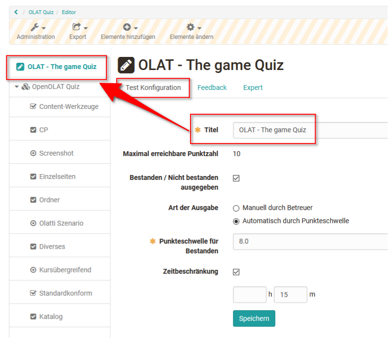
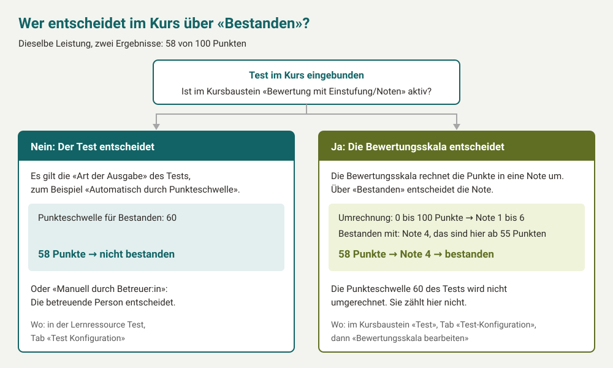
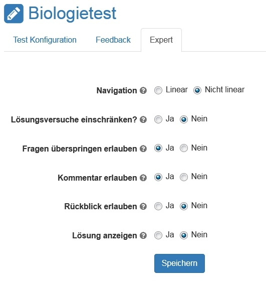

# Test konfigurieren

Für die OpenOlat Tests stehen weitere Strukturierungs- und Konfigurationsmöglichkeiten zur Verfügung. Grundsätzlich besteht jeder Test mindestens aus einer Sektion und einer Frage. Deshalb finden Sie beim Erstellen eines neuen Tests bereits eine Sektion ("Sektion") und eine Single-Choice-Frage ("Single Choice"). Falls in Ihrem Test keine Single-Choice-Frage vorkommt, können Sie die standardmässig angelegte Single-Choice-Frage löschen, sobald Sie eine andere Frage hinzugefügt haben.

Alle hier beschriebenen Einstellungen nehmen Sie im Testeditor vor: `Test > Administration > Testeditor`. Den Testeditor öffnen Besitzer:innen des Tests, Administrator:innen und Lernressourcenverwalter:innen.

Einstellungen für Tests können auf drei Ebenen vorgenommen werden:

* auf Ebene Test: Einstellungen für den gesamten Test
* auf Ebene Part: Einstellungen für Bereiche mit Fragen und Sektionen
* auf Ebene Sektion: Einstellungen für einzelnen Sektionen

Dabei ist die Test Ebene die oberste Ebene. Der Test kann dann mehrere Parts enthalten, die wiederum verschiedene Sektionen beinhalten. Enthält ein Test nur einen Part, kann dieser Part trotzdem mehrere Sektionen umfassen.

**Sektionen** werden zur Gliederung Ihres Tests verwendet. Häufig werden zum Beispiel zuerst einleitende Fragen gestellt und dafür eine Sektion "Allgemeines" erstellt. Ihr Test kann aus beliebig vielen Sektionen bestehen. Eine Verschachtelung mehrerer Sektionen untereinander ist möglich.

Wenn Sie eine neue Sektion oder einen weiteren Part hinzufügen möchten, wählen Sie oben im Dropdown-Menü `Elemente hinzufügen > Sektion` bzw. `Test-Part`. Anschliessend können Sie der Sektion konkrete Fragen zuordnen.

Im Folgenden werden die Einstellungsmöglichkeiten auf den drei Ebenen erläutert:

## Test Ebene

Auf Ebene des Tests legen Sie den Titel fest, der in der Navigation erscheint. Zudem können folgende Konfigurationen ausgewählt werden:

{ class="shadow lightbox" }

### Tab Test Konfiguration

* **Maximal erreichbare Punktzahl:** Diese Punktzahl wird von den Punkten der einzelnen Fragen im Test automatisch berechnet.
* **Bestanden / Nicht bestanden ausgegeben:** Aktivieren Sie das Feld, wenn für den Test ein "bestanden" bzw. "nicht bestanden" angezeigt werden soll.
* **Art der Ausgabe:** Ist "Bestanden / Nicht bestanden ausgegeben" aktiviert, legen Sie hier fest, wie das Ergebnis zustande kommt: "Automatisch durch Punkteschwelle" oder "Manuell durch Betreuer:in". Diese Einstellung und die Punkteschwelle gelten auch, wenn Sie den Test in einen Kurs einbinden. Ausnahme: Aktivieren Sie dort die Option "Bewertung mit Einstufung/Noten", rechnet die Bewertungsskala die erreichten Punkte in eine Note oder Stufe um, zum Beispiel 0 bis 100 Punkte in Schweizer Noten von 1 bis 6. Ob der Test bestanden ist, entscheidet dann die Note: Die Bewertungsskala legt mit "Bestanden mit" fest, ab welcher Note der Test bestanden ist, zum Beispiel ab Note 4. Die Punkteschwelle des Tests wird dabei nicht umgerechnet und zählt nicht mehr, siehe [Kursbaustein "Test"](Course_Element_Test.de.md#section_test) und [Einstufung/Noten](Assessment_translate_points_in_grades.de.md).

    { class="shadow lightbox" }
* **Punkteschwelle für Bestanden:** Geben Sie hier die Punktzahl ein, die mindestens notwendig ist, damit der Test als bestanden gilt.
* **Zeitbeschränkung:** Die Zeitbeschränkung kann für den gesamten Test definiert werden. Es können Stunden und Minuten definiert werden. Den Teilnehmenden wird oberhalb des Tests angezeigt, wie viel Zeit ihnen noch zur Verfügung steht. Durch die farbliche Hervorhebung wird zusätzlich das nahende Ende des Tests verdeutlicht. Eine Zeitbeschränkung für eine Sektion oder einzelne Fragen ist nicht möglich.

    Sobald die Zeit abgelaufen ist, wird der Test eingezogen. Antworten, welche noch nicht gesendet wurden, werden als leere, nicht beantwortete Fragen behandelt und geben keine Punkte. Es wird nicht nachgefragt, ob die Frage gespeichert werden soll oder nicht. Das Feedback über den gesamten Test und der Rückblick gehören der Zeiterfassung an.

!!! note "Hinweis"

    Eine zeitliche Beschränkung des Tests kann sowohl direkt im Testeditor wie hier beschrieben oder nach dem Einbinden des Tests in einen Kurs im Kurseditor im Tab `Optionen` eingerichtet werden. Wenn nötig kann die Testzeit auch für einzelne Personen im [Bewertungswerkzeug](../learningresources/Assessment_tool_overview.de.md) verlängert werden.

### Tab Feedback

* **Feedback, wenn notwendige Punktzahl für "Bestanden" erreicht:** Geben Sie hier ein Gesamtfeedback ein, wenn die Punktzahl für bestanden erreicht ist.
* **Feedback, wenn notwendige Punktzahl für "Bestanden" _nicht_ erreicht:** Tragen Sie hier ein Gesamtfeedback ein, wenn die Punktzahl nicht ausreicht.

### Tab Expert {: #expert} [:octicons-tag-16:{ title="ab Release 20.3.0 (OO-8321)" }](https://track.frentix.com/issue/OO-8321)

Im Tab "Expert" (oder auf der Ebene Part, sofern ein Part hinzugefügt wurde) können folgende Konfigurationen vorgenommen werden:

{ class="shadow lightbox" }

* **Navigation:**

    * Linear: Alle Fragen müssen der Reihe nach beantwortet werden. Es kann nicht zwischen den Fragen hin und her gesprungen werden
    * Nicht linear: Die Fragen können in der gewünschten Reihenfolge beantwortet werden.

* **Anzahl Versuche einschränken:** Wenn nur eine gewisse Anzahl an Lösungsversuchen zulässig sein soll, kann dies hier definiert werden. Diese Einschränkung gilt jedoch nur für den Testpart. Wenn die Anzahl Lösungsversuche für den gesamten Test eingeschränkt werden sollen, muss dies unter Optionen oder im Kursbaustein Test vorgenommen werden. Enthält ein Test nur einen Test-Part gilt die Einstellung ebenfalls für den gesamten Test.

    Wenn die Anzahl Lösungsversuche auf Ebene Test oder Part eingeschränkt wird, vererbt sich diese Einschränkung auf alle darunter liegenden Sektionen und Fragen.

* **Fragen überspringen erlauben:** Wenn diese Option gewählt ist, kann der Test beendet werden, bevor alle Fragen beantwortet sind.

* **Persönliche Notizen erlauben:** Die Teilnehmenden können sich persönliche Notizen machen, welche nach dem Beenden des Tests nicht mehr zur Verfügung stehen und nicht ausgewertet werden. Diese Funktion kann nur gewählt werden, wenn unter Optionen "Persönliche Notizen" ausgewählt ist.

* **Rückblick erlauben:** Nach dem Beenden des Tests kann der Test und die Antworten nochmals angeschaut, aber nicht mehr korrigiert werden.

* **Lösung anzeigen:** Beim Rückblick werden zusätzlich die Lösungen angezeigt. Diese Funktion ist nur möglich, wenn "Rückblick erlauben" ausgewählt ist.

## Part Ebene

Auf der Ebene Part verhält es sich praktisch wie auf der Ebene des Tests. Jeder erstellte Test besteht aus einem Part. Dieser wird jedoch zunächst nicht separat dargestellt. Die Parts sind erst sichtbar, wenn mindestens ein weiterer Part hinzugefügt wird und der Test somit aus mindestens zwei Parts besteht.

Sobald zwei oder mehr Parts bestehen, wird der Tab "Expert" in die Konfigurationen der Parts verlagert und erfolgt nicht mehr auf der Ebene des Tests. So können Bereiche eines Tests unterschiedlich konfiguriert werden, z.B. ein Bereich in dem Fragen übersprungen werden dürfen und einen in dem alle Fragen beantwortet werden müssen oder ein Bereich mit eingeschränkten Lösungen und ein Bereich ohne Einschränkung.  

## Sektion Ebene {: #section}

Einem Test Part können mehrere Sektionen untergeordnet werden. Mehrere verschachtelte Sektionen mit Beschreibung werden untereinander angezeigt und können jeweils separat ein- und ausgeblendet und auch zufällig sortiert angezeigt werden. Existiert für einen Test nur ein Test Part, erscheinen alle Sektionen auf der obersten Ebene.

Im Tab **"Sektion"** kann eine Beschreibung für die Sektion eingetragen und definiert werden ob alle oder nur eine Auswahl der Fragen der Sektion erscheinen sollen. Ferner kann die Art der Reihenfolge, zufällig oder linear definiert werden.

Der Tab "Expert" der Test oder Part Ebene kann auf Sektionsebene noch einmal überschrieben und geändert werden. Damit ist für einzelne Sektionen ein abweichendes Verhalten im Vergleich zum restlichen Test konfigurierbar.

Ist die Sichtbarkeit des Sektionstitels im Tab "Expert" aktiviert, so wird auch die jeweilige Sektionsbeschreibung an folgenden Stellen in OpenOlat angezeigt:

* Im Test, wenn eine zur Sektion zugehörige Frage aufgerufen wird. Die Sektionsbeschreibung kann von den Teilnehmenden aus- und eingeblendet werden.
* In den Testresultaten.
* Im Korrektur-Workflow an den zu dieser Sektion gehörenden Fragen.

## Weiterführende Informationen {: #further_information}

[Kursbaustein "Test" >](Course_Element_Test.de.md) 
[Einstufung/Noten >](Assessment_translate_points_in_grades.de.md) 
[Bewertungswerkzeug - Übersicht >](Assessment_tool_overview.de.md) 
[Testeditor >](Test_editor_QTI_2.1.de.md) 
[Test Einstellungen - Administration >](Test_settings.de.md)

[Zum Seitenanfang ^](#test-konfigurieren)
