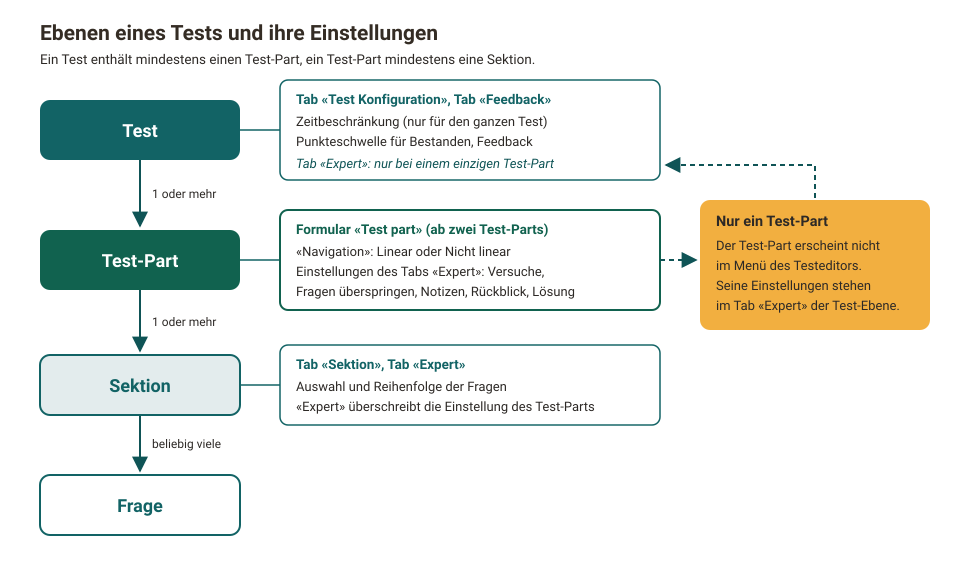
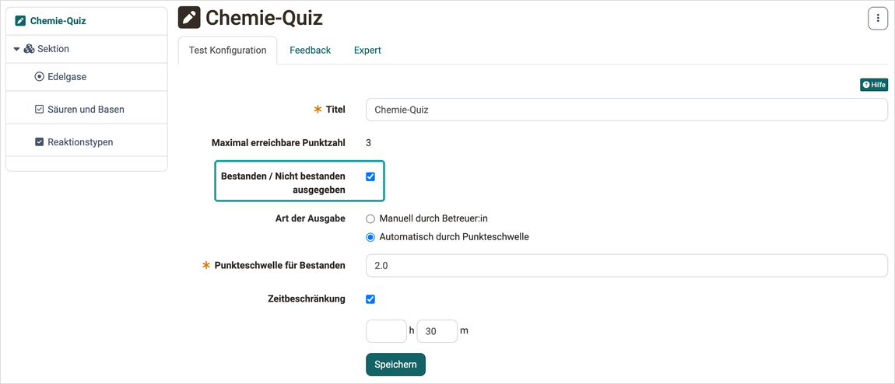
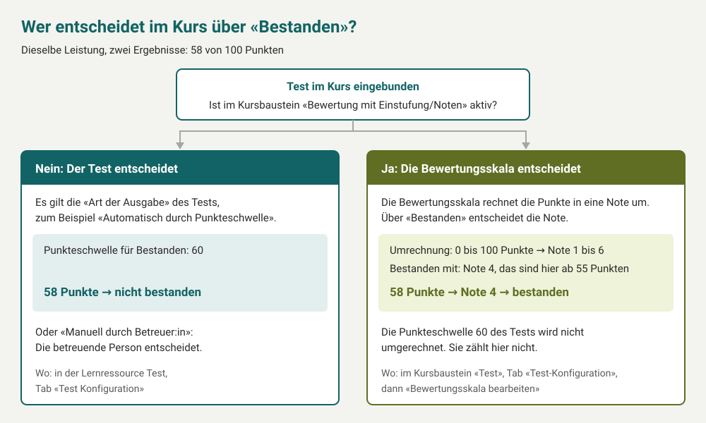
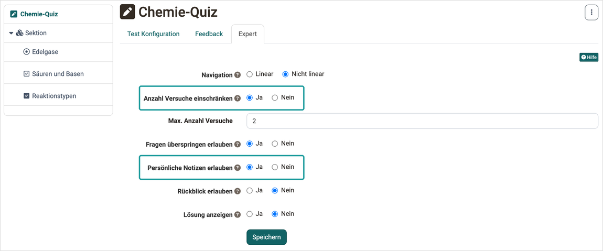
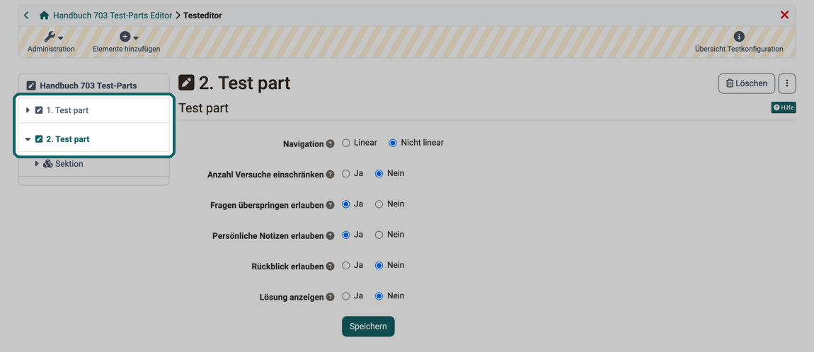

# Test konfigurieren

Für die OpenOlat Tests stehen weitere Strukturierungs- und Konfigurationsmöglichkeiten zur Verfügung. Grundsätzlich besteht jeder Test mindestens aus einer Sektion und einer Frage. Deshalb finden Sie beim Erstellen eines neuen Tests bereits eine Sektion ("Sektion") und eine Single-Choice-Frage ("Single Choice"). Falls in Ihrem Test keine Single-Choice-Frage vorkommt, können Sie die standardmässig angelegte Single-Choice-Frage löschen, sobald Sie eine andere Frage hinzugefügt haben.

Alle hier beschriebenen Einstellungen nehmen Sie im Testeditor vor: `Test > Administration > Testeditor`. Den Testeditor öffnen Besitzer:innen des Tests, Administrator:innen und Lernressourcenverwalter:innen.

Einstellungen für Tests können auf drei Ebenen vorgenommen werden:

* auf Ebene Test: Einstellungen für den gesamten Test
* auf Ebene Test-Part: Einstellungen für einen Block aus Sektionen, den Teilnehmende als Ganzes bearbeiten und beenden
* auf Ebene Sektion: Einstellungen für einzelne Sektionen

Dabei ist die Test Ebene die oberste Ebene. Der Test kann dann mehrere Test-Parts enthalten, die wiederum verschiedene Sektionen beinhalten. Enthält ein Test nur einen Test-Part, kann dieser Test-Part trotzdem mehrere Sektionen umfassen. Teilen Sie einen Test in mehrere Test-Parts, wenn Teile des Tests unterschiedlichen Regeln folgen sollen, siehe [Test-Part Ebene](#testpart).

{ class="shadow lightbox" title="Ebenen eines Tests · 2026.10.07" }

**Sektionen** werden zur Gliederung Ihres Tests verwendet. Häufig werden zum Beispiel zuerst einleitende Fragen gestellt und dafür eine Sektion "Allgemeines" erstellt. Ihr Test kann aus beliebig vielen Sektionen bestehen. Eine Verschachtelung mehrerer Sektionen untereinander ist möglich.

Wenn Sie eine neue Sektion oder einen weiteren Test-Part hinzufügen möchten, wählen Sie oben im Dropdown-Menü `Elemente hinzufügen > Sektion` bzw. `Test-Part`. Anschliessend können Sie der Sektion konkrete Fragen zuordnen.

Im Folgenden werden die Einstellungsmöglichkeiten auf den drei Ebenen erläutert:

## Test Ebene

Auf Ebene des Tests legen Sie den Titel fest, der in der Navigation erscheint. Zudem können folgende Konfigurationen ausgewählt werden:

{ class="shadow lightbox" title="Tab Test Konfiguration im Testeditor" }

### Tab Test Konfiguration

* **Maximal erreichbare Punktzahl:** Diese Punktzahl wird von den Punkten der einzelnen Fragen im Test automatisch berechnet.
* **Bestanden / Nicht bestanden ausgegeben:** Aktivieren Sie das Feld, wenn für den Test ein "bestanden" bzw. "nicht bestanden" angezeigt werden soll.
* **Art der Ausgabe:** Ist "Bestanden / Nicht bestanden ausgegeben" aktiviert, legen Sie hier fest, wie das Ergebnis zustande kommt: "Automatisch durch Punkteschwelle" oder "Manuell durch Betreuer:in". Diese Einstellung und die Punkteschwelle gelten auch, wenn Sie den Test in einen Kurs einbinden. Ausnahme: Aktivieren Sie dort die Option "Bewertung mit Einstufung/Noten", rechnet die Bewertungsskala die erreichten Punkte in eine Note oder Stufe um, zum Beispiel 0 bis 100 Punkte in Schweizer Noten von 1 bis 6. Ob der Test bestanden ist, entscheidet dann die Note: Die Bewertungsskala legt mit "Bestanden mit" fest, ab welcher Note der Test bestanden ist, zum Beispiel ab Note 4. Die Punkteschwelle des Tests wird dabei nicht umgerechnet und zählt nicht mehr, siehe [Kursbaustein "Test"](Course_Element_Test.de.md#section_test) und [Einstufung/Noten](Assessment_translate_points_in_grades.de.md).

    { class="shadow lightbox" title="Bestanden im Kurs mit und ohne Einstufung/Noten" }
* **Punkteschwelle für Bestanden:** Geben Sie hier die Punktzahl ein, die mindestens notwendig ist, damit der Test als bestanden gilt.
* **Zeitbeschränkung:** Die Zeitbeschränkung kann für den gesamten Test definiert werden. Es können Stunden und Minuten definiert werden. Den Teilnehmenden wird oberhalb des Tests angezeigt, wie viel Zeit ihnen noch zur Verfügung steht. Durch die farbliche Hervorhebung wird zusätzlich das nahende Ende des Tests verdeutlicht. Eine Zeitbeschränkung für eine Sektion oder einzelne Fragen ist nicht möglich.

    Sobald die Zeit abgelaufen ist, wird der Test eingezogen. Antworten, welche noch nicht gesendet wurden, werden als leere, nicht beantwortete Fragen behandelt und geben keine Punkte. Es wird nicht nachgefragt, ob die Frage gespeichert werden soll oder nicht. Das Feedback über den gesamten Test und der Rückblick gehören der Zeiterfassung an.

!!! note "Hinweis"

    Eine zeitliche Beschränkung des Tests kann sowohl direkt im Testeditor wie hier beschrieben oder nach dem Einbinden des Tests in einen Kurs im Kurseditor im Tab `Optionen` eingerichtet werden. Wenn nötig kann die Testzeit auch für einzelne Personen im [Bewertungswerkzeug](../learningresources/Assessment_tool_overview.de.md) verlängert werden.

### Tab Feedback

* **Feedback, wenn notwendige Punktzahl für "Bestanden" erreicht:** Geben Sie hier ein Gesamtfeedback ein, wenn die Punktzahl für bestanden erreicht ist.
* **Feedback, wenn notwendige Punktzahl für "Bestanden" _nicht_ erreicht:** Tragen Sie hier ein Gesamtfeedback ein, wenn die Punktzahl nicht ausreicht.

### Tab Expert {: #expert} [:octicons-tag-16:{ title="ab Release 20.3.0 (OO-8321)" }](https://track.frentix.com/issue/OO-8321)

Im Tab "Expert" können folgende Konfigurationen vorgenommen werden. Hat der Test mindestens zwei Test-Parts, stehen dieselben Einstellungen im Formular "Test part" des jeweiligen Test-Parts, siehe [Test-Part Ebene](#testpart).

{ class="shadow lightbox" title="Tab Expert im Testeditor" }

* **Navigation:**

    * Linear: Alle Fragen müssen der Reihe nach beantwortet werden. Es kann nicht zwischen den Fragen hin und her gesprungen werden
    * Nicht linear: Die Fragen können in der gewünschten Reihenfolge beantwortet werden.

* **Anzahl Versuche einschränken:** Wenn nur eine gewisse Anzahl an Lösungsversuchen zulässig sein soll, kann dies hier definiert werden. Bei "Ja" geben Sie die Zahl unter "Max. Anzahl Versuche" ein. Diese Einschränkung bezieht sich auf einen Test-Part und nicht auf den gesamten Test. Wenn die Anzahl Lösungsversuche für den gesamten Test eingeschränkt werden sollen, muss dies im Kursbaustein Test oder in den Einstellungen des Tests vorgenommen werden: `Test > Administration > Einstellungen > Tab "Optionen"`. Enthält ein Test nur einen Test-Part, gilt die Einstellung ebenfalls für den gesamten Test.

    Wenn die Anzahl Lösungsversuche auf Ebene Test oder Test-Part eingeschränkt wird, vererbt sich diese Einschränkung auf alle darunter liegenden Sektionen und Fragen.

* **Fragen überspringen erlauben:** Wenn diese Option gewählt ist, kann der Test beendet werden, bevor alle Fragen beantwortet sind.

* **Persönliche Notizen erlauben:** Die Teilnehmenden können sich persönliche Notizen machen, welche nach dem Beenden des Tests nicht mehr zur Verfügung stehen und nicht ausgewertet werden. Diese Funktion kann nur gewählt werden, wenn im Tab "Optionen" der Einstellungen "Persönliche Notizen" ausgewählt ist.

* **Rückblick erlauben:** Nach dem Beenden des Tests kann der Test und die Antworten nochmals angeschaut, aber nicht mehr korrigiert werden.

* **Lösung anzeigen:** Beim Rückblick werden zusätzlich die Lösungen angezeigt. Diese Funktion ist nur möglich, wenn "Rückblick erlauben" ausgewählt ist.

## Test-Part Ebene {: #testpart}

Sollen Teile eines Tests unterschiedlichen Regeln folgen, etwa ein Pflichtteil ohne Zurückblättern vor einem frei bearbeitbaren Teil, teilen Sie den Test in Test-Parts. Ein Test-Part ist die oberste Gliederungsebene eines Tests. Er fasst Sektionen zusammen und legt für sie gemeinsam fest, wie sich Teilnehmende durch die Fragen bewegen ("Navigation": "Linear" oder "Nicht linear") und welche Einstellungen des Tabs "Expert" gelten.

Teilnehmende bearbeiten die Test-Parts nacheinander. Wer einen Test-Part beendet, gibt ihn ab: OpenOlat speichert die Antworten, und der Test-Part lässt sich danach nicht mehr öffnen. Das ist der Grund, einen Test zu teilen, und zugleich das, was Sie beim Planen bedenken.

Ein Beispiel: Test-Part 1 enthält Grundlagenfragen mit "Navigation" "Linear" und eingeschränkter Anzahl Versuche, die Teilnehmenden lösen die Fragen der Reihe nach. Test-Part 2 enthält Fragen mit "Navigation" "Nicht linear", deren Reihenfolge die Teilnehmenden selbst wählen. Wer Test-Part 2 betritt, kann die Antworten aus Test-Part 1 nicht mehr ändern.

Im Testeditor gelten für Test-Parts folgende Regeln:

* Jeder neue Test enthält einen Test-Part. Solange es nur einen gibt, erscheint er nicht im Menü des Testeditors, und seine Einstellungen stehen im Tab "Expert" der Test-Ebene.
* `Elemente hinzufügen > Test-Part` legt einen weiteren Test-Part am Ende des Tests an, mit einer leeren Sektion "Sektion". Ein neuer Test-Part startet mit "Navigation" "Nicht linear", "Fragen überspringen erlauben" und "Persönliche Notizen erlauben" auf "Ja" und "Rückblick erlauben" auf "Nein".
* Ab zwei Test-Parts erscheint jeder Test-Part als eigener Eintrag im Menü, zum Beispiel "1. Test part" und "2. Test part". Ein Klick darauf öffnet das Formular "Test part" mit "Navigation" und den Einstellungen des Tabs "Expert": "Anzahl Versuche einschränken" mit "Max. Anzahl Versuche", "Fragen überspringen erlauben", "Persönliche Notizen erlauben", "Rückblick erlauben" und "Lösung anzeigen". Die Test-Ebene hat dann keinen Tab "Expert".
* "Löschen" erscheint bei einem Test-Part erst, wenn der Test mindestens zwei Test-Parts hat. Nach der Rückfrage "Wollen Sie den Test-Part mit allen Fragen wirklich löschen?" entfernt OpenOlat den Test-Part mit allen seinen Fragen.
* Ein Test-Part enthält immer mindestens eine Sektion. Die letzte Sektion lässt sich nicht löschen, OpenOlat meldet "Diese Sektion kann nicht gelöscht werden. Ein Test oder ein Test-Part muss mindestens eine Sektion enthalten."
* Sobald der Test durchgeführt wurde, zeigt der Testeditor "Die Ressource wird bereits für die Auswertung verwendet. Die Bearbeitung ist begrenzt." Alle Einstellungen der Test-Parts sind dann gesperrt, "Löschen" und "Elemente hinzufügen" fehlen.

{ class="shadow lightbox" title="Formular Test part im Testeditor · 2026.10.07" }

Die Einstellungen eines Test-Parts steuern auch, was Teilnehmende beim Beenden erleben:

* Bei "Navigation" "Linear" ohne "Fragen überspringen erlauben" erscheint der Button "Test Part beenden" erst, wenn alle Fragen des Test-Parts beantwortet sind. Mit "Fragen überspringen erlauben" steht er ab der ersten Frage bereit.
* Mit "Rückblick erlauben" zeigt OpenOlat nach dem Beenden die Seite "Test Part abgeschlossen", auf der Teilnehmende ihre Antworten ansehen, aber nicht mehr ändern. Ohne Rückblick geht es direkt in den nächsten Test-Part.

!!! warning "Im linearen Test-Part führt «Nächste Frage» nur vorwärts"

    Erlaubt ein Test-Part mit "Navigation" "Linear" das Überspringen von Fragen, stehen "Nächste Frage" und "Test Part beenden" nebeneinander. "Nächste Frage" ohne Antwort lässt die Frage unbeantwortet, und Teilnehmende erreichen sie in diesem Test-Part nicht mehr. Auf der letzten Frage beendet "Nächste Frage" den Test-Part ohne Rückfrage. Weisen Sie Ihre Teilnehmenden vor dem Test darauf hin.

Eine Zeitbeschränkung gibt es nur für den ganzen Test (Tab "Test Konfiguration"), nicht je Test-Part.

!!! info "Wichtig"

    Ein Test aus einem anderen Werkzeug als OpenOlat kann beim Import mehrere Test-Parts mitbringen. Für einen solchen Test meldet der Testeditor "Dieser Test kann nicht mit dem OpenOlat-Editor bearbeitet werden." Im Formular "Test part" lässt sich nur "Navigation" ändern, die übrigen Einstellungen sind gesperrt. Die Fragen öffnen sich im Tab "Unbekannt", über "Konvertieren" wandeln Sie eine Frage in einen Fragetyp des Testeditors um. Ein Test, den Sie aus OpenOlat exportiert und wieder importiert haben, bleibt vollständig bearbeitbar.

Was Teilnehmende während der Durchführung sehen, beschreibt die Seite [Kursbaustein "Test"](Course_Element_Test.de.md#participate_as_learner).

## Sektion Ebene {: #section}

Einem Test-Part können mehrere Sektionen untergeordnet werden. Mehrere verschachtelte Sektionen mit Beschreibung werden untereinander angezeigt und können jeweils separat ein- und ausgeblendet und auch zufällig sortiert angezeigt werden. Existiert für einen Test nur ein Test-Part, erscheinen alle Sektionen auf der obersten Ebene.

Im Tab **"Sektion"** kann eine Beschreibung für die Sektion eingetragen und definiert werden ob alle oder nur eine Auswahl der Fragen der Sektion erscheinen sollen. Ferner kann die Art der Reihenfolge, zufällig oder linear definiert werden.

Der Tab "Expert" der Test oder Test-Part Ebene kann auf Sektionsebene noch einmal überschrieben und geändert werden. Damit ist für einzelne Sektionen ein abweichendes Verhalten im Vergleich zum restlichen Test konfigurierbar.

Ist die Sichtbarkeit des Sektionstitels im Tab "Expert" aktiviert, so wird auch die jeweilige Sektionsbeschreibung an folgenden Stellen in OpenOlat angezeigt:

* Im Test, wenn eine zur Sektion zugehörige Frage aufgerufen wird. Die Sektionsbeschreibung kann von den Teilnehmenden aus- und eingeblendet werden.
* In den Testresultaten.
* Im Korrektur-Workflow an den zu dieser Sektion gehörenden Fragen.

## Weiterführende Informationen {: #further_information}

[Kursbaustein "Test" >](Course_Element_Test.de.md) 
[Einstufung/Noten >](Assessment_translate_points_in_grades.de.md) 
[Bewertungswerkzeug - Übersicht >](Assessment_tool_overview.de.md) 
[Testeditor >](Test_editor_QTI_2.1.de.md) 
[Test Einstellungen - Administration >](Test_settings.de.md)

[Zum Seitenanfang ^](#test-konfigurieren)
