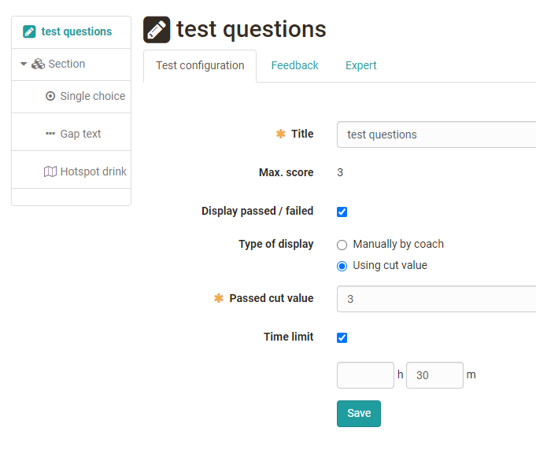
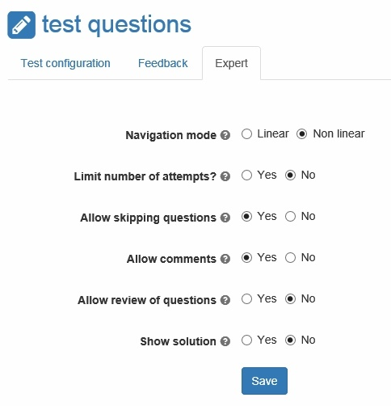

# Configure tests

Further structuring and configuration options are available for the OpenOlat tests. In principle, each test consists of at least one section and one question. Therefore, when creating a new test, you will already find a section ("New Section") and a single-choice question ("New Question"). If there is no single-choice question in your test, you can delete the default single-choice question as soon as you have added another question.

Settings for tests can be made on three levels:

* on test level: Settings for the entire test
* on part level: settings for areas with questions and sections
* at section level: Settings for individual sections

The test level is the top level. The test can then contain several parts, which in turn contain different sections. If a test contains only one part, this part can still contain several sections.

**Sections** are used to structure your test. Often, for example, introductory questions are asked first and a "General" section is created. Your test can consist of any number of sections. It is possible to nest several sections among each other.

If you want to add a new section or another part, select `"Section" or "Test Part" in the drop-down menu "Add Elements"` → at the top in the dropdown menu. You can then assign specific questions to the section.

In the following, the setting options on the three levels are explained:

## Test level

At test level, you define the title that appears in the navigation. The following configurations can also be selected:

{ class="shadow lightbox" }

### Tab Test configuration

* **Max. score:** This score is calculated automatically out of the single questions of the test.
* **Display passed / failed:** Check the box if you want a "pass" or "fail" to be displayed for the test.
* **Type of display** If pass / fail has been activated, it can be defined here whether the output should be taken over automatically by a point threshold or manually by a coach.
* **Passed cut value:** Enter the minimum score required to pass the test.
* **Time limit:** The time limit can be defined for the whole test. Hours and minutes can be defined. The user is shown above the test how much time is still available. The color highlighting also indicates that the end of the test is approaching. A time limit for sections or single questions is not possible.

    As soon as the time is over, the test is pulled. Questions which have not been submitted yet will be treated as empty, not answered questions and don't give a score. It is not asked, if the questions should be saved or not. The feedback over the whole test and the review are also part of the time limit.

!!! info

    A time limit of the test can either be done in the test editor as described here or after embedding the test into the course in the course editor in the tab `Options`. If necessary the test time can be extended for single users in the [assessment tool](../learningresources/Assessment_tool_overview.md).  
  
### Tab Feedback

* **Necessary score for "Passed" is reached:** Enter a total feedback here if the score for passed is reached.
* **Necessary score for "Passed" _not_ reached:** Enter a total feedback here if the score is not sufficient.
  
### Tab Expert {: #expert}

In the tab expert (or on the level of the part, as far as a part has been added), the following configurations can be done:

{ class="shadow" }

* **Navigation mode:**

    * Linear: All questions need to be solved after each other. It cannot be jumped in between the menu.
    * Non linear: The questions can be answered in the desired order.

* **Limit number of attempts?** If only a certain number of attempts is allowed, it can be defined here. This limitation is only valid for the test part. If the number of attempts should be limited for the whole test, it needs to be limited in the options or in the course element test. If a test contains only one test part, the setting also applies to the entire test.

    If the number of attempts is limited on the level of the test or part, this configuration is inherited to all sections and questions below.

* **Allow skipping questions:** If this check box is selected, the test can be finished before all questions are answered.

* **Allow comments:** The participant can take personal notes, which are not available after the test anymore and are not assessed. This feature can only be selected, if "Personal notes" is selected in Options.

* **Allow review of questions:** After finishing the test, the test and its answers can be shown again, but no corrections are possible.

* **Show solution:** In the review the solutions are shown additionally. This feature is only possible, if "Allow review of questions" is selected.
  
## Part Level

At the Part level, it is practically the same as at the Test level. Each created test consists of one part. However, this is not shown. The parts are only visible when another part is added and the test consists of at least two parts.

As soon as two or more parts exist, the configurations are defined mainly at the level of the parts and no longer at the level of the test. For example, an area in which questions can be skipped and one in which all questions must be answered, or an area with restricted solutions and an area without restrictions.

### Section level {: #section}

Several sections can be subordinated to a test part. Several nested sections with descriptions are displayed one below the other and can be shown and hidden separately and also displayed in random order. If only one test part exists for a test, all sections appear at the top level.

In the tab **"Section"** a description for the section can be entered and it can be defined whether all or only a selection of the questions of the section should appear. Furthermore, the type of order, random or linear, can be defined.

The "Expert" tab of the Test or Part level can be overwritten and changed again at section level. This allows to configure a different behavior for single sections compared to the rest of the test.

If the visibility of the section title in the "Expert" tab is activated, the respective section description is also displayed in the following places in OpenOlat:

* In the test, when a question belonging to the section is called. The participant can show or hide the section description.
* In the test results.
* In the correction workflow for the questions belonging to this section.
* No keywords
