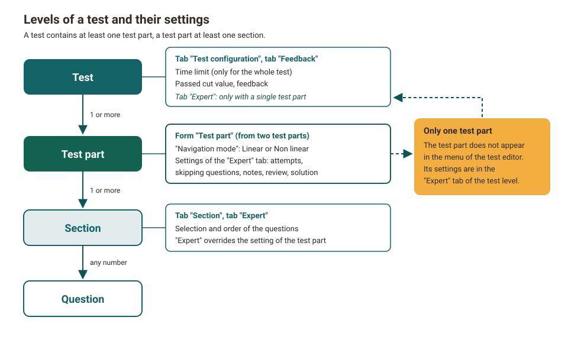
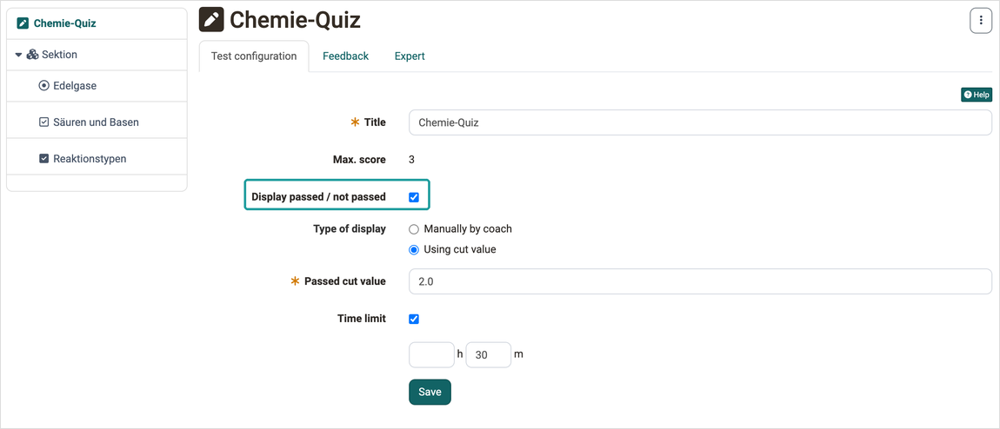
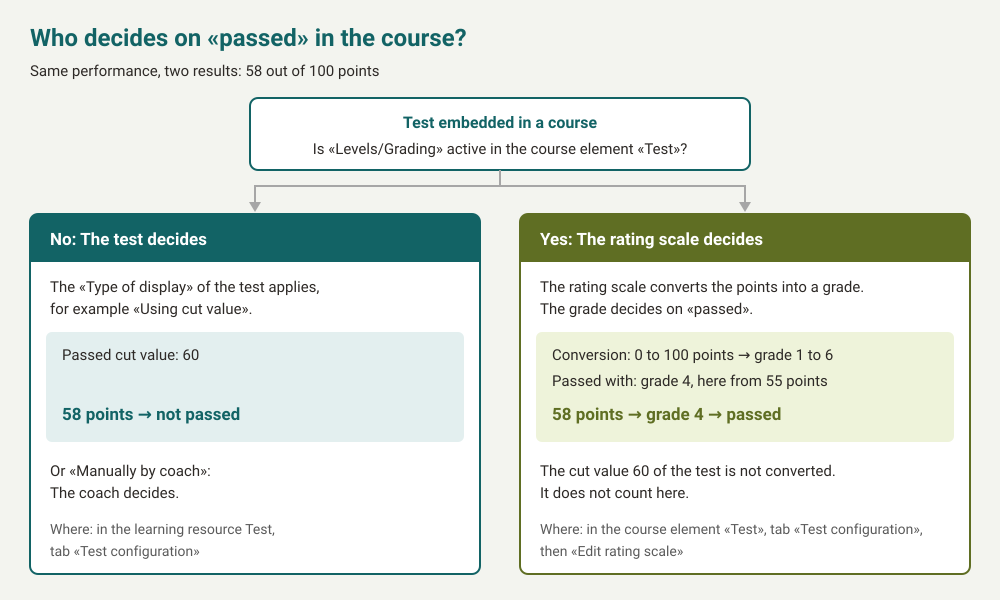
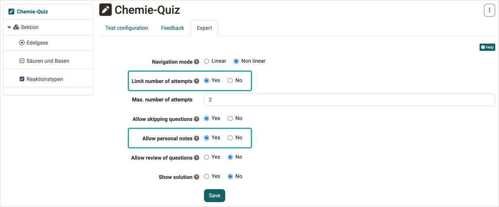
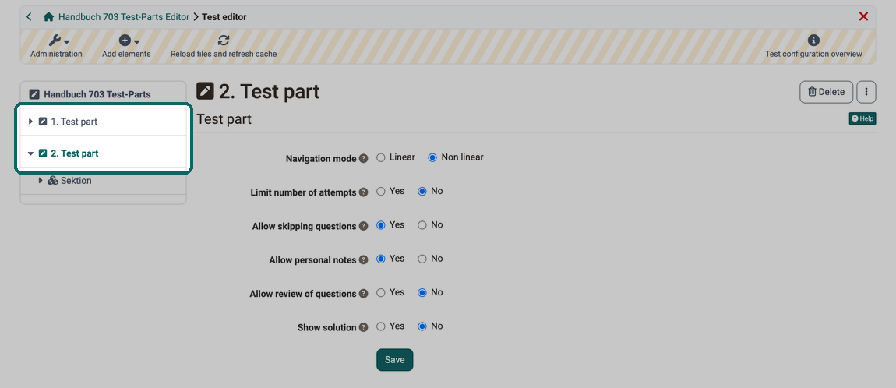

# Configure tests

Further structuring and configuration options are available for the OpenOlat tests. In principle, each test consists of at least one section and one question. Therefore, when creating a new test, you will already find a section ("Section") and a single-choice question ("Single choice"). If there is no single-choice question in your test, you can delete the default single-choice question as soon as you have added another question.

You make all settings described here in the test editor: `Test > Administration > Test editor`. The test editor can be opened by owners of the test, administrators and learning resource managers.

Settings for tests can be made on three levels:

* on test level: Settings for the entire test
* on test part level: settings for a block of sections that participants work on and finish as a whole
* at section level: Settings for individual sections

The test level is the top level. The test can then contain several test parts, which in turn contain different sections. If a test contains only one test part, this test part can still contain several sections. Divide a test into several test parts if parts of the test are to follow different rules, see [Test part level](#testpart).

{ class="shadow lightbox" title="Levels of a test · 2026.10.07" }

**Sections** are used to structure your test. Often, for example, introductory questions are asked first and a "General" section is created. Your test can consist of any number of sections. It is possible to nest several sections among each other.

If you want to add a new section or another test part, select `Add elements > Section` or `Test part` at the top in the dropdown menu. You can then assign specific questions to the section.

In the following, the setting options on the three levels are explained:

## Test level

At test level, you define the title that appears in the navigation. The following configurations can also be selected:

{ class="shadow lightbox" title="Test configuration tab in the test editor" }

### Tab Test configuration

* **Max. score:** This score is calculated automatically out of the single questions of the test.
* **Display passed / not passed:** Check the box if you want a "passed" or "not passed" to be displayed for the test.
* **Type of display:** If "Display passed / not passed" is activated, you define here how the result is determined: "Using cut value" or "Manually by coach". This setting and the cut value also apply when you embed the test in a course. Exception: if you activate the option "Levels/Grading" there, the rating scale converts the points reached into a grade or level, for example 0 to 100 points into Swiss grades from 1 to 6. The grade then decides whether the test is passed: with "Passed with", the rating scale defines from which grade the test is passed, for example from grade 4. The cut value of the test is not converted and no longer counts, see [Course element "Test"](Course_Element_Test.md#section_test) and [Levels/Grading](Assessment_translate_points_in_grades.md).

    { class="shadow lightbox" title="Passed in the course with and without Levels/Grading" }
* **Passed cut value:** Enter the minimum score required to pass the test.
* **Time limit:** The time limit can be defined for the whole test. Hours and minutes can be defined. Participants see above the test how much time is still available. The color highlighting also indicates that the end of the test is approaching. A time limit for sections or single questions is not possible.

    As soon as the time is over, the test is pulled. Questions which have not been submitted yet will be treated as empty, not answered questions and don't give a score. It is not asked, if the questions should be saved or not. The feedback over the whole test and the review are also part of the time limit.

!!! note "Note"

    A time limit of the test can either be done in the test editor as described here or after embedding the test into the course in the course editor in the tab `Options`. If necessary the test time can be extended for single users in the [assessment tool](../learningresources/Assessment_tool_overview.md).

### Tab Feedback

* **Feedback for all correct answers:** Enter a total feedback here if the score for passed is reached.
* **Feedback for wrong answer:** Enter a total feedback here if the score is not sufficient.

### Tab Expert {: #expert} [:octicons-tag-16:{ title="from Release 20.3.0 (OO-8321)" }](https://track.frentix.com/issue/OO-8321)

In the "Expert" tab, the following configurations can be done. If the test has at least two test parts, the same settings are in the "Test part" form of the respective test part, see [Test part level](#testpart).

{ class="shadow lightbox" title="Expert tab in the test editor" }

* **Navigation mode:**

    * Linear: All questions need to be solved after each other. It cannot be jumped in between the menu.
    * Non linear: The questions can be answered in the desired order.

* **Limit number of attempts:** If only a certain number of attempts is allowed, it can be defined here. With "Yes", enter the number under "Max. number of attempts". This limitation refers to one test part and not to the entire test. If the number of attempts should be limited for the whole test, it needs to be limited in the course element test or in the settings of the test: `Test > Administration > Settings > Tab "Options"`. If a test contains only one test part, the setting also applies to the entire test.

    If the number of attempts is limited on the level of the test or test part, this configuration is inherited to all sections and questions below.

* **Allow skipping questions:** If this check box is selected, the test can be finished before all questions are answered.

* **Allow personal notes:** Participants can take personal notes, which are not available after the test anymore and are not assessed. This feature can only be selected if "Personal notes" is selected in the "Options" tab of the settings.

* **Allow review of questions:** After finishing the test, the test and its answers can be shown again, but no corrections are possible.

* **Show solution:** In the review the solutions are shown additionally. This feature is only possible, if "Allow review of questions" is selected.

## Test part level {: #testpart}

If parts of a test are to follow different rules, for example a mandatory part without going back before a part that can be worked on freely, divide the test into test parts. A test part is the top level of structure of a test. It bundles sections and sets for all of them together how participants move through the questions ("Navigation mode": "Linear" or "Non linear") and which settings of the "Expert" tab apply.

Participants work on the test parts one after the other. Finishing a test part submits it: OpenOlat saves the answers, and the test part can no longer be opened afterwards. This is the reason for dividing a test, and at the same time what you take into account when planning.

An example: test part 1 contains basic questions with "Navigation mode" "Linear" and a limited number of attempts, participants solve the questions in order. Test part 2 contains questions with "Navigation mode" "Non linear", whose order participants choose themselves. Anyone who enters test part 2 can no longer change the answers from test part 1.

In the test editor, the following rules apply to test parts:

* Every new test contains one test part. As long as there is only one, it does not appear in the menu of the test editor, and its settings are in the "Expert" tab of the test level.
* `Add elements > Test part` creates another test part at the end of the test, with an empty section "Section". A new test part starts with "Navigation mode" "Non linear", "Allow skipping questions" and "Allow personal notes" set to "Yes" and "Allow review of questions" set to "No".
* From two test parts onwards, each test part appears as a separate entry in the menu, for example "1. Test part" and "2. Test part". Clicking on it opens the "Test part" form with "Navigation mode" and the settings of the "Expert" tab: "Limit number of attempts" with "Max. number of attempts", "Allow skipping questions", "Allow personal notes", "Allow review of questions" and "Show solution". The test level then has no "Expert" tab.
* "Delete" only appears for a test part when the test has at least two test parts. After the confirmation "Do you really want to delete the test part along with all its questions?", OpenOlat removes the test part with all its questions.
* A test part always contains at least one section. The last section cannot be deleted, OpenOlat reports "The section cannot be deleted. A test or a test part must contain at least one section."
* As soon as the test has been carried out, the test editor shows "The resource is already used for assessment purposes. Editing is limited." All settings of the test parts are then locked, "Delete" and "Add elements" are missing.

{ class="shadow lightbox" title="Test part form in the test editor · 2026.10.07" }

The settings of a test part also control what participants experience when finishing:

* With "Navigation mode" "Linear" without "Allow skipping questions", the "Finish test part" button only appears when all questions of the test part have been answered. With "Allow skipping questions", it is available from the first question.
* With "Allow review of questions", OpenOlat shows the page "Test part complete" after finishing, on which participants can view their answers but no longer change them. Without review, participants go directly to the next test part.

!!! warning "In a linear test part, «Next question» only moves forward"

    If a test part with "Navigation mode" "Linear" allows skipping questions, "Next question" and "Finish test part" are shown next to each other. "Next question" without an answer leaves the question unanswered, and participants can no longer reach it in this test part. On the last question, "Next question" finishes the test part without confirmation. Inform your participants about this before the test.

A time limit exists only for the whole test ("Test configuration" tab), not per test part.

!!! info "Important"

    A test from a tool other than OpenOlat can bring several test parts with it when imported. For such a test, the test editor reports "This test cannot be processed with the OpenOlat editor." In the "Test part" form, only "Navigation mode" can be changed, the other settings are locked. The questions open in the "Unknown" tab, with "Convert" you change a question into a question type of the test editor. A test that you exported from OpenOlat and imported again remains fully editable.

What participants see while taking the test is described on the page [Course element "Test"](Course_Element_Test.md#participate_as_learner).

## Section level {: #section}

Several sections can be subordinated to a test part. Several nested sections with descriptions are displayed one below the other and can be shown and hidden separately and also displayed in random order. If only one test part exists for a test, all sections appear at the top level.

In the tab **"Section"** a description for the section can be entered and it can be defined whether all or only a selection of the questions of the section should appear. Furthermore, the type of order, random or linear, can be defined.

The "Expert" tab of the Test or Test part level can be overwritten and changed again at section level. This allows to configure a different behavior for single sections compared to the rest of the test.

If the visibility of the section title in the "Expert" tab is activated, the respective section description is also displayed in the following places in OpenOlat:

* In the test, when a question belonging to the section is called. Participants can show or hide the section description.
* In the test results.
* In the correction workflow for the questions belonging to this section.

## Further information {: #further_information}

[Course Element "Test" >](Course_Element_Test.md) 
[Levels/Grading >](Assessment_translate_points_in_grades.md) 
[Assessment tool - overview >](Assessment_tool_overview.md) 
[Test editor >](Test_editor_QTI_2.1.md) 
[Test settings - Administration >](Test_settings.md)

[To the top of the page ^](#configure-tests)
