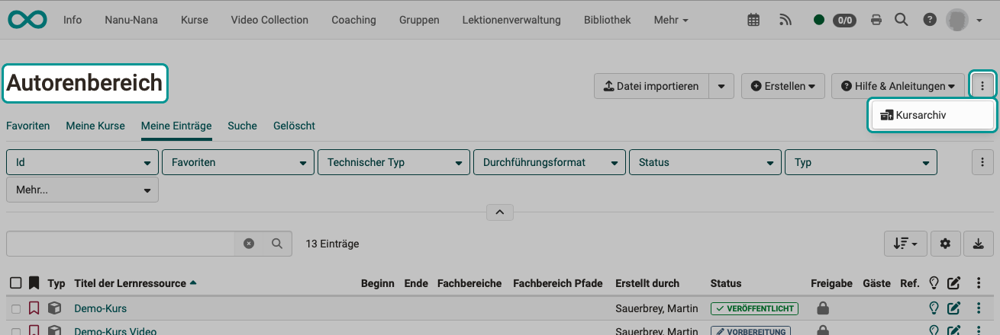
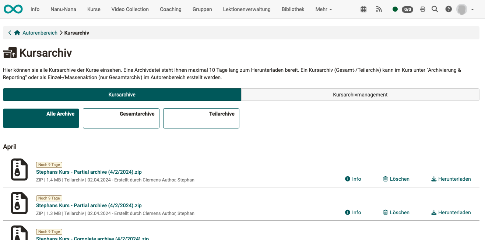
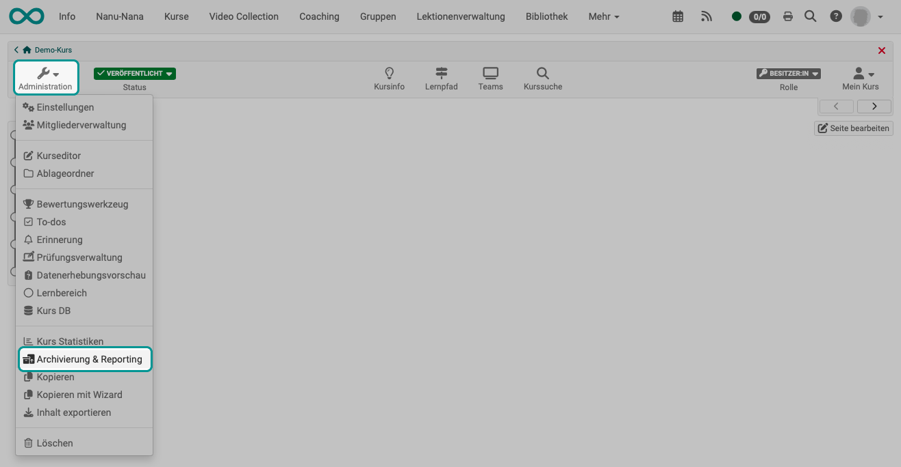
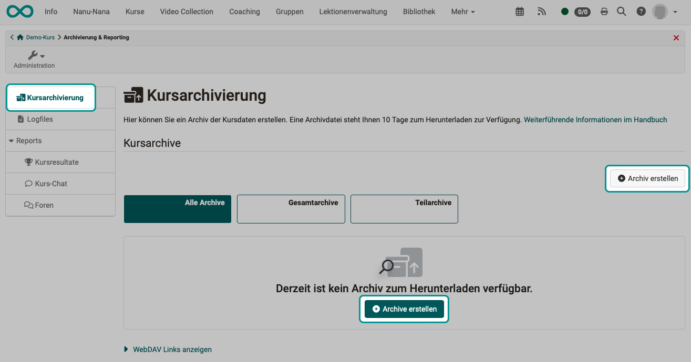
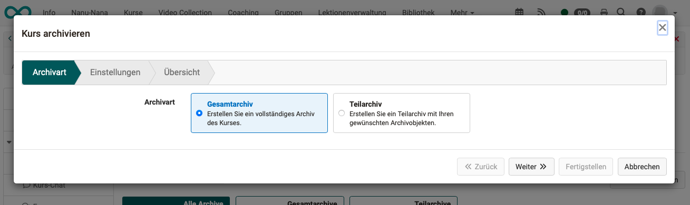
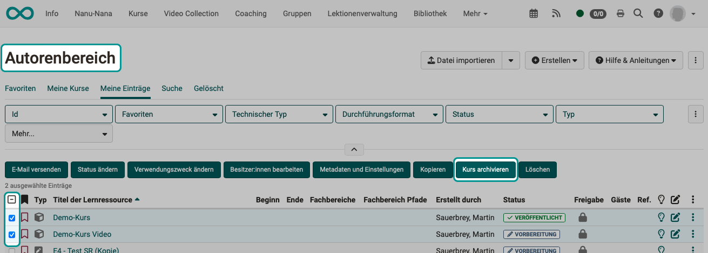
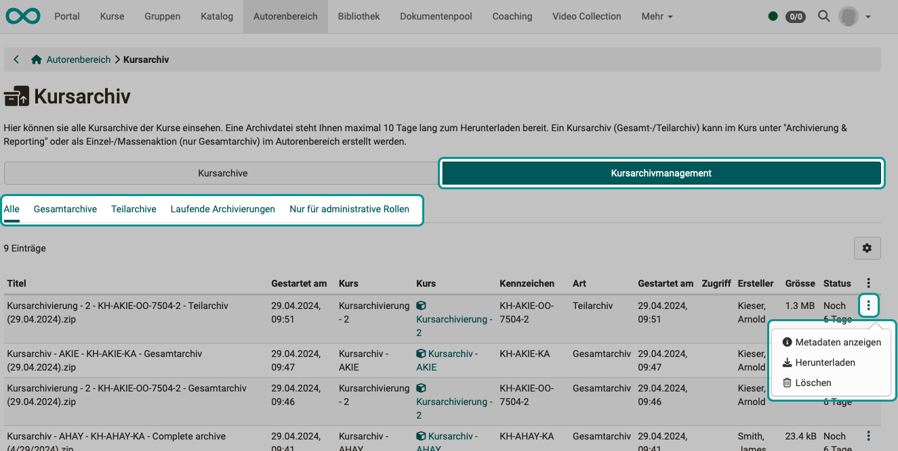
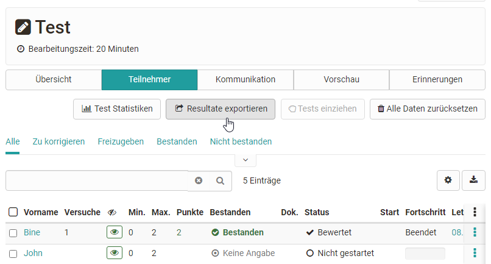

# Kursadministration - Archivierung & Reporting {: #Course_Archiving}

:octicons-tag-24: Release 19.0

## Was ist das Kursarchiv?

**Wozu ein Kursarchiv?** 
Müssen z.B. die Ergebnisse von Teilnehmer:innen aus rechtlichen Gründen 10 Jahre aufbewahrt werden, kann der Kurs selbst gelöscht werden, während die Teilnehmerdaten separat in einem Kursarchiv aufbewahrt werden.

**Was enthält eine Archivdatei?** 
Sowohl in der Kursadministration als auch im Autorenbereich können Kursarchiv-Dateien (**zip-Dateien**) erstellt werden, in denen v.a. **Excel-Dateien** enthalten sind, bzw. für Textformate rtf Dateien. Darin sind alle in einem Kurs erbrachten Ergebnisse der Kursteilnehmer:innen tabellarisch aufgelistet. Gehören zur Archivierung noch weitere Dateien, werden diese in Unterordnern innerhalb der zip Datei bereitgestellt.

**Gesamtarchiv - Teilarchiv** 
Auf Wunsch können auch Teilarchive erstellt werden, wenn z.B. nur die Ergebnisse eines bestimmten Kursbausteins archiviert werden sollen. (Z.B. der Abschlusstest und Übungstests sollen nicht im Archiv enthalten sein.)

Ein solches Kursarchiv ist zu unterscheiden von der Option ["Inhalt exportieren"](../learningresources/Export_Content.de.md) in der Kursadministration. 

| Kursadministration >  Inhalt exportieren | Kursadministration >  Kursarchiv | Kursadministration >  Reports |
| ------------------------------------- | ------------------------------------- | -------------------------------------|
| Kursstruktur und Kursinhalte archivieren | Ergebnisse der Teilnehmer:innen archivieren   | Bericht mit statistischer Analyse zu einem bestimmten Kursbaustein |
| leerer Kurs ohne Teilnehmerdaten      | reine Teilnehmerdaten zur Dokumentation (Nachweis)| Report-Excel enthält mehr als die Teilnehmerdaten in den Excel des Kursarchivs |
| zur Übertragung in ein anderes LMS        | nicht wieder importierbar     | Report für gewisse Bausteine, wie z.B. Forum |
| v.a. html und xml-Dateien                | v.a. Excel-Dateien                         |kursbausteinspezifische Excel-Dateien |

## Wo finde ich Kursarchiv-Dateien?   

In der obersten Button-Zeile des Autorenbereichs finden Sie ganz rechts ein Icon mit 3 Punkten. Darunter finden Sie das Kursarchiv, in dem alle vorhandenen Kursarchiv-Dateien aufgelistet sind und heruntergeladen werden können.

{ class="shadow lightbox" }

!!! info "Hinweis"

    Im Kursarchiv werden alle von Ihnen erstellten Archive aufgelistet.  Administrator:innen und Lernressourcenmanager:innen sehen unter Kursarchive auch nur die von Ihnen selbst erstellten Archive oder Kurse, in denen sie Besitzer:in sind.  Im Tab Kursarchiv**management** werden System Administrator:innen dagegen die Archive aller Autor:innen aufgelistet.

{ class="shadow lightbox" }

## Kursarchive erstellen

### Einen einzelnen Kurs archivieren

* Öffnen Sie den Autorenbereich.
* Wählen Sie den gewünschten Kurs.
* Klicken Sie unter "**Administration**" auf die Option "**Archivierung & Reporting**".
* Wählen Sie anschliessend im Bereich "Kursarchivierung" einen der Buttons "**Archiv erstellen**". 

{ class="shadow lightbox" }

{ class="shadow lightbox" }

### Ein Teilarchiv erstellen

Sobald Sie **via Kursadministration** ein Archiv erstellen möchten, werden Sie als Erstes gefragt, ob es ein Gesamt- oder Teilarchiv sein soll.

{ class="shadow lightbox" }

!!! hint "Hinweis"

    Erstellen Administrator:innen ein Archiv oder Teilarchiv, können sie im Wizard entscheiden, ob die Archivdaten **personalisierte oder nicht personalisierte Logfiles** enthalten sollen. (Je nach Anforderungen des Datenschutzes.) Archive mit personalisierten Logfiles sind anschliessend nur für Administrator:innen und Lernressourcenverwalter:innen zugänglich.

### Gesamtarchive mehrerer Kurse im Autorenbereich erstellen

* Öffnen Sie den Autorenbereich.
* Markieren Sie alle für die Archivierung gewünschten Kurse in der 1. Spalte.
* Sobald mindestens ein Kurs selektiert ist, erscheint über der Liste eine Buttonzeile.
* Wählen Sie den Button "Kurs archivieren".

{ class="shadow lightbox" }

!!! hint "Hinweis"

    Werden mehrere Archive mit dieser Bulk Action erstellt, können nur Gesamtarchive erstellt werden, keine Teilarchive.

## Kursarchivmanagement

!!! info "Hinweis"

    Dieser Tab ist nur für OpenOlat Administrator:innen und Lernressourcenmanager:innen verfügbar, nicht für Autor:innen.

Im Tab **Kursarchivmanagement** sind alle Kursarchive aufgelistet.

* Sie können durch weitere Tabs vorselektiert werden.
* Unter dem Icon mit den 3 Punkten am Ende einer Zeile befindet sich auch die Option zum Herunterladen. Die Kursarchive können hier eine bestimmte Zeit lang heruntergeladen werden (Voreinstellung 10 Tage). 

{ class="shadow lightbox" }

## Was wird von den einzelnen Elementen archiviert?

### Umfragen

Es werden alle [Umfragen](../learningresources/Course_Element_Survey.de.md) des Kurses entsprechend ihrer Einbindung in der Kurssstruktur angezeigt. Die gewünschten zu archivierenden Umfragen können ausgewählt und als Zip-Datei gespeichert werden.

### Fragebogen

Speicherung der *alten* OpenOlat Fragebögen. In der Regel nicht mehr relevant, da die Fragebögen durch Formulare im Kursbaustein Umfrage ersetzt wurden. 

### Tests

Es werden alle [Tests](../learningresources/Course_Element_Test.de.md) und [Selbsttests](../learningresources/Course_Element_Self_Test.de.md) des Kurses angezeigt. Die gewünschten zu archivierenden Elemente können ausgewählt und als Zip-Datei gespeichert werden. In der Zip-Datei liegen dann die einzelnen ausgewählten Tests in jeweils einem extra Ordner.

Archivierte Selbsttests enthalten anonymisierte Benutzerdaten, Tests werden personalisiert gespeichert und enthalten alle Testergebnisse.

!!! note "Hinweis"

    Sollen Testergebnisse als PDF gespeichert werden erfolgt dies im Bewertungswerkzeug oder im Kursrun des gewünschten Test Kursbausteins.

    

### Kursresultate

Hier werden die *Endresultate* von allen im Kurs integrierten Assessment Bausteinen wie [Tests](../learningresources/Course_Element_Test.de.md), [Bewertungen](../learningresources/Course_Element_Assessment.de.md), [Portfolioaufgaben](../learningresources/Course_Element_Portfolio_Task.de.md), [Checklisten](../learningresources/Course_Element_Checklist.de.md), [Aufgaben](../learningresources/Course_Element_Task.de.md) usw. von allen Kursteilnehmenden gebündelt als Zip-Datei archiviert. Die Zip-Datei kann direkt heruntergeladen und gespeichert werden, liegt aber auch noch im privaten Ordner des Kursbesitzers in OpenOlat. 

Im Zip-File findet man eine xlsx-Datei mit Informationen zu den Kursteilnehmenden sowie eventuell von den Teilnehmenden abgegebene Dokumente. Diese Dokumente werden pro Kursbaustein gebündelt und enthalten Unterordner mit den Namen der Teilnehmenden, die Dokumente eingereicht haben.

Kursresultate beinhalten die zusammengefasste Gesamtauswertung eines Kurses, _nicht_ einzelne Elemente.

### Aufgabe und Gruppenaufgaben

Es werden alle [Aufgaben](../learningresources/Course_Element_Task.de.md) und [Gruppenaufgaben](../learningresources/Course_Element_GoToMeeting.de.md) des Kurses angezeigt. Die gewünschten zu archivierenden Aufgaben bzw. Gruppenaufgaben können ausgewählt und als Zip-Datei gespeichert werden.

In der Zip-Datei liegen dann die einzelnen ausgewählten Aufgaben/Gruppenaufgaben in jeweils einem extra Ordner. In diesem befinden sich dann die Ergebnisse der einzelnen Lernenden sowie der Gesamtüberblick als Excel-Datei.

### Themenvergabe

Es werden alle [Themenvergaben](../learningresources/Course_Element_Topic_Assignment.de.md) des Kurses angezeigt. Die gewünschten zu archivierenden Elemente können ausgewählt und als Zip-Datei gespeichert werden. In der Zip-Datei liegen dann die einzelnen ausgewählten Elemente in jeweils einem extra Ordner.

### Logfiles

Hier können die personalisierten Logfiles der Kursbesitzer sowie die anonymisierten Logfiles der Kurs Teilnehmenden für einen gewählten Zeitraum gesichert werden. Je nach Umfang kann die Erstellung einige Zeit in Anspruch nehmen. Anschliessend findet man die Logfiles im persönlichen, privaten OpenOlat Ordner als Zip-File mit Excel-Tabelle.

### Foren

Es werden alle [Foren](../learningresources/Course_Element_Forum.de.md) des Kurses angezeigt. Die gewünschten zu archivierenden Foren können ausgewählt und als Zip-Datei gespeichert werden. In der Zip-Datei liegen dann die einzelnen ausgewählten Foren in jeweils einem extra Ordner mit einer DOCX-Datei, die sämtliche Forenbeiträge umfasst.

Ab :octicons-tag-24: Release 18.0: Neben der Archivierung kann auch ein Bericht im xlsx-Format zu den gewünschten Foren generiert werden. Jedes Posting wird im Bericht als ein Zeileneintrag vermerkt und enthält Informationen zum Erstellungsdatum, letzte Änderung, Anzahl der Wörter, Zeichenzahl usw.  

### Dateidiskussion

Es werden alle [Dateidiskussionen](../learningresources/Course_Element_File_Dialog.de.md) des Kurses angezeigt. Die gewünschten zu archivierenden Elemente können ausgewählt und als Zip-Datei gespeichert werden.

### Teilnehmer Ordner

Es werden alle ["Teilnehmer Ordner"](../learningresources/Course_Element_Participant_Folder.de.md) Kursbausteine angezeigt. Die gewünschten zu archivierenden Elemente können ausgewählt und als Zip-Datei gespeichert werden. In der Zip-Datei befinden sich dann die einzelnen Elemente mit jeweils einem Ordner pro Teilnehmer mit je einem Abgabe- und Rückgabeordner.

### Wikis

Es werden alle [Wikis](../learningresources/Course_Element_Wiki.de.md) des Kurses aufgelistet. Die gewünschten zu archivierenden Wikis können ausgewählt und als Zip-Datei gespeichert werden. In der Zip-Datei befinden sich dann jeweils ein Ordner pro Wiki sowie einem Ordner mit Metadaten für jedes gespeicherte Wikis.

Beim Wiki werden alle Seiten und alle hochgeladenen Dateien in eine ZIP-Datei verpackt. Der Teilnehmer Ordner wird entsprechend der Ordner Struktur dieses Bausteins gespeichert.

### SCORM Resultate

Es werden alle [SCORM](../learningresources/Course_Element_SCORM_Learning_Content.de.md) Kursbausteine des Kurses aufgelistet. Die gewünschten zu archivierenden Wikis können ausgewählt und die Ergebnisse als Zip-Datei gespeichert werden.

### Checklisten

Es werden alle [Checklisten](../learningresources//Course_Element_Checklist.de.md) des Kurses aufgelistet. Die gewünschten zu archivierenden Checklisten können ausgewählt und als Zip-Datei gespeichert werden. Die zip Datei enthält einen Ordner für jede Checkliste. Darin befindet sich jeweils eine xlsx Datei, die die Ergebnisse der Personen, die die Checklisten ausgefüllt haben enthält.

### Formulare

Es werden alle Kursbaustein [Formulare](../learningresources/Course_Element_Form.de.md) des Kurses aufgelistet. Die gewünschten Formulare können ausgewählt und als Zip-Datei gespeichert werden. Die zip Datei enthält einen Ordner für jedes Formular. Darin befindet sich jeweils eine xlsx Datei, die die Formular Antworten der Personen, die die das Formular ausgefüllt haben, enthält.

### Videoaufgabe 
Es werden alle im Kurs eingebauten Kursbausteine [Video-Aufgabe](../learningresources/Course_Element_Video_Task.de.md) unabhängig vom gewählten Modus aufgelistet. Die gewünschten Bausteine können ausgewählt und die Ergebnisse als Zip-Datei gespeichert werden. Die zip Datei enthält eine xlsx Datei mit den Ergebnissen der einzelnen Teilnehmenden.

### Chat Historie

Hier kann der Chatverlauf als xlsx Datei exportiert und auch gelöscht werden.

### Buchungen

Hier werden die Personen, die den Kurs gebucht haben angezeigt, sofern der Kurs über eine [Buchungsmethode](../learningresources/Access_configuration.de.md) verfügt.

## Weitere Informationen

Wenn Sie einen Kurs löschen, werden automatisch alle Kursdaten (nicht die Kursbausteine!) in Ihrem [persönlichen Ordner](../personal_menu/Personal_folders.de.md) gespeichert.

Weitere Details zu den aufgezeichneten Logfiles erfahren Sie im Kapitel "[Aufzeichnung der Kursaktivitäten](Record_of_Course_Activities.de.md)".

Über die Rechtevergabe in der [Mitgliederverwaltung](Members_management.de.md) kann auch weiteren Personen das Recht für die gesamte Datenarchivierung gegeben werden.

