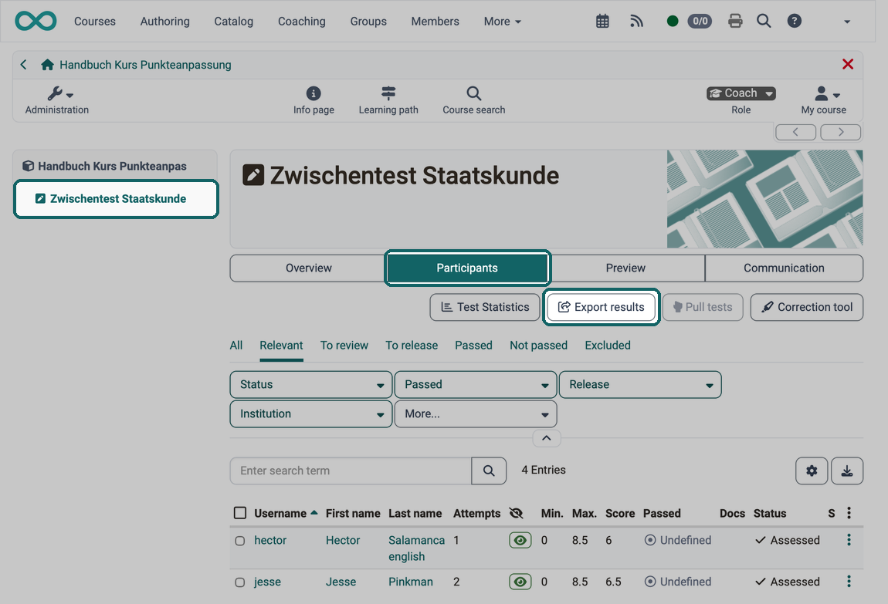

# Course administration - Archiving & Reports {: #course_archiving}

[:octicons-tag-16:{ title="from Release 19.0 (OO-7504)" }](https://track.frentix.com/issue/OO-7504){:target="_blank"}

## What is the course archive?

**Why is a course archive needed?** 
If, for example, the results of participants have to be kept for 10 years for legal reasons, the course itself can be deleted while the participant data is kept separately in a course archive.

**What does an archive file include?** 
Course archive files (**ZIP files**) can be created in the course administration as well as in the Authoring area, which mainly contain **Excel files** or rtf files for text formats. This lists all the results achieved by course participants in a course in tabular form. If the archiving includes other files, these are provided in subfolders within the ZIP file.

**Complete archive - partial archive** 
Partial archives can also be created on request, e.g. if only the results of a particular course element are to be archived. (E.g. the final test and practice tests should not be included in the archive).

Such a course archive must be distinguished from the [“Export content”](../learningresources/Export_Content.md) option in the course administration.

| `Course > Administration > Export content` | `Course > Administration > Archiving & Reporting > Course archiving` | `Course > Administration > Archiving & Reporting > Reports` |
| ------------------------------------- | ------------------------------------- | -------------------------------------|
| Archive course structure and archive | Archive participant results   | Report with statistical analysis for a specific course element |
| Empty course without participant data      | pure participant data for documentation (proof)| Report Excel contains more than the participant data in the Excel of the course archive |
| for transfer to another LMS        | not re-importable     | Report for certain modules, e.g. forum |
| especially html and xml-files                | especially Excel-files                         |Course element-specific Excel files |

If you delete a course, all course data (not the course elements) is automatically saved in your [personal files](../personal_menu/File_Hub.md). By assigning rights in [Members management](Members_management.md), other persons can also be given the right to archive all data.

## Where can I find course archive files?

In the top button line of the author area, you will find an icon with 3 dots on the far right. Below this you will find the course archive, in which all existing course archive files are listed and can be downloaded.

{ class="shadow lightbox" title="Top button row in the authoring area" }

!!! info "Important"

    All the archives you have created are listed in the course archive.  Administrators and learning resource managers only see the archives they have created themselves or courses they own in the "Course archives" tab.  In the **Course archive management** tab, on the other hand, the archives of all authors are listed for administrators and learning resource managers.

{ class="shadow lightbox" title="Course archive page in the authoring area" }

## Create course archive

### Archive a single course

* Open the authoring area
* Select the desired course
* Click on the "**Archiving & Reporting**" option in the "**Administration**" area
* Then, select the button "**Create archive**" in the "Course archiving" area.

{ class="shadow lightbox" title="Administration menu of a course" }

{ class="shadow lightbox" title="Course archiving under Archiving & Reporting" }

### Create a partial archive

As soon as you want to create an archive **via course administration**, you will first be asked whether it should be a complete or partial archive.

{ class="shadow lightbox" title="Archive course dialog" }

!!! tip "Tip"

    If administrators or learning resource managers create a complete archive, they can decide in the wizard step "Settings" under "Log files of participants" whether participants appear **anonymised or personalised** in the log files. (Depending on data protection requirements.) Archives with personalised log files are then only accessible to administrative roles.

### Archive multiple courses in the authoring area

* Open the authoring area
* Select all the courses you want to archive in the 1st column
* As soon as at least one course is selected, a button line appears above the list
* Select the “Archive course” button

{ class="shadow lightbox" title="Course list in the authoring area" }

!!! info "Important"

    If several archives are created with this bulk action, only complete archives can be created, not partial archives.

## Course archive management

!!! info "Important"

    This tab is only available for OpenOlat administrators and learning resource managers, not for authors.

All course archives are listed in the **Course archive management** tab.

* They can be preselected by further tabs: "All", "Complete archives", "Partial archives", "Ongoing archiving" and "Only for administrative roles".
* The download option is also located under the icon with the 3 dots at the end of a line. The course archives can be downloaded here for a certain period of time (default setting 10 days).

{ class="shadow lightbox" title="Course archive management tab on the Course archive page" }

## What is archived from the individual elements?

### Surveys

All [surveys](../learningresources/Course_Element_Survey.md) of the course are displayed according to their integration in the course structure. The desired surveys to be archived can be selected and saved as a ZIP file.

### Questionnaire

Storage of *old* OpenOlat questionnaires. Generally no longer relevant, as the questionnaires have been replaced by forms in the course element "Survey".

### Tests

All [tests](../learningresources/Course_Element_Test.md) of the course are displayed. The desired elements to be archived can be selected and saved as a ZIP file. The individual selected tests are then stored in a separate folder in the ZIP file.

Archived tests are saved on a personalized basis and contain all test results.

The archive contains test results as PDF files if you select "Customised" for "Course elements" in the wizard step "Settings" and "Advanced – with PDF" for the course element Test. The selection only appears if the [PDF service](../../manual_admin/administration/External_Tools_-_Administration.md#pdf_generator) is switched on in the system administration under `Administration > External tools > PDF generator`. The option "All PDF files in one folder" is only offered by the export in the course element Test via the button "Export results". More on this under [Archiving test results](../learningresources/Course_Element_Test.md#archive) and [Export tests](../learningresources/Test_export.md#pdf_files). [:octicons-tag-16:{ title="from Release 21.1 (OO-9600)" }](https://track.frentix.com/issue/OO-9600)

{ class="shadow lightbox" title="Participants tab in the course element Test" }

### Course results

The *final results* of all assessment modules integrated in the course, such as [tests](../learningresources/Course_Element_Test.md), [assessments](../learningresources/Course_Element_Assessment.md), [portfolio tasks](../learningresources/Course_Element_Portfolio_Task.md), [checklists](../learningresources/Course_Element_Checklist.md), [tasks](../learningresources/Course_Element_Task.md), etc., are archived here as a ZIP file for all course participants. The ZIP file can be downloaded and saved directly, but can also be found in the course owner's private folder in OpenOlat.

The ZIP file contains an xlsx file with information on the course participants and any documents submitted by the participants. These documents are bundled per course element and contain subfolders with the names of the participants who have submitted documents.

Course results contain the summarized overall assessment of a course, _not_ individual elements.

### Task and group tasks [:octicons-tag-16:{ title="from Release 14.0 (OO-3945)" }](https://track.frentix.com/issue/OO-3945)

All [tasks](../learningresources/Course_Element_Task.md) and [group tasks](../learningresources/Course_Element_Grouptask.md) of the course are displayed. The desired tasks or group tasks to be archived can be selected and saved as a ZIP file.

The ZIP file then contains the individual selected tasks/group tasks, each in a separate folder. This folder then contains the results of the individual learners as well as the overall overview as an Excel file.

### Topic assignment

All [topics assigned](../learningresources/Course_Element_Topic_Assignment.md) to the course are displayed. The desired elements to be archived can be selected and saved as a ZIP file. The individual selected elements are then stored in a separate folder in the ZIP file.

### Log files

The personalized log files of course owners and the pseudonymized log files of course participants can be saved here for a selected period of time. Depending on the scope, the creation may take some time. You will then find the log files in your personal, private OpenOlat folder as a ZIP file with an Excel table.

### Forums

All [forums](../learningresources/Course_Element_Forum.md) of the course are displayed. The desired forums to be archived can be selected and saved as a ZIP file. In the ZIP file, the individual selected forums are then each in a separate folder with a DOCX file containing all the forum posts.

In addition to archiving, a report in xlsx format can also be generated for the desired forums. Each posting is noted in the report as a line entry and contains information on the creation date, last change, number of words, number of characters, etc. [:octicons-tag-16:{ title="from Release 18.0 (OO-6908)" }](https://track.frentix.com/issue/OO-6908){:target="_blank"}

### File discussion

All [file discussions](../learningresources/Course_Element_File_Dialog.md) of the course are displayed. The desired elements to be archived can be selected and saved as a ZIP file.

### Participant folder [:octicons-tag-16:{ title="from Release 11.3 (OO-2455)" }](https://track.frentix.com/issue/OO-2455)

All ["Participants folder"](../learningresources/Course_Element_Participant_Folder.md) course elements are displayed. The desired elements to be archived can be selected and saved as a ZIP file. The ZIP file then contains the individual elements, each with a folder for each participant with a submission and return folder.

### Wikis

All [wikis](../learningresources/Course_Element_Wiki.md) in the course are listed. The desired wikis to be archived can be selected and saved as a ZIP file. The ZIP file then contains one folder for each wiki and a folder with metadata for each saved wiki.

In the wiki, all pages and all uploaded files are packed into a ZIP file. The participant folder is saved according to the folder structure of this module.

### SCORM results

All [SCORM](../learningresources/Course_Element_SCORM_Learning_Content.md) course elements of the course are listed. The desired SCORM course elements to be archived can be selected and the results saved as a ZIP file.

### Checklists

All [checklists](../learningresources/Course_Element_Checklist.md) for the course are listed. The desired checklists to be archived can be selected and saved as a ZIP file. The ZIP file contains a folder for each checklist. Inside is an xlsx file containing the results of the people who completed the checklists.

### Forms

All [forms](../learningresources/Course_Element_Form.md) of the course are listed. The desired forms can be selected and saved as a ZIP file. The ZIP file contains a folder for each form. This contains an xlsx file with the form responses of the people who have completed the form.

### Video task

All of the course elements integrated in the course [Video task](../learningresources/Course_Element_Video_Task.md) are listed, regardless of the mode selected. The desired modules can be selected and the results saved as a ZIP file. The ZIP file contains an xlsx file with the results of the individual participants.

### Chat history

Here the chat history can be exported as an xlsx file and also deleted.

### Booking orders

The people who have booked the course are displayed here if the course has [offers](../learningresources/Access_configuration.md).

[To the top of the page ^](#course_archiving)

---

## Further information {: #further_information}

**Mentioned on this page** 
[Export content >](../learningresources/Export_Content.md) 
[User tools: File Hub >](../personal_menu/File_Hub.md) 
[Members management >](Members_management.md) 
[Course Element "Survey" >](../learningresources/Course_Element_Survey.md) 
[Course Element "Test" >](../learningresources/Course_Element_Test.md) 
[External Tools: Overview >](../../manual_admin/administration/External_Tools_-_Administration.md) 
[Export tests >](../learningresources/Test_export.md) 
[Course Element "Assessment" >](../learningresources/Course_Element_Assessment.md) 
[Course Element "Portfolio Task" >](../learningresources/Course_Element_Portfolio_Task.md) 
[Course Element "Checklist" >](../learningresources/Course_Element_Checklist.md) 
[Course Element "Task" >](../learningresources/Course_Element_Task.md) 
[Course Element "Group Task" >](../learningresources/Course_Element_Grouptask.md) 
[Course Element "Topic Assignment" >](../learningresources/Course_Element_Topic_Assignment.md) 
[Course Element "Forum" >](../learningresources/Course_Element_Forum.md) 
[Course Element "File Dialog" >](../learningresources/Course_Element_File_Dialog.md) 
[Course Element "Participant folder" >](../learningresources/Course_Element_Participant_Folder.md) 
[Course Element "Wiki" >](../learningresources/Course_Element_Wiki.md) 
[Course Element "SCORM 1.2" >](../learningresources/Course_Element_SCORM_Learning_Content.md) 
[Course Element "Form" >](../learningresources/Course_Element_Form.md) 
[Course Element "Video task" >](../learningresources/Course_Element_Video_Task.md) 
[Access configuration >](../learningresources/Access_configuration.md)

**Further reading** 
[Record of Course Activities >](Record_of_Course_Activities.md) 
[Delete (a course or learning resource) >](Course_Delete.md) 
[Assessment tool - overview >](Assessment_tool_overview.md)

[To the top of the page ^](#course_archiving)
