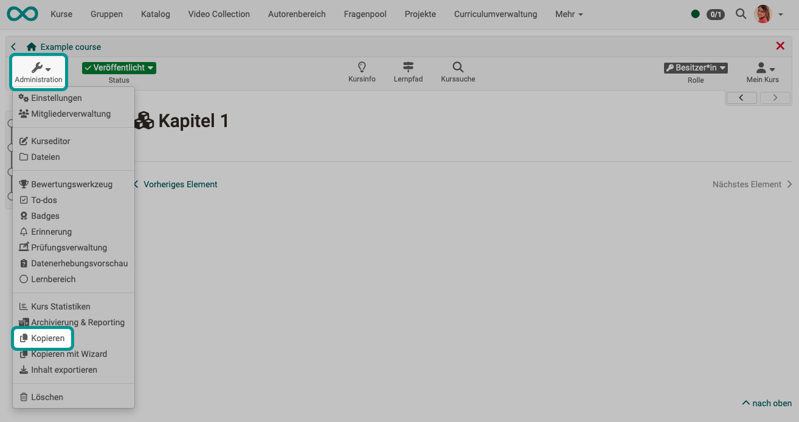

# Kopieren (eines Kurses) {: #course_copy}

Beim Kopieren ganzer Kurse und Lernressourcen ist zu beachten, dass Kursstruktur und Daten der Benutzer:innen unterschiedlich behandelt werden.

{ class="shadow lightbox" }

Ist ein Kurs abgelaufen, soll aber im nächsten Semester oder in einem gewissen Zeitabstand wiederholt durchgeführt werden, sollte dieser Kurs kopiert werden. Beim Kopieren eines Kurses werden die komplette Struktur, Ordnerinhalte, HTML-Seiten und Gruppennamen (ohne Gruppenmitglieder) übernommen. Das gesamte **Kursgerüst** bleibt also erhalten. 

**Benutzerdaten** wie Forenbeiträge, Gruppenmitglieder etc. werden jedoch nicht kopiert. Somit erhalten Sie auf diesem Weg einen komplett zurückgesetzten Kurs ohne benutzerspezifische Datenreste.

!!! tip "Hinweis"

    Erstellen Sie auf jeden Fall eine Kurskopie, wenn Sie einen Kurs wiederholt durchführen möchten, anstatt nur die Personen aus der Mitgliederliste zu entfernen. Auf diese Weise entfallen auch alle Einträge im Bewertungswerkzeug und man erhält einen komplett bereinigten Kurs.

!!! tip "Tipp"

    Eine Kurs-Kopie kann auch sinnvollerweise nach Fertigstellung des Kurses und vor Beginn der Durchführung als Backup erstellt werden.

!!! tip "Hinweis"

    Das Kopieren kann auch in der Liste des Autorenbereichs aufgerufen werden. Dort finden Sie die Option nach Klick auf die 3 Punkte am Ende einer Zeile.

[Zum Seitenanfang ^](#course_copy)