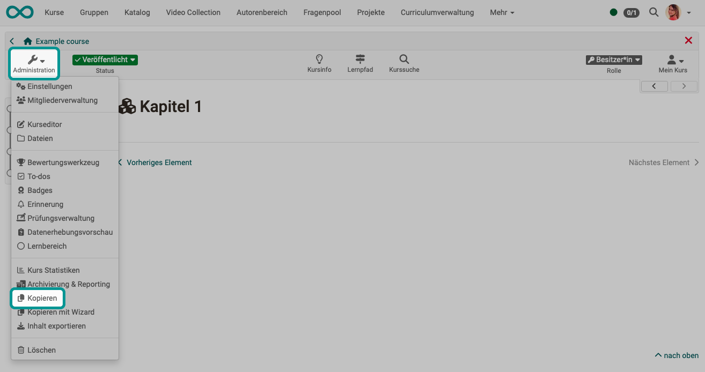

# Copy (a course) {: #course_copy}

When copying entire courses and learning resources, please note that the course structure and user data are treated differently.

{ class="shadow lightbox" }

You can find this option in the course under `Course > Administration > Copy`.

If a course has expired but is to be repeated in the next semester or at a certain interval, this course should be copied. When copying a course, the complete structure, folder contents, HTML pages and group names (without group members) are copied. The entire **course structure** is therefore retained. 

However, **user data** such as forum posts, group members etc. are not copied. In this way, you will receive a completely reset course without user-specific data residues.

!!! tip "Tip"

    It is best to create a course copy if you want to run a course repeatedly instead of just removing the people from the member list. This way, all entries in the assessment tool are also omitted and you get a completely cleaned course.

!!! tip "Tip"

    A course copy can also usefully be created as a backup after the course has been completed and before the course begins.

!!! tip "Tip"

    Copying can also be called up in the list of the authoring area. There you will find the option after clicking on the 3 dots at the end of a line.

[To the top of the page ^](#course_copy)