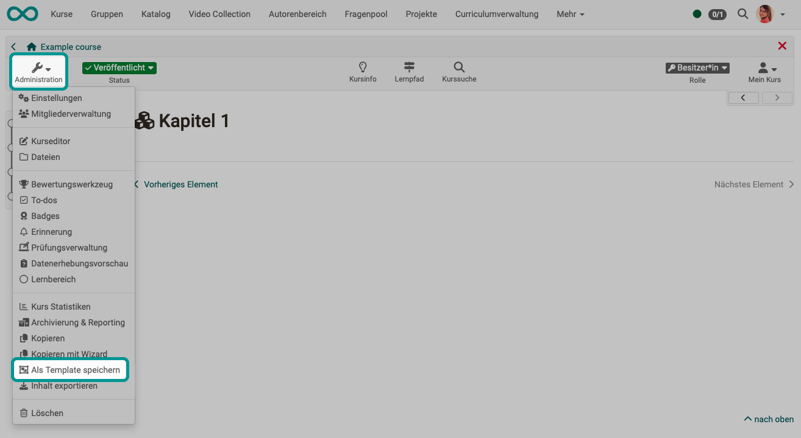
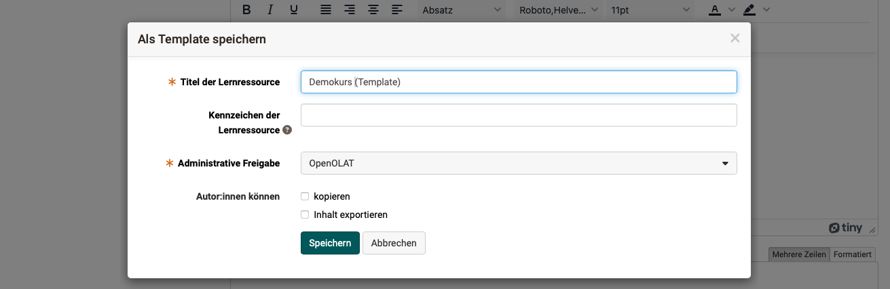

# Speichern (eines Kurses) als Template {: #course_copy_template}

Mit dem Course Planner können Kurse in Durchführungen vorab geplant und erst zu einem späteren Zeitpunkt in eine Durchführung eingebunden werden. Sie werden aus einem Kurstemplate instanziert. 

Soll ein solches Template aus einem bereits bestehenden Kurs erstellt werden, verwenden Sie dazu im entsprechenden Kurs unter **Administration** die Option **Als Template speichern**. Der existierende Kurs (unabhängig vom technischen Typ) wird damit auf eine Art kopiert, die ein Template für die Instanzierung daraus erstellt. 

{ class="shadow lightbox" }

{ class="shadow lightbox" }

[Zum Seitenanfang ^](#course_copy_template)