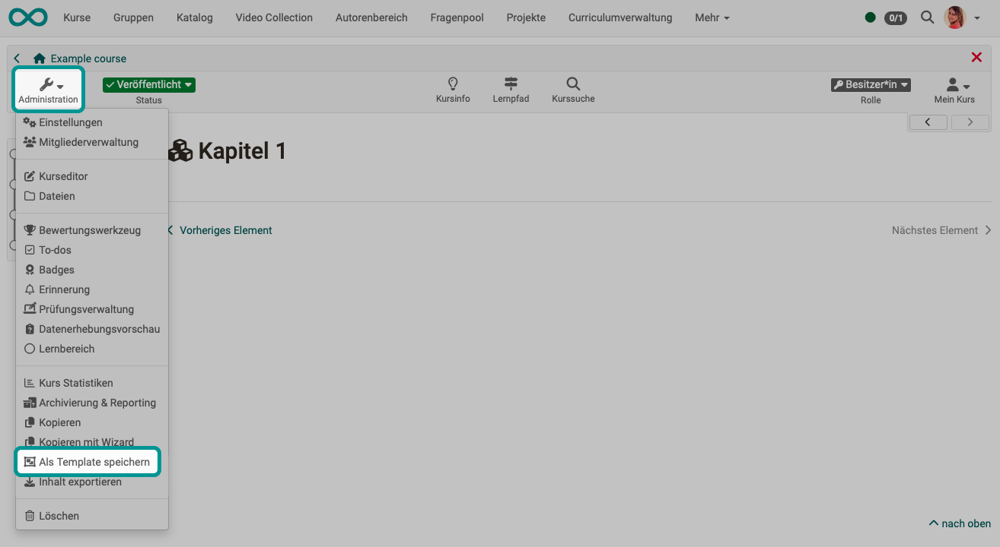
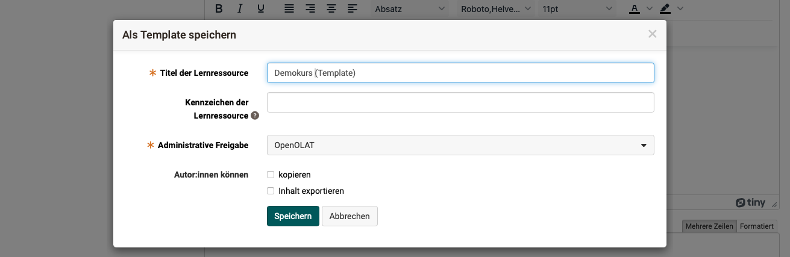

# Save (a course) as template {: #course_copy_template}

If you want to create a template from an existing course, use the **Save as template** option in the corresponding course under **Administration**. The existing course (regardless of its technical type) is then copied in a way that a template is created for instantiation. 

{ class="shadow lightbox" }

{ class="shadow lightbox" }

[Zum Seitenanfang ^](#course_copy_template)