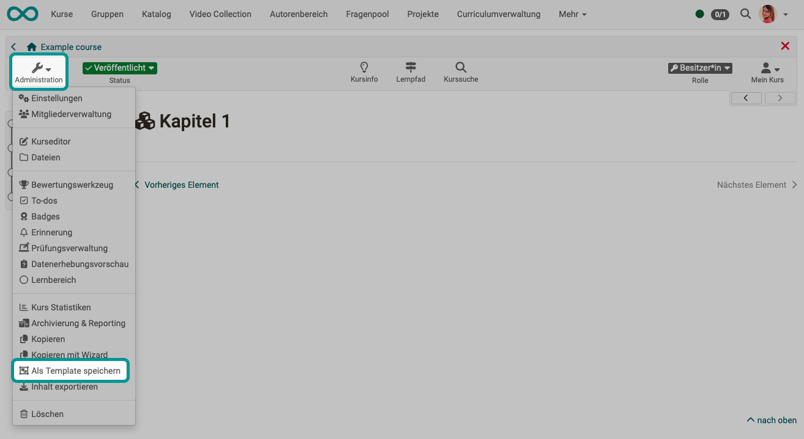
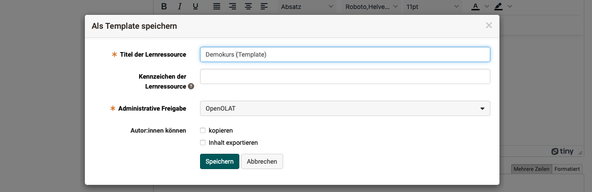

# Save (a course) as template {: #course_copy_template}

If you want to create a template from an existing course, select `Course > Administration > Save as template` in the corresponding course. The existing course (regardless of its technical type) is then copied in a way that a template is created for instantiation. 

{ class="shadow lightbox" }

{ class="shadow lightbox" }

[To the top of the page ^](#course_copy_template)