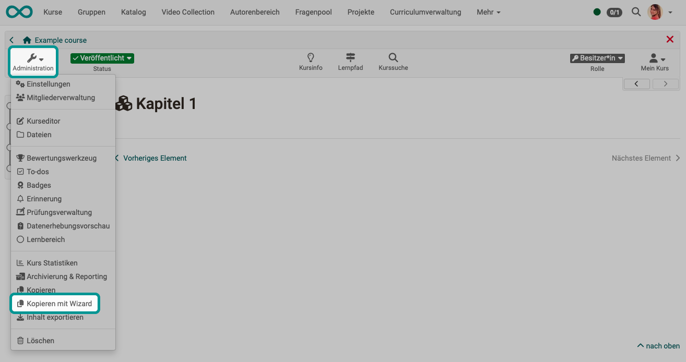

# Kopieren eines Kurses mit Wizard {: #course_copy_wizard}

{ class="shadow lightbox" title="Menü Administration eines Kurses" }

Sie finden diese Option im Kurs unter `Kurs > Administration > Kopieren mit Wizard`. Sie steht Besitzer:innen des Kurses mit der Rolle Autor:in, Lernressourcenverwalter:innen und Administrator:innen zur Verfügung. Weitere Autor:innen erhalten sie, wenn unter `Kurs > Administration > Einstellungen > Tab "Freigabe"` bei «Autor:innen können» die Auswahl «kopieren» angekreuzt ist.

Mit Hilfe des Wizards können die zu kopierenden Elemente eines Kurses ausgewählt werden. So kann noch effektiver eine Übertragung für einen neuen Kursdurchlauf erfolgen. 

Im ersten Schritt «Allgemeine Einstellungen» wählen Sie den Kopiermodus «Automatisch» oder «Benutzerdefiniert». Im Kopiermodus «Benutzerdefiniert» können die zu kopierenden Kursobjekte ausgewählt und weitere Einstellungen, z.B. bezüglich der Mitgliederverwaltung und bestimmten Kursbausteinen vorgenommen werden. 

Diese Funktion ist nur für [Lernpfadkurse](Learning_path_course.de.md) verfügbar. Einen herkömmlichen Kurs kopieren Sie für den nächsten Durchlauf unter `Kurs > Administration > Kopieren`, siehe [Kopieren (eines Kurses)](Course_Copy.de.md).

!!! tip "Tipp"

    Erstellen Sie auf jeden Fall eine Kurskopie, wenn Sie einen Kurs wiederholt durchführen möchten, anstatt nur die Personen aus der Mitgliederliste zu entfernen. Auf diese Weise entfallen auch alle Einträge im Bewertungswerkzeug und Sie erhalten einen komplett bereinigten Kurs.

!!! tip "Tipp"

    Eine Kurs-Kopie kann auch sinnvollerweise nach Fertigstellung des Kurses und vor Beginn der Durchführung als Backup erstellt werden.

!!! tip "Tipp"

    Das Kopieren kann auch in der Liste des Autorenbereichs aufgerufen werden. Dort finden Sie die Option nach Klick auf die 3 Punkte am Ende einer Zeile.

## Termine und Raumbuchungen [:octicons-tag-16:{ title="ab Release 16.0 (OO-4416)" }](https://track.frentix.com/issue/OO-4416){:target="_blank"} {: #events_rooms}

Wer einen Kurs für den nächsten Durchlauf kopiert, kann die Termine mitkopieren, statt sie neu zu erfassen. Die Auswahl «Termine» erscheint, wenn der Kurs Termine hat und Sie im Schritt «Allgemeine Einstellungen» den Kopiermodus «Benutzerdefiniert» wählen. Der Schritt «Kopieroptionen» zeigt sie dann unter «Weitere Optionen» mit «Kopieren», «Anpassen» und «Nicht kopieren». Mit «Anpassen» folgt der Schritt «Termine», in dem Sie je Termin Datum und Ort ändern und die Dozent:innen neu zuweisen.

Im Kopiermodus «Automatisch» gilt die Voreinstellung Ihrer OpenOlat-Instanz, standardmässig werden dabei keine Termine kopiert. Welche Einstellung gilt, zeigt die Hilfe beim Feld «Kopiermodus». Die Voreinstellung ist Teil der Serverkonfiguration. frentix-Kund:innen wenden sich für eine Änderung an den frentix Support: [support@frentix.com](mailto:support@frentix.com)

Ist das [Modul «Räume»](../../manual_admin/administration/Modules_Rooms.de.md) aktiviert, übernimmt jeder kopierte Termin auch die Raumbuchungen des ursprünglichen Termins. Der Zeitraum der Raumbuchung folgt dem kopierten Termin. Den Raum übernimmt die Raumbuchung immer vom ursprünglichen Termin, auch wenn Sie im Schritt «Termine» das Feld «Ort» ändern. OpenOlat prüft beim Kopieren nicht, ob der Raum im neuen Zeitraum noch frei ist. Eine Überschneidung zeigt die [Raumplanung im Course Planner](../area_modules/Course_Planner_Rooms.de.md#warnings) als Warnung an. [:octicons-tag-16:{ title="ab Release 21.0 (OO-9459)" }](https://track.frentix.com/issue/OO-9459){:target="_blank"}

## Weiterführende Informationen {: #further_information}

**Auf dieser Seite erwähnt** 
[Lernpfadkurs - Überblick >](Learning_path_course.de.md) 
[Kopieren (eines Kurses) >](Course_Copy.de.md) 
[Modul Räume (Administration) >](../../manual_admin/administration/Modules_Rooms.de.md) 
[Course Planner: Raumverwaltung >](../area_modules/Course_Planner_Rooms.de.md)

**Weiterführend** 
[Speichern (eines Kurses) als Template >](Course_Copy_Template.de.md) 
[Termine und Absenzen >](Events_and_absences.de.md)

[Zum Seitenanfang ^](#course_copy_wizard)
