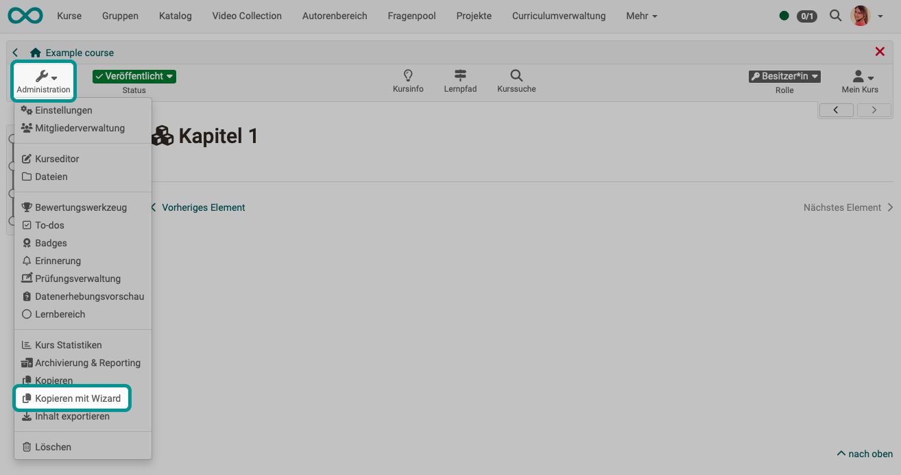

# Kopieren eines Kurses mit Wizard {: #course_copy_wizard}

{ class="shadow lightbox" }

Mit Hilfe des Wizards können die zu kopierenden Elemente eines Kurses ausgewählt werden. So kann noch effektiver eine Übertragung für einen neuen Kursdurchlauf erfolgen. 

Die Erstellung der Kopie kann im letzten Schritt automatisch oder benutzerdefiniert abgeschlossen werden. Bei der benutzerdefinierten Erstellung können die zu kopierenden Kursobjekte ausgewählt und weitere Einstellungen, z.B. bezüglich der Mitgliederverwaltung und bestimmten Kursbausteinen vorgenommen werden. 

Diese Funktion ist nur für [Lernpfad-Kurse](../learningresources/Learning_path_course.de.md) verfügbar. 

!!! tip "Hinweis"

    Erstellen Sie auf jeden Fall eine Kurskopie, wenn Sie einen Kurs wiederholt durchführen möchten, anstatt nur die Personen aus der Mitgliederliste zu entfernen. Auf diese Weise entfallen auch alle Einträge im Bewertungswerkzeug und Sie erhalten einen komplett bereinigten Kurs.

!!! tip "Tipp"

    Eine Kurs-Kopie kann auch sinnvollerweise nach Fertigstellung des Kurses und vor Beginn der Durchführung als Backup erstellt werden.

!!! tip "Hinweis"

    Das Kopieren kann auch in der Liste des Autorenbereichs aufgerufen werden. Dort finden Sie die Option nach Klick auf die 3 Punkte am Ende einer Zeile.

[Zum Seitenanfang ^](#course_copy_wizard)
