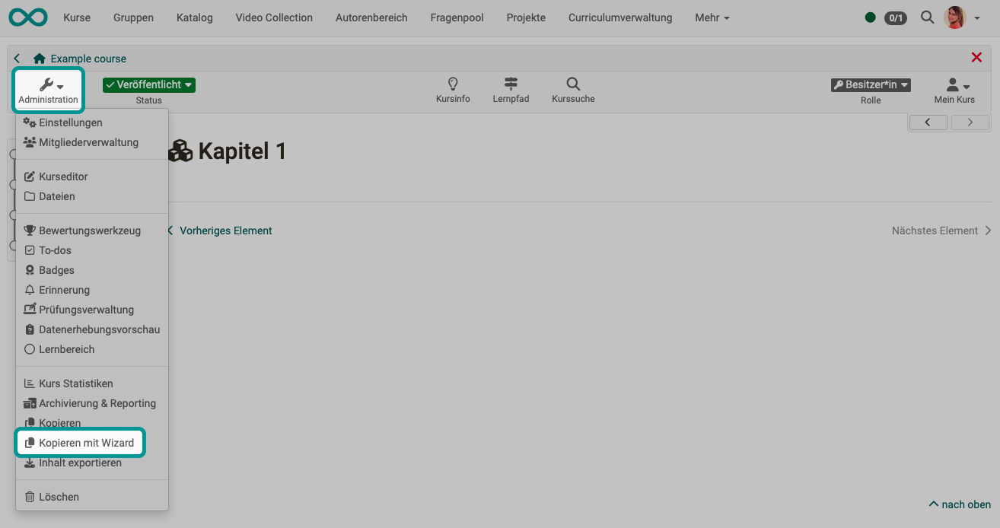

# Copy a course with wizard {: #course_copy_wizard}

{ class="shadow lightbox" }

The wizard can be used to select the elements of a course to be copied. This makes it even more effective to transfer elements for a new course run.

The creation of the copy can be completed automatically or user-defined in the last step. In the case of user-defined creation, the course objects to be copied can be selected and further settings can be made, e.g. with regard to member administration and certain course elements. 

This function is only available for [Learning_path_courses](../learningresources/Learning_path_course.md).

!!! tip "Note"

    Always create a course copy if you want to repeat a course instead of just removing the people from the member list. This will also remove all entries in the assessment tool and you will receive a completely clean course.

!!! tip "Hint"

    It also makes sense to create a course copy as a backup after the course has been completed and before the start of the course.

!!! tip "Note"

    Copying can also be called up in the list of the authoring area. There you will find the option after clicking on the 3 dots at the end of a line.

[To the top of the page ^](#course_copy_wizard)

