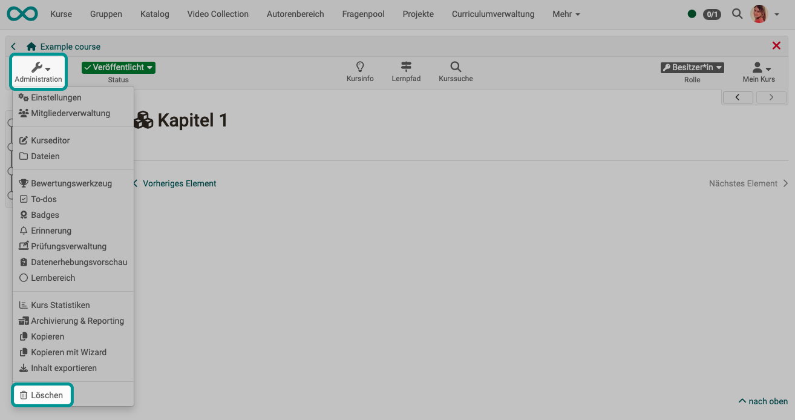

# Löschen (eines Kurses/einer Lernressource) {: #course_delete}

{ class="shadow lightbox" }

Wenn ein Kurs bzw. eine Lernressource gelöscht wird, werden alle Benutzerdaten entfernt und der Kurs ist nun weder für die ehemaligen Teilnehmenden noch die Betreuer:innen aufruf- oder einsehbar. 

Kursbesitzer:innen finden die gelöschte Lernressource anschliessend im Autorenbereich im Tab "Gelöscht". Hier erscheint die Lernressource mit dem Status "Papierkorb". Es besteht weiter Zugriff auf die Menüpunkte der Administration. Der Status "Papierkorb" kann nicht geändert werden. Jedoch ist es möglich, über den Link im 3-Punkte Menü die Lernressource wiederherzustellen.

!!! info "Endgültiges Löschen"

    Das endgültige Löschen eines Kurses bzw. Lernressource aus dem Tab "Gelöscht" ist nur durch OpenOlat-Administrator:innen möglich.

!!! info "Archivierung"

    Wenn Sie einen Kurs löschen, werden Benutzerdaten (z.B. Testresultate) zuerst als Excel-Datei in Ihrem [persönlichen Ordner](../personal_menu/Personal_folders.de.md) archiviert und im Anschluss gelöscht.

Es ist möglich, andere Kursbesitzer:innen via E-Mail über das Beenden oder Löschen eines Kurses zu informieren. Dies kann entweder im Beenden/Löschen-Dialog optional ausgewählt oder von OpenOlat-Administrator:innen systemweit eingestellt werden.

Bei einer gelöschten Lernressource erscheint in der Kursadministration der Menüpunkt "Wiederherstellen". 

Ebenso kann ein Kurs auch automatisiert beendet bzw. gelöscht werden. Entsprechende Einstellungen nehmen ebenfalls OpenOlat-Administrator:innen vor.

[Zum Seitenanfang ^](#course_delete)
