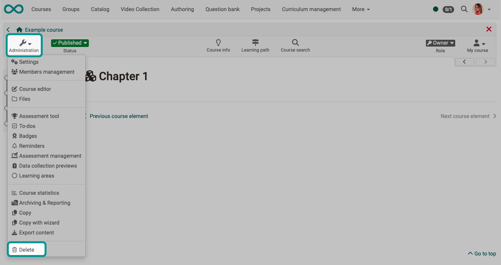

# Delete (a course or learning resource) {: #course_delete}

{ class="shadow lightbox" }

When a course or learning resource is deleted, all user data is removed and the course can now neither be accessed nor viewed by former participants or coaches.

Course owners will subsequently find the deleted learning resource in the authoring area in the "Deleted" tab. Only the course owner has access and finds the course in the authoring area under the tab "Deleted". 
Here the learning resource appears with the status "Trash". There is still access to the administration menu items. The "Trash" status cannot be changed. However, it is possible to restore the learning resource using the link in the 3-dot menu.

!!! info "Final deletion"

    The final deletion of a course or learning resource from the "Deleted" tab is only possible by OpenOlat administrators.

!!! info "Archiving"

    When you delete a course, user data (e.g. test results) is first archived as an Excel file in your [personal folder](../personal_menu/Personal_folders.de.md) and then deleted.

It is possible to inform other course owners via e-mail about the completion or deletion of a course. This can either be optionally selected in the Finish/Delete dialog or set in the administration. 

If a learning resource has been deleted, the menu item "Restore" appears in the course administration. 

A course can also be closed or deleted automatically. The administrator makes the appropriate settings. 

[To the top of the page ^](#course_delete)

