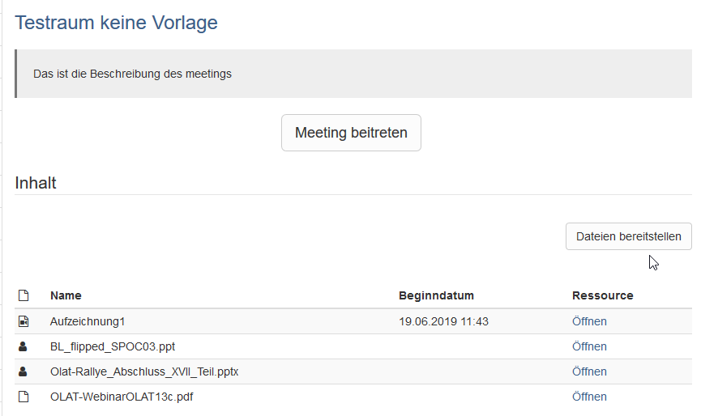
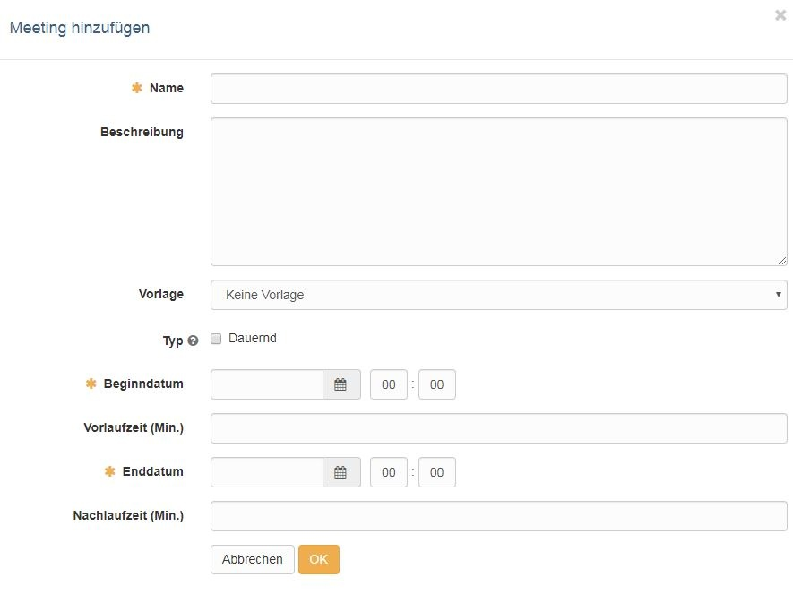

# Kursbaustein "Adobe Connect"

## Steckbrief

Name | Adobe Connect
---------|----------
Icon | { class=size24  }
Verfügbar seit | 
Funktionsgruppe | Kommunikation und Kollaboration
Verwendungszweck | Integration der Webkonferenz-Software Adobe Connect
Bewertbar | nein
Spezialität / Hinweis | Adobe Connect ist eine kommerzielle Software. Um den Kursbaustein zu nutzen ist eine separate Lizenz und ein Serverhosting erforderlich.

## Tool Spezifisches

Standardmässig sind Kursbesitzer und Betreuer Adobe Connect Verwalter und
Kursteilnehme sind Connect Teilnehmende ohne weitere Rechte.

Im Connect Raum stehen diverse Elemente (Pods) zur Verfügung, die miteinander kombiniert und in "Layouts" organisiert werden können. So können u.a. Präsentationsdateien hochgeladen und auch ein Veranstaltungsmitschnitt aktiviert werden. Sowohl die hochgeladenen Präsentationsdateien als auch die Aufzeichnungen sind in OpenOlat für die Kursbesitzer und Betreuer sichtbar und können den Kursteilnehmenden alle oder teilweise zur Verfügung gestellt werden.

  

## Konfiguration im Kurseditor

Hier steht der Reiter Konfiguration für weitere Einstellungen zur Verfügung. 

## Konfiguration im Kursrun (geschlossener Editor)

Nachdem der Kursbaustein hinzugefügt wurde, muss ein Meetingraum im Tab "Konfiguration" über den Button "Meeting hinzufügen" erstellt werden. Anschliessend erscheint der folgende Dialog:

Unter dem eingetragenen Namen wird der Raum im Bereich der Meetings angezeigt. Die Beschreibung wird sichtbar nachdem man den Raum ausgewählt hat.

Sofern vorhanden können Sie eine vom Hosting-Server bereitgestellte Vorlage verwenden oder "Keine Vorlage" wählen. Definieren Sie auch ob der Raum permanent (=dauernd) oder nur zu einem bestimmten Termin zur Verfügung stehen soll. Bei einem termingebundenen Raum können Sie noch ein Vorlauf und Nachlaufzeit ergänzen.

Unabhängig von der Raumkonfiguration kann der Zugang zum Kursbaustein des Virtuellen Klassenzimmers auch wie alle anderen Kursbausteine über die Tabs Sichtbarkeit und Zugang im Kurseditor konfiguriert werden.

Ein eingebauter Adobe Connect Kursbaustein kann mehrere unterschiedlich konfigurierte Meeting-Räume enthalten. Je nach Konfiguration in der OpenOlat Administration führen alle eingerichteten Meetings in denselben oder verschiedene Adobe Connect Räume.

Im Tab "Meetings" wird die Übersicht der eingerichteten virtuellen Räume so angezeigt, wie sie auch für Teilnehmende sichtbar sind. Terminlich abgelaufene, termingebundene Meetings werden entsprechend gekennzeichnet.

Über "Auswählen" gelangt man in das entsprechende virtuelle Klassenzimmer. Beim ersten Aufruf muss man sich für das Meeting "anmelden" und anschließend hat man die Möglichkeit über ein weiteres Dialogfenster dem Meeting beizutreten. Mit "Meeting beitreten" gelangt man in das Virtuelle Klassenzimmer und sämtliche raumspezifischen Werkzeuge stehen zur Verfügung.  
  
!!! note "Link zu weiteren Infos"

    Adobe Connect Anbieter Webseite: <https://www.adobe.com/de/products/adobeconnect.html>

    Da viele Hochschulen in Deutschland den [DFN Server](https://www.conf.dfn.de/anleitungen-und-dokumentation/adobe-connect) für Adobe Connect nutzen, können auch die entsprechenden Informationen interessant sein.

