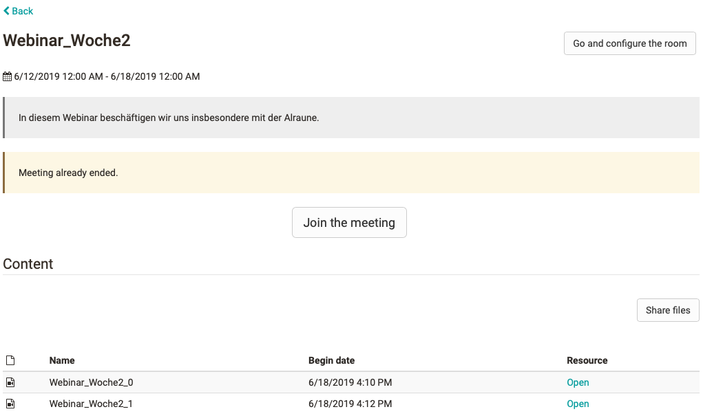
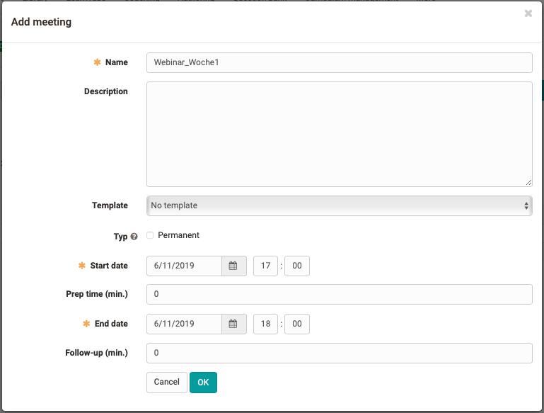
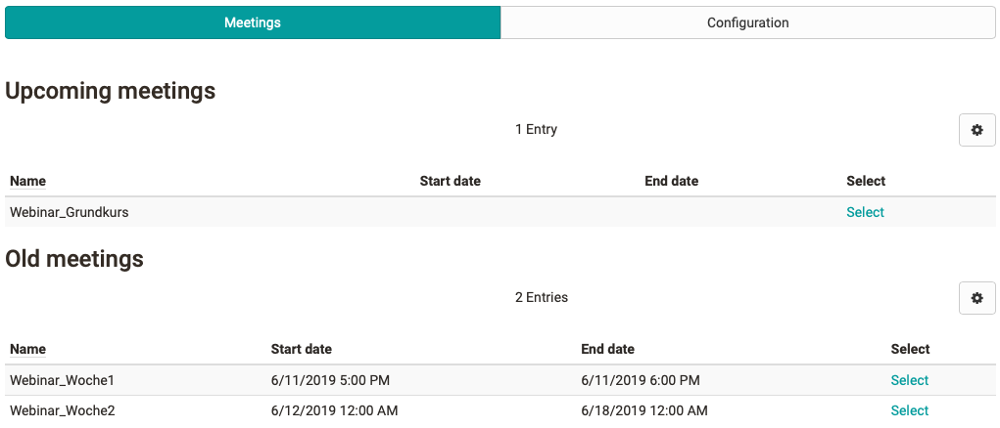

# Course Element "Adobe Connect"

## Profile

Name | Adobe Connect
---------|----------
Icon | { class=size24  }
Available since | 
Functional group | Communication und collaboration
Purpose | Integration of the Adobe Connect web conferencing software 
Assessable | no
Specialty / Note | Adobe Connect is commercial software. To use the course element, a separate license and server hosting is required.

## Tool-specific

By default, course owners and coaches are Adobe Connect administrators and participants are Connect participants with no other rights.

In the Connect room, various elements (pods) are available, which can be combined with each other and organized in "layouts". For example, presentation files can be uploaded and an event recording can be activated. Both the uploaded presentation files and the recordings are visible in OpenOlat for course owners and coaches and can be made available to course participants in full or in part.

  
  
## Configuration in the course editor
 
Here, the configuration tab is available for further settings.  

## Configuration in the course run (closed editor)

After the course element has been added, a meeting room must be created in the tab "Configuration" via the button "Add Meeting". Then the following dialog appears:

Under the entered title the room is displayed in the meeting area. The description becomes visible after you have selected the room.

If available, you can use a template provided by the hosting server or "No template". Also define whether the room should be available permanently or only at a certain date. For a time-bound room, you can add a lead time and a follow-up time.

Irrespective of the room configuration, access to the course element of the virtual classroom can also be configured like all other course elements via the Visibility and Access tabs in the course editor.

A built-in Adobe Connect course element can contain multiple differently configured meeting rooms. Depending on the configuration in the OpenOlat Administration, all meetings set up run in the same or different Adobe Connect rooms.

In the "Meetings" tab, the overview of the virtual rooms set up is displayed in the same way as they are visible to participants. Scheduled meetings are marked accordingly.

"Select" takes you to the corresponding virtual classroom. At the first call you have to "register" for the meeting and afterwards you have the possibility to join the meeting via another dialog window. With "Join Meeting" you enter the virtual classroom and all room specific tools are available.  
  
 !!! note "Link to further information"

    Adobe Connect Provider Website: <https://www.adobe.com/de/products/adobeconnect.html>

    Since many universities in Germany use the [DFN server](https://www.conf.dfn.de/anleitungen-und-dokumentation/adobe-connect) for Adobe Connect, the corresponding information can also be interesting.  
  
