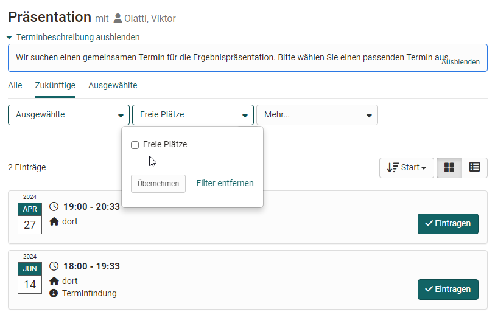
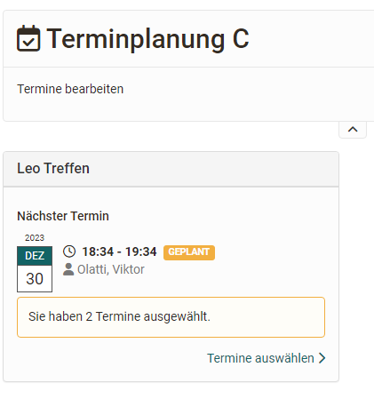

# Kursbaustein "Terminplanung" {: #appointment_scheduling}

## Steckbrief

Name | Terminplanung
---------|----------
Icon | { class=size24  }
Verfügbar seit | 
Funktionsgruppe | Verwaltung und Organisation
Verwendungszweck | Terminfindung und Einschreibung für bestimmte gemeinsame Termine
Bewertbar | nein
Spezialität / Hinweis |

Mit dem Kursbaustein Terminplanung können sowohl Einschreibungen für bestimmte
Termine als auch Terminfindungen organisiert werden. Generell kann
konfiguriert werden, ob mehrere Termine ausgewählt werden können, ob es eine
Begrenzung der Teilnehmerzahl gibt, ob die Teilnehmenden sehen wer sich
eingetragen hat und ob ein BigBlueButton Raum zugeordnet werden soll.

Im Kurseditor wird der Kursbaustein hinzugefügt und es kann festgelegt werden,
ob Betreuer Themen und Termine ebenfalls bearbeiten dürfen oder ob dies nur
durch die Kursbesitzer möglich ist. Soll die Terminwahl nur innerhalb eines
bestimmten Zeitfensters möglich sein, müssen die Zeitangaben im Kurseditor im
Tab "Lernpfad" entsprechend angegeben werden bzw. bei herkömmlichen Kursen die
Sichtbarkeit oder der Zugang passend konfiguriert werden.

Die eigentliche Konfiguration und Einrichtung der Termine erfolgt jedoch im
Kursrun bei geschlossenem Editor. Dafür werden zunächst über den Button
"Anlass erstellen" eine neue Einschreibung oder Terminfindung angelegt und die
Basiskonfiguration vorgenommen sowie Termine eingetragen.

Über den Button "**Termin hinzufügen**" können Sie auch später noch weitere
Termine dieser Abstimmung hinzufügen.  Auch können bereits angelegte Termine
über den Drei-Punkte-Link wieder überarbeitet werden.

## Anlass konfigurieren

Ein "Anlass" ist eine Zusammenstellung von mehreren Terminen die ausgewählt werden können.

So konfigurieren Sie eine Terminbuchung oder Terminfindung:

**Titel:** Geben Sie hier die Bezeichnung des Termins an, z.B. "Abstimmung Abschlussmeeting", "Kick-Off-Meeting" usw.. Die Eingabe ist notwendig
(Pflichtfeld).

 **Beschreibung:** Erläutern Sie die Terminwahl näher.

 **Typ:** Entscheiden Sie ob es sich um eine Terminfindung für einen gemeinsamen Termin oder um die Einschreibung für einen oder mehrere Termine
aus einer Auswahl, z.B. Labortermine handelt.

 **Konfiguration:** Entscheiden sie ob die Teilnehmenden nur einen oder
mehrere Termine auswählen dürfen und ob die Namen der Teilnehmenden für andere Teilnehmende sichtbar sein sollen. Beim Typ "Terminbuchung" kann ergänzend noch
definiert werden ob der Organisator den Termin noch bestätigen muss.

 **Organisator:**  Definieren Sie hier, wer als Organisator der Terminplanung
angezeigt wird.

 **Ort:** Geben Sie hier den Veranstaltungsort ein.

 **Max. Teilnehmer:** Sie können die Mitgliederzahl für einen Termin begrenzen (nur bei "Terminbuchung")

 **Terminart:** Sie können Termine basierend auf der Dauer, basierend auf einem Start- und Enddatum oder wiederkehrend nach bestimmten Wochentagen
anlegen. Die Auswahl erleichtert Ihnen die Erstellung von weiteren Terminen.

!!! info "Info"

    Wird "Dauer" gewählt, werden beim Hinzufügen von weiteren Terminen die Termine am gleichen Tag vorkonfiguriert und die Uhrzeiten entsprechend der Dauer angepasst.

    Wird Start/Ende gewählt bleiben die gewählten Uhrzeiten erhalten und man braucht bei neuen Einträgen nur das Datum anzupassen.

 **Termine:** Hier werden die konkreten Wahltermine eingetragen. Durch Klick auf das „+ Zeichen“ werden neue Termine hinzugefügt. Durch Klick auf das „-Zeichen“ werden Termine wieder gelöscht.

 **Online Termin:** Die Optionen sind: Nein, kein Online-Termin oder man wählt
direkt das gewünschte Tool BigBlueButton oder Teams aus, sofern vom Administrator die Virtuellen Klassenzimmer aktiviert wurden.

!!! tip "Tipp"

    Wird BigBlueButton oder Teams aktiviert, kann für die gewählten Termine jeweils ein BigBlueButton bzw. Teams Raum hinzugefügt und weiter konfiguriert werden. Beim Ort wird in diesem Fall automatisch "online" angezeigt.

  
Ein erstellter "Anlass" kann später mit Klick auf das Zahnrad bearbeitet, dupliziert oder gelöscht werden. Auch kann der Teilnehmerkreis für den Anlass
auf bestimmte Gruppen eingeschränkt werden. Ein Export der Teilnehmenden für
einen Anlass ist ebenfalls möglich.

## Termine organisieren 

Die konkreten für einen "Anlasse" definierten Termine können über den Link "Termine anzeigen" im Überblick näher betrachtet und vom Kursbesitzer bzw. Betreuer
auch einzeln editiert werden. Sie können hier Teilnehmende hinzufügen, löschen, umbuchen,
die Beschreibung anpassen, Termine ändern oder Termine bestätigen.

## Teilnehmerperspektive

Mit Klick auf den Kursbaustein werden den Teilnehmenden alle, zukünftige oder ausgewählte Termine angezeigt und eine Auswahl ist über den Link "**Eintragen**" möglich. Auch eine Filterung nach Terminen mit freien Plätzen kann über die Filterfunktion vorgenommen werden. 

