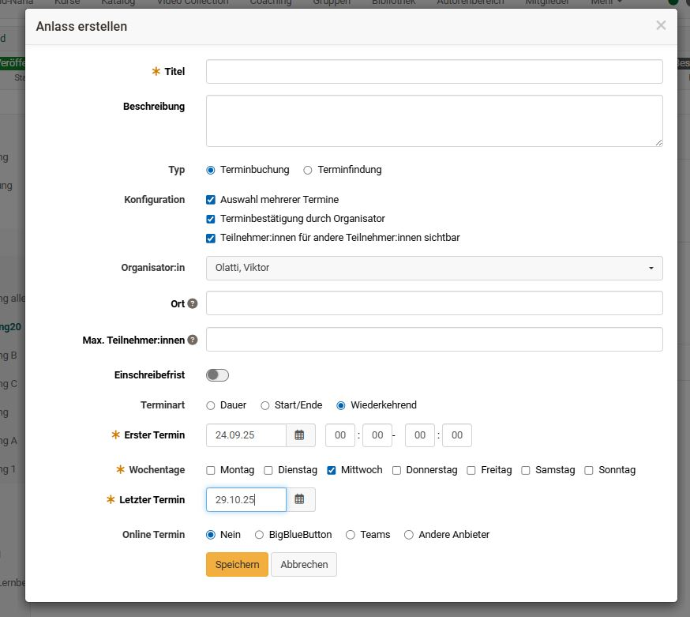
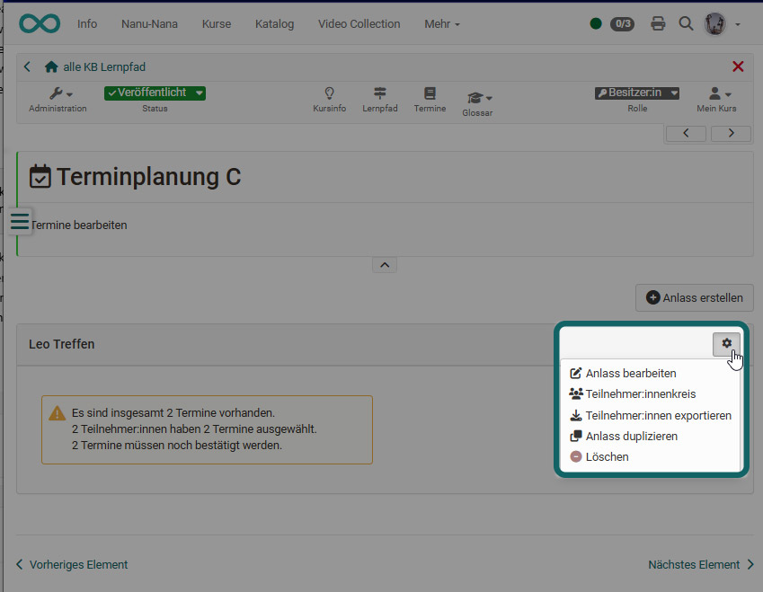
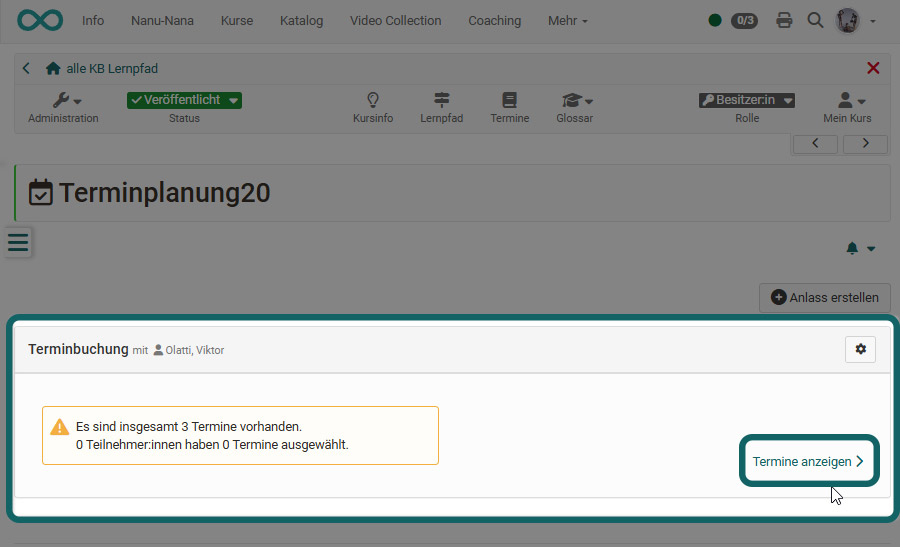
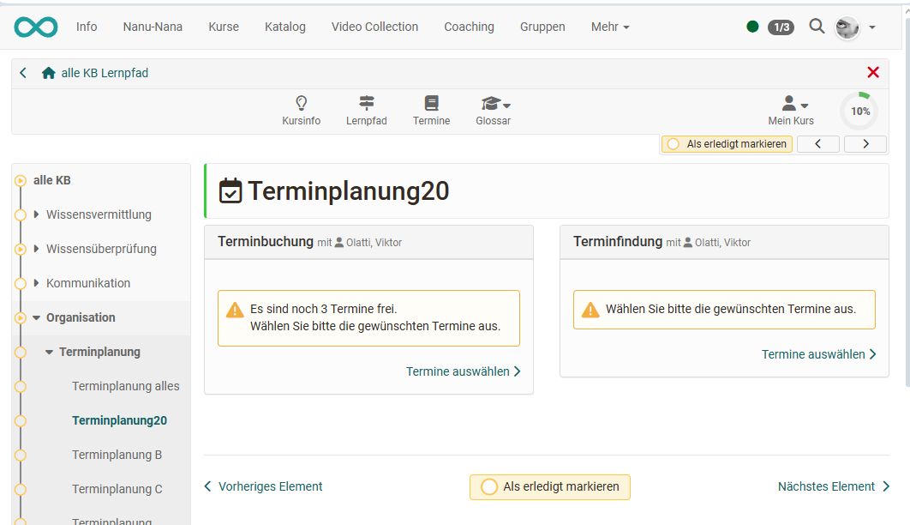
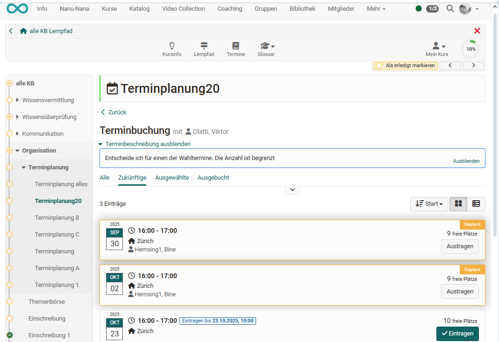

# Kursbaustein "Terminplanung" {: #appointment_scheduling}

## Steckbrief

Name | Terminplanung
---------|----------
Icon | { class=size24  }
Verfügbar seit | 
Funktionsgruppe | Verwaltung und Organisation
Verwendungszweck | Terminfindung und Einschreibung für bestimmte gemeinsame Termine
Bewertbar | nein
Spezialität / Hinweis |

Mit dem Kursbaustein Terminplanung lassen sich sowohl Einschreibungen für feste Termine als auch Terminfindungen organisieren. Dabei kann unter anderem festgelegt werden, ob mehrere Termine auswählbar sind, ob die Teilnehmendenzahl begrenzt wird, ob sichtbar ist, wer sich eingetragen hat, und ob ein in der OpenOlat-Instanz installiertes virtuelles Klassenzimmer (z. B. BigBlueButton oder Teams) zugeordnet werden soll.

## Im Kurseditor

Im Kurseditor wird der Kursbaustein hinzugefügt. Im Tab "Konfiguration" werden die Berechtigungen für bestimmte Personengruppen festgelegt. So kann definiert werden ob Kurs Besitzer:innen und /oder Kurs Betreuende als Organisator:innen der Termine gelten, ob diese eine E-Mail-Benachrichtigung erhalten, ob Teilnehmende ihre Wahl kommentieren dürfen und wer die Berechtigung erhält einen Anlass zu bearbeiten (z.B. Personen mit einer bestimmten Rolle, einzelne Teilnehmende oder bestimmte Gruppe). 

Soll die Terminwahl nur innerhalb eines bestimmten Zeitfensters möglich sein, müssen die Zeitangaben im Kurseditor im Tab "Lernpfad" entsprechend angegeben werden bzw. bei herkömmlichen Kursen die Sichtbarkeit oder der Zugang passend konfiguriert werden.

## Im Kursrun (geschlossener Kurseditor)

Die eigentliche Konfiguration und Einrichtung der wählbaren Termine erfolgt im Kursrun bei geschlossenem Editor. Über den Button „Anlass erstellen“ wird zunächst eine neue Terminbuchung oder Terminfindung angelegt, die Basiskonfiguration vorgenommen und die ersten Termine eingetragen. Mit „Termin hinzufügen“ können später weitere Termine ergänzt werden. Bereits angelegte Termine lassen sich über das Drei-Punkte-Menü jederzeit wieder bearbeiten.

### Anlass konfigurieren

Klicken Sie als erstes auf **"Anlass erstellen".** Ein "Anlass" ist eine Zusammenstellung von mehreren Terminen die ausgewählt werden können. 

Es erscheint das Konfigurationsmenü und Sie können folgende Aspekte festlegen: 

**Titel:** Geben Sie hier die Bezeichnung des Termins an, z.B. "Abstimmung Abschlussmeeting", "Kick-Off-Meeting" usw. Die Eingabe ist notwendig (Pflichtfeld).

**Beschreibung:** Erläutern Sie die Terminwahl näher. Worum geht es?

**Typ:** Entscheiden Sie ob es sich um eine *Terminfindung* für einen gemeinsamen Termin oder um die Einschreibung für einen oder mehrere Termine aus einer Auswahl, z.B. Labortermine handelt (= *Terminbuchung*).

**Konfiguration:** Entscheiden sie ob die Teilnehmenden nur einen oder mehrere Termine auswählen dürfen und ob die Namen der Teilnehmenden für andere Teilnehmende sichtbar sein sollen. Beim Typ "Terminbuchung" kann ergänzend noch definiert werden ob die Organisator:innen den Termin noch bestätigen müssen. 

**Organisator:in:**  Definieren Sie hier, wer als Organisator:in der Terminplanung für die User angezeigt wird.

**Ort:** Geben Sie hier den Veranstaltungsort ein.

**Max. Teilnehmer:** Sie können die Mitgliederzahl für einen Termin begrenzen (nur bei "Terminbuchung").

**Einschreibefrist:** Hier kann festgelegt werden, bis wann vor dem Termin eine Einschreibung möglich ist. Beispiel: Mit „1d“ endet die Einschreibung einen Tag vor dem Termin.

**Terminart:** Sie können Termine basierend auf der Dauer, basierend auf einem Start- und Enddatum oder wiederkehrend nach bestimmten Wochentagen anlegen. Die Auswahl erleichtert Ihnen die Erstellung von weiteren Terminen.

!!! info "Info"

    Wird "Dauer" gewählt, werden beim Hinzufügen von weiteren Terminen die Termine am gleichen Tag vorkonfiguriert und die Uhrzeiten entsprechend der Dauer angepasst.

    Wird Start/Ende gewählt bleiben die gewählten Uhrzeiten erhalten und man braucht bei neuen Einträgen nur das Datum anzupassen.

**Termine:** Hier werden die konkreten Wahltermine eingetragen. Durch Klick auf das "+ Zeichen" werden neue Termine hinzugefügt. Durch Klick auf das "-Zeichen" werden Termine wieder gelöscht.

**Online Termin:** Sollen die Wahltermine mit einem Virtuellen Klassenzimmer wie BigBlueButton oder Teams verbunden werden, kann das hier direkt vorausgewählt und die Räume entsprechend konfiguriert werden. Welche Systeme zur Verfügung stehen ist abhängig von der jeweiligen OpenOlat Installation. 
Wählen Sie "Nein", wenn keine entsprechende  Verknüpfung vorgesehen ist. 

!!! info "Info"

    Wird BigBlueButton oder Teams aktiviert wird beim Ort automatisch "online" angezeigt.  

  
Ein erstellter "Anlass" kann später mit Klick auf das Zahnrad bearbeitet, dupliziert oder gelöscht werden. Auch kann der Teilnehmerkreis für den Anlass auf bestimmte Gruppen eingeschränkt werden. Ein Export der Teilnehmenden für einen Anlass ist ebenfalls möglich.

### Termine organisieren 

Die konkreten für einen "Anlasse" definierten Termine können über den Link "Termine anzeigen" im Überblick näher betrachtet und von den Kursbesitzer:innen bzw. Betreuer:innen auch einzeln editiert werden. 

Sie können hier Teilnehmende hinzufügen, löschen, umbuchen, die Beschreibung anpassen, Termine ändern oder bei der Terminplanung Termine bestätigen.

### Teilnehmenden Perspektive

Mit Klick auf den Kursbaustein werden den Teilnehmenden die vorbereiteten Terminfindungen bzw. möglichen Terminbuchungen angezeigt. Umfasst der Kursbaustein mehrere Anlässe erscheint zunächst eine Übersichtsseite. 

Anschliessend können die Termine ausgewählt werden. Gibt es nur einen Anlass wird die konkrete Auswahl direkt angezeigt. 

Über den Button "Eintragen" kann ein Termin gewählt werden. Je nach Konfiguration kann auch noch ein Kommentar hinzugefügt oder mehrere Termine ausgewählt werden. Auch ein Austragen ist möglich.  

Über die Filteroption "Ausgebucht" können sich Teilnehmende auch anzeigen lassen wer den Termin ausgewählt (sofern aktiviert) und untereinander Kontakt aufnehmen um Termine zu tauschen. 

