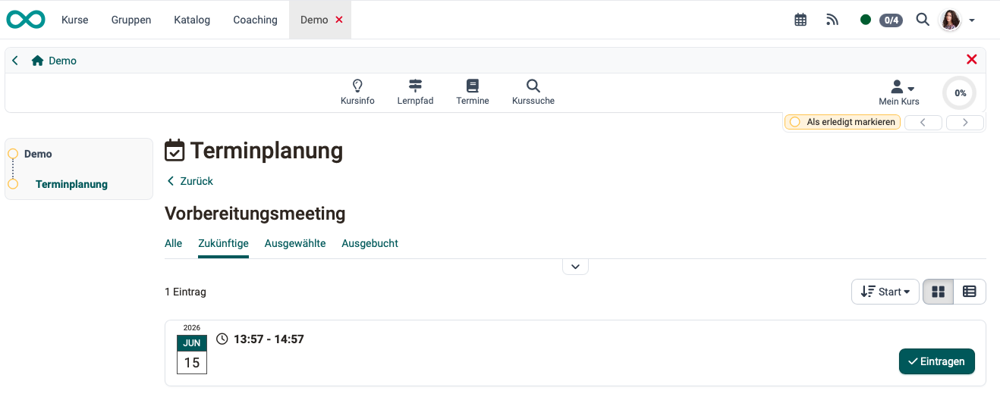
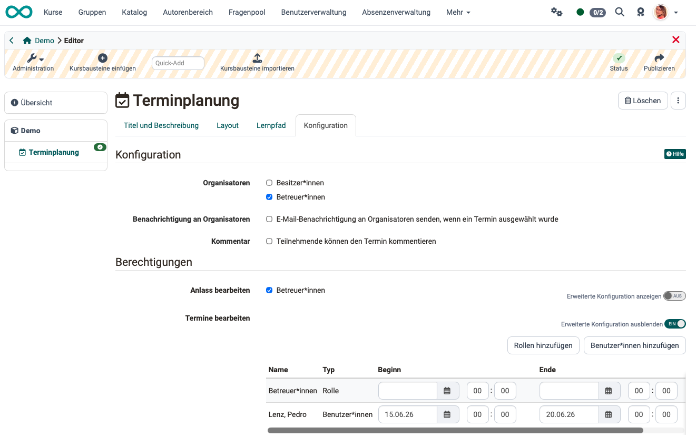
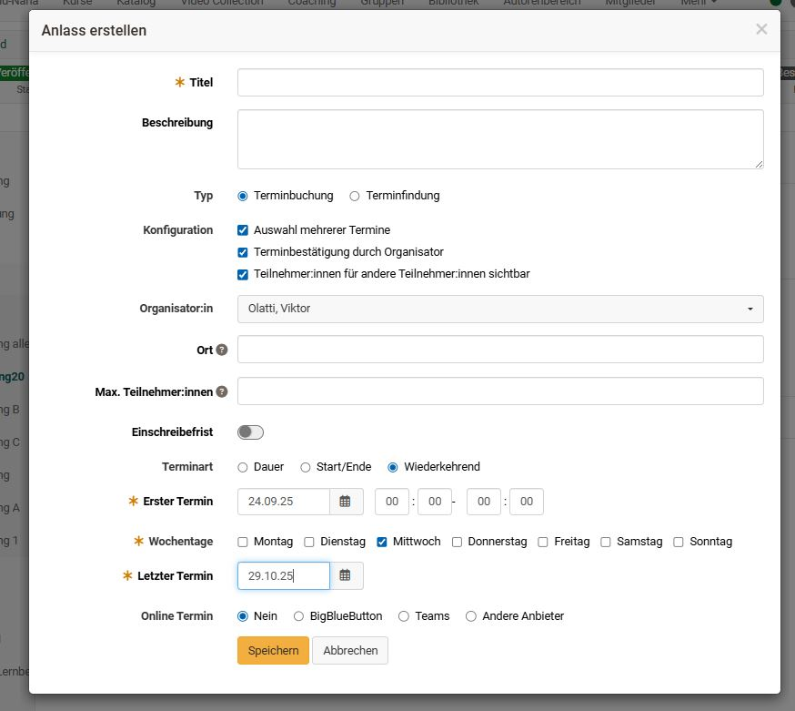
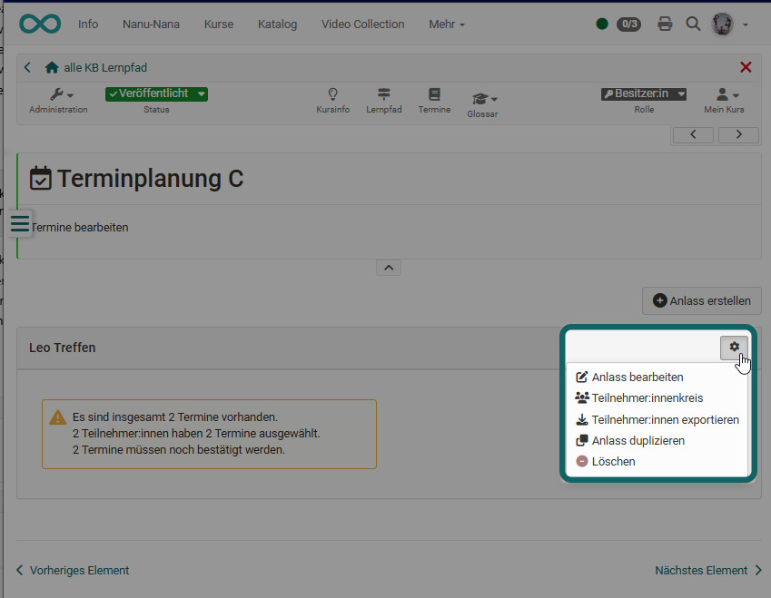
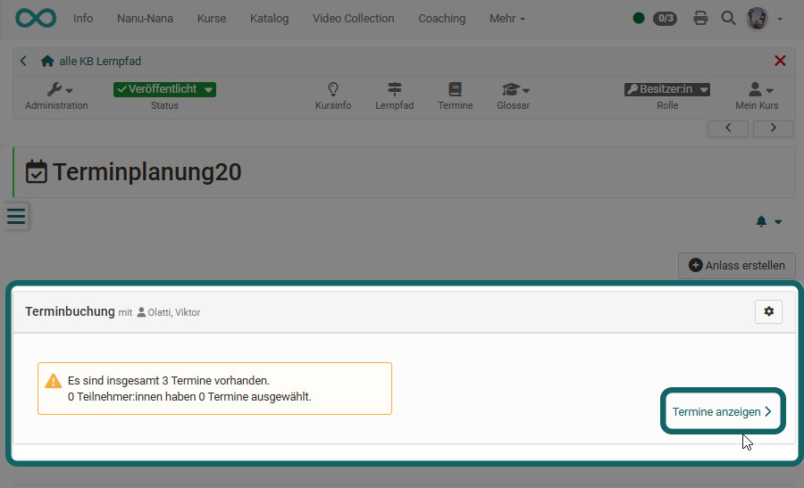
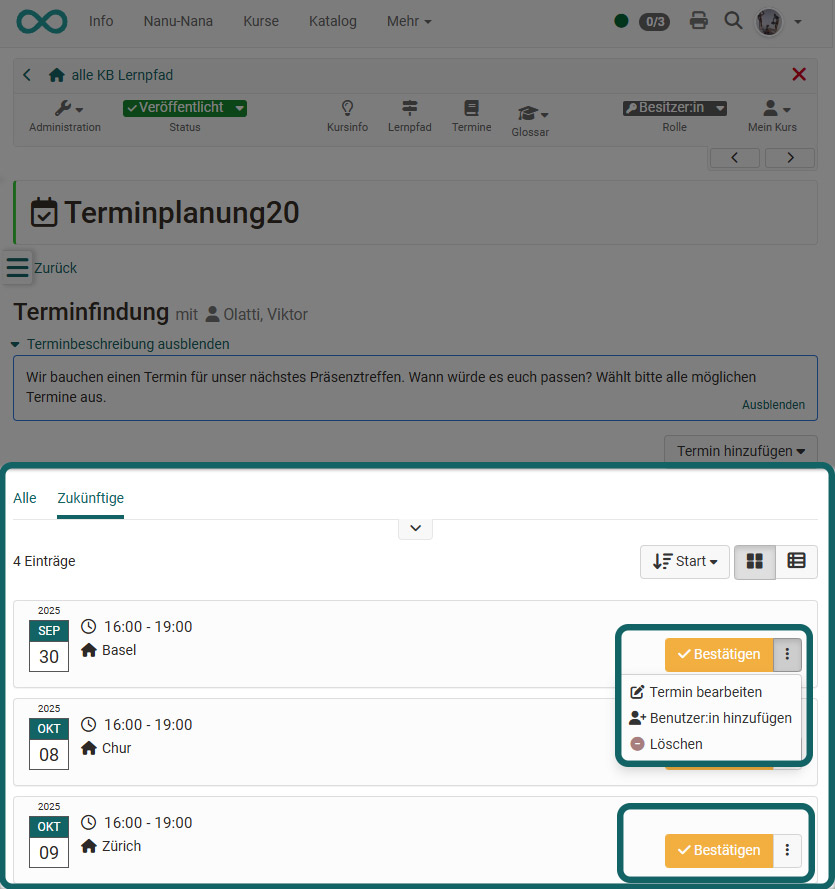
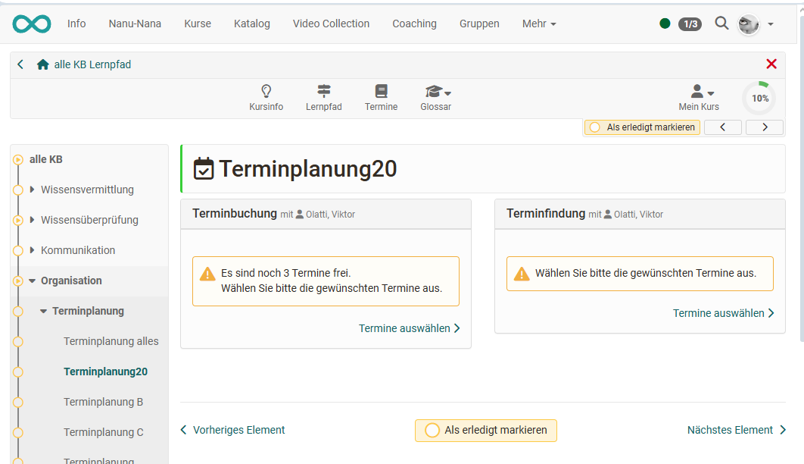
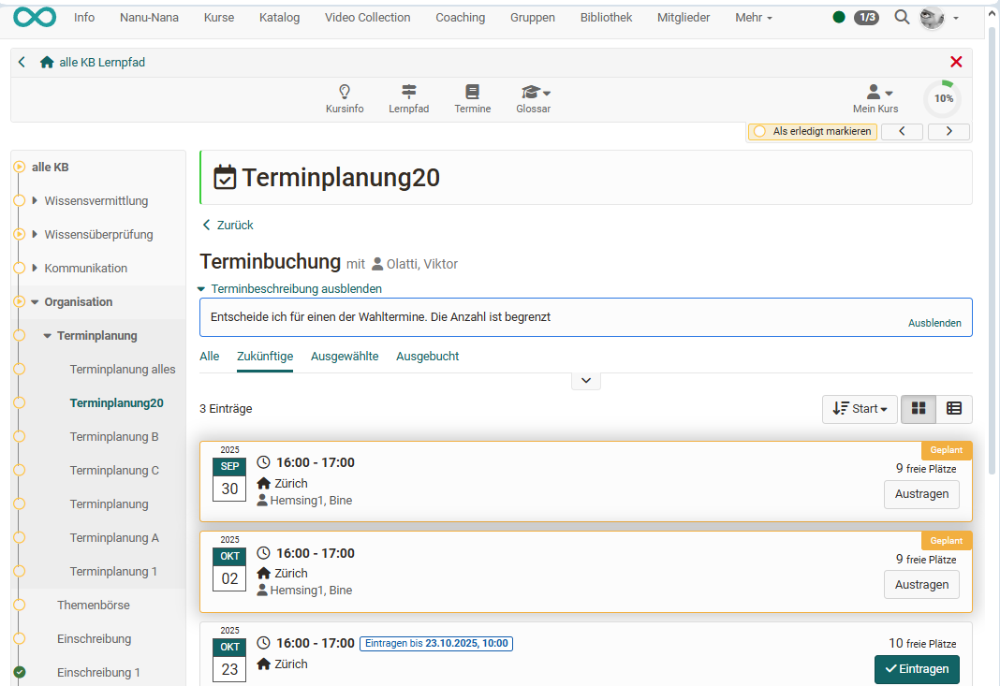

# Kursbaustein "Terminplanung" {: #appointment_scheduling}

## Steckbrief

Name | Terminplanung
---------|----------
Icon | { class=size24  }
Verfügbar seit | 
Funktionsgruppe | Verwaltung und Organisation
Verwendungszweck | Terminfindung und Einschreibung für bestimmte gemeinsame Termine
Bewertbar | nein
Spezialität / Hinweis |

Mit dem Kursbaustein Terminplanung lassen sich  
a) **Einschreibungen für feste Termine** und  
b) **Terminfindungen**  
organisieren.

Mehrere einzeln wählbare **Termine** werden zusammengestellt zu einem **Anlass**. 

{ class="shadow lightbox" }

Autor:innen können unter anderem festgelegen, ob mehrere Termine auswählbar sind, ob die Teilnehmendenzahl begrenzt wird, ob sichtbar ist, wer sich eingetragen hat, und ob ein in der OpenOlat-Instanz installiertes virtuelles Klassenzimmer (z. B. BigBlueButton oder Teams) zugeordnet werden soll.

---

## Einrichtung im Kurseditor {: #editor}

Wurde im Kurseditor der Kursbaustein hinzugefügt, werden im Tab "Konfiguration" die Berechtigungen für bestimmte Personengruppen festgelegt.

{ class="shadow lightbox" }

**Organisatoren** 
Es kann definiert werden, ob Kurs-Besitzer:innen und/oder Kurs-Betreuer:innen als Organisator:innen der Termine gelten.

**Benachrichtigung an Organisatoren** 
Ist diese Option ausgewählt, werden E-Mail-Benachrichtigung an die Organisator:innen gesendet, wenn ein Termin ausgewählt wurde.

**Kommentar** 
Als Kursbesitzer:in entscheiden Sie hier, ob Teilnehmende ihre Terminwahl kommentieren dürfen. 

**Anlass bearbeiten** 
Wer diese Berechtigung erhält, kann einen Anlass bearbeiten. (Ein Anlass ist eine Zusammenstellung mehrerer Termine.)
Das Recht kann per Checkbox den Betreuer:innen des aktuellen Kurses generell gegeben werden oder über die erweiterte Konfiguration auch mit einer zeitlichen Eingrenzung. Zudem kann das Recht über die erweiterte Konfigurationan auch an ganz bestimmte Einzelpersonen vergeben werden.

**Termine bearbeiten** 
Wer diese Berechtigung erhält, kann einen Termin bearbeiten. Das Recht kann per Checkbox den Betreuer:innen des aktuellen Kurses generell gegeben werden oder über die erweiterte Konfiguration auch mit einer zeitlichen Eingrenzung. Zudem kann das Recht über die erweiterte Konfigurationan auch an ganz bestimmte Einzelpersonen vergeben werden.

!!! tip "Tipp"

    Soll für die Teilnehmer:innen die Terminwahl nur innerhalb eines bestimmten Zeitfensters möglich sein, müssen die Zeitangaben im Kurseditor im Tab "Lernpfad" entsprechend angegeben werden bzw. bei herkömmlichen Kursen die Sichtbarkeit oder der Zugang passend konfiguriert werden.

---

## Einrichtung im Kursrun (geschlossener Kurseditor) {: #course_run}

Die eigentliche Konfiguration und Einrichtung der wählbaren Termine erfolgt im Kursrun bei geschlossenem Editor. 
Zunächst wird ein **Anlass** erstellt. Dies ist eine Zusammenstellung mehrerer einzeln wählbarer **Termine**. 

Über den Button "Anlass erstellen" wird zunächst eine neue Terminbuchung oder Terminfindung angelegt, die Basiskonfiguration vorgenommen und die ersten Termine eingetragen. Mit "Termin hinzufügen" können später weitere Termine ergänzt werden. Bereits angelegte Termine lassen sich über das Drei-Punkte-Menü jederzeit wieder bearbeiten.

### Anlass konfigurieren {: #cofig_occassion}

Klicken Sie als erstes auf **"Anlass erstellen".** Ein "Anlass" ist eine Zusammenstellung von mehreren Terminen die ausgewählt werden können. 

Es erscheint das Konfigurationsmenü und Sie können folgende Aspekte festlegen: 

**Titel** 
Geben Sie hier die Bezeichnung des Termins an, z.B. "Abstimmung Abschlussmeeting", "Kick-Off-Meeting" usw. Die Eingabe ist notwendig (Pflichtfeld).

**Beschreibung** 
Erläutern Sie die Terminwahl näher. Worum geht es?

**Typ** 
Entscheiden Sie ob es sich um eine *Terminfindung* für einen gemeinsamen Termin oder um die Einschreibung für einen oder mehrere Termine aus einer Auswahl, z.B. Labortermine handelt (= *Terminbuchung*).

**Konfiguration** 
Entscheiden sie ob die Teilnehmenden nur einen oder mehrere Termine auswählen dürfen und ob die Namen der Teilnehmenden für andere Teilnehmende sichtbar sein sollen. Beim Typ "Terminbuchung" kann ergänzend noch definiert werden ob die Organisator:innen den Termin noch bestätigen müssen. 

**Organisator:in** 
Definieren Sie hier, wer als Organisator:in der Terminplanung für die User angezeigt wird.

**Ort** 
Geben Sie hier den Veranstaltungsort ein.

**Max. Teilnehmer:innen** 
Sie können die Mitgliederzahl für einen Termin begrenzen (nur bei "Terminbuchung").

**Einschreibefrist** 
Hier kann festgelegt werden, bis wann vor dem Termin eine Einschreibung möglich ist. Beispiel: Mit „1d“ endet die Einschreibung einen Tag vor dem Termin.

**Terminart** 
Sie können Termine basierend auf der Dauer, basierend auf einem Start- und Enddatum oder wiederkehrend nach bestimmten Wochentagen anlegen. Die Auswahl erleichtert Ihnen die Erstellung von weiteren Terminen.

**Termine:** 
Hier werden die konkreten Wahltermine eingetragen. Je nach gewählter Terminart stehen unterschiedliche Eingabefelder zur Verfügung.

* Termine mit Terminart "Dauer" 
Durch Klick auf das "+ Zeichen" werden neue Termine hinzugefügt. Durch Klick auf das "-Zeichen" werden Termine wieder gelöscht. Wird "Dauer" gewählt, werden beim Hinzufügen von weiteren Terminen die Termine am gleichen Tag vorkonfiguriert und die Uhrzeiten entsprechend der Dauer angepasst.

* Termine mit Terminart "Start/Ende" 
Es können mehrere Termine mit frei geweähltem Datum und unterschiedlichen Start- und Endzeitpunkten erstellt werden.
Wird Start/Ende gewählt bleiben die gewählten Uhrzeiten erhalten und man braucht bei neuen Einträgen nur das Datum anzupassen.

* Termine mit Terminart "Wiederkehrend" 
Für wiederkehrende Termine wird eine Angabe des ersten und letzten Termins der Serie verlangt, sowie Uhrzeit und Wochentag der regelmässigen Wiederholungen.

**Online Termin** 
Sollen die Wahltermine mit einem Virtuellen Klassenzimmer wie BigBlueButton oder Teams verbunden werden, kann das hier direkt vorausgewählt und die Räume entsprechend konfiguriert werden. Welche Systeme zur Verfügung stehen ist abhängig von der jeweiligen OpenOlat Installation. 
Wählen Sie "Nein", wenn keine entsprechende  Verknüpfung vorgesehen ist. 

!!! info "Info"

    Wird BigBlueButton oder Teams aktiviert, wird beim Ort automatisch "online" angezeigt.  

  
Ein erstellter "Anlass" kann später mit Klick auf das Zahnrad bearbeitet, dupliziert oder gelöscht werden. Auch kann der Teilnehmerkreis für den Anlass auf bestimmte Gruppen eingeschränkt werden. Ein Export der Teilnehmenden für einen Anlass ist ebenfalls möglich.

### Termine organisieren {: #config_event}

Die konkreten für einen "Anlass" definierten Termine können über den Link "Termine anzeigen" im Überblick näher betrachtet und von den Kursbesitzer:innen bzw. Betreuer:innen auch einzeln editiert werden. 

Sie können hier Teilnehmende hinzufügen, löschen, umbuchen, die Beschreibung anpassen, Termine ändern oder bei der Terminplanung Termine bestätigen.

---

## Teilnehmenden-Perspektive {: #participant}

Mit Klick auf den Kursbaustein werden den Teilnehmenden die vorbereiteten Terminfindungen bzw. möglichen Terminbuchungen angezeigt. Umfasst der Kursbaustein mehrere Anlässe, erscheint zunächst eine Übersichtsseite. 

Anschliessend können die Termine ausgewählt werden. Gibt es nur einen Anlass wird die konkrete Auswahl direkt angezeigt. 

Über den Button "Eintragen" kann ein Termin gewählt werden. Je nach Konfiguration kann auch noch ein Kommentar hinzugefügt oder mehrere Termine ausgewählt werden. Auch ein Austragen ist möglich.  

Über die Filteroption "Ausgebucht" können sich Teilnehmende auch anzeigen lassen, wer den Termin ausgewählt hat (sofern aktiviert) und untereinander Kontakt aufnehmen um Termine zu tauschen. 

