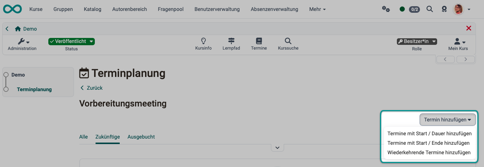

# Course Element "Appointment scheduling" {: #appointment_scheduling}

## Profile

Name | Appointment scheduling
---------|----------
Icon | :fontawesome-regular-calendar-check:
Available since | Release 15.3
Functional group | Administration and organisation
Purpose | Appointment finding and enrolment for specific joint appointments
Assessable | No
Specialty / Note |

The Appointment scheduling course element can be used to organize 
a) **enrolments for fixed appointments** and 
b) **appointment finding** 
.

Several individually selectable **appointments** are combined into an **occasion**.

{ class="shadow lightbox" }

Among other things, authors can define whether multiple appointments can be selected, whether the number of participants is limited, whether it is visible who has enrolled, and whether a virtual classroom installed in the OpenOlat instance (e.g. BigBlueButton or Teams) should be assigned.

[To the top ^](#appointment_scheduling)

---

## In the course editor [:octicons-tag-16:{ title="from Release 15.3 (OO-4918)" }](https://track.frentix.com/issue/OO-4918){:target="_blank"} {: #editor}

Once the course element has been added in the course editor, the permissions for specific groups of people are defined in the "Configuration" tab.

{ class="shadow lightbox" }

**Organizers** 
You can define whether course owners and/or course coaches are considered organizers of the appointments.

**Notification to organizers** 
If this option is selected, email notifications are sent to the organizers when an appointment has been selected.

**Comment** 
As course owner, you decide here whether participants are allowed to comment on their appointment choice.

**Edit occasion** 
Whoever is granted this permission can edit an occasion. (An occasion is a compilation of several appointments.)
The right can be granted to the coaches of the current course in general via a checkbox, or via the advanced configuration also with a time restriction. In addition, the right can be assigned to very specific individuals via the advanced configuration.

**Edit appointments** 
Whoever is granted this permission can edit an appointment. The right can be granted to the coaches of the current course in general via a checkbox, or via the advanced configuration also with a time restriction. In addition, the right can be assigned to very specific individuals via the advanced configuration.

!!! tip "Tip"

    If the selection of appointments should only be possible for participants within a certain time window, the time specifications must be entered accordingly in the course editor in the "Learning path" tab or, in the case of conventional courses, the visibility or access must be configured accordingly.

[To the top ^](#appointment_scheduling)

---

## Setup in the course run (closed course editor) [:octicons-tag-16:{ title="from Release 15.3 (OO-4918)" }](https://track.frentix.com/issue/OO-4918){:target="_blank"} {: #course_run}

The actual configuration and setup of the selectable appointments takes place in the course run with the editor closed.
First, an **occasion** is created. This is a compilation of several individually selectable **appointments**.

Using the "Create occasion" button, a new appointment booking or appointment finding is first created, the basic configuration is performed, and the first appointments are entered. Additional appointments can be added later using "Add appointment". Appointments that have already been created can be edited at any time via the three-dot menu.

[To the top ^](#appointment_scheduling)

---

### Configure occasion [:octicons-tag-16:{ title="from Release 20.1 (OO-8501)" }](https://track.frentix.com/issue/OO-8501){:target="_blank"} {: #config_occassion}

First, click on **"Create occasion".**

The configuration menu appears and you can define the following aspects:

{ class="shadow lightbox" }

**Title** 
Enter the name of the appointment here, e.g. "Vote on closing meeting", "Kick-off meeting" etc. The entry is required (mandatory field).

**Description** 
Explain the appointment choice in more detail. What is it about?

**Type** 
Decide whether it is an *appointment finding* for a joint appointment or an enrolment for one or more appointments from a selection, e.g. lab appointments (= *appointment booking*).

**Configuration** 
Decide whether participants are allowed to select only one or several appointments and whether the names of the participants should be visible to other participants. For the "Appointment booking" type, you can additionally define whether the organizers still have to confirm the appointment.

**Organizer** 
Define here who is displayed to the users as the organizer of the appointment scheduling.

**Location** 
Enter the venue here.

**Max. participants** 
You can limit the number of members for an appointment (only for "Appointment booking").

**Enrollment deadline** 
Here you can define how long before the appointment enrolment is possible. Example: With "1d", enrolment ends one day before the appointment.

**Type of appointment** 
You can create appointments based on the duration, based on a start and end date, or recurring according to specific weekdays. The selection makes it easier for you to create further appointments.

**Appointments:** 
The concrete selectable appointments are entered here. Depending on the selected type of appointment, different input fields are available.

* Appointments with type "Duration" 
Click on the "+ sign" to add new appointments. Click on the "- sign" to delete appointments again. If "Duration" is selected, when adding further appointments the appointments are preconfigured on the same day and the times are adjusted according to the duration.

* Appointments with type "Start/End" 
Several appointments with a freely chosen date and different start and end times can be created.
If Start/End is selected, the selected times are retained and for new entries you only need to adjust the date.

* Appointments with type "Recurring" 
For recurring appointments, the first and last appointment of the series is required, as well as the time and weekday of the regular repetitions.

**Online appointment** 
If the selectable appointments are to be connected with a virtual classroom such as BigBlueButton or Teams, this can be preselected directly here and the rooms configured accordingly. Which systems are available depends on the respective OpenOlat installation.
Select "No" if no such connection is intended.

!!! note "Note"

    If BigBlueButton or Teams is activated, "online" is automatically displayed for the location.

A created "occasion" can later be edited, duplicated or deleted by clicking on the cogwheel. The group of participants for the occasion can also be restricted to certain groups. An export of the participants for an occasion is also possible.

{ class="shadow lightbox" }

[To the top ^](#appointment_scheduling)

---

### Create appointments {: #create_appointment}

The associated appointment(s) can be created directly when creating an occasion. (See [above ^](#config_occassion))

As course owner or coach, however, you are also shown the "Add appointment" button in the course run after selecting the course element. There, too, choose one of the 3 types of appointment.

{ class="shadow lightbox" }

[To the top ^](#appointment_scheduling)

---

### Organize appointments {: #config_appointment}

{ class="shadow lightbox" }

The concrete appointments defined for an "occasion" can be viewed in more detail via the "View appointments" link in the overview and can also be edited individually by the course owners or coaches.

Here you can add, delete or rebook participants, adjust the description, change appointments or, in the case of appointment finding, confirm appointments.

{ class="shadow lightbox" }

[To the top ^](#appointment_scheduling)

---

## Participant view [:octicons-tag-16:{ title="from Release 20.1 (OO-8715)" }](https://track.frentix.com/issue/OO-8715){:target="_blank"} {: #participant}

By clicking on the course element, participants are shown the prepared appointment findings or possible appointment bookings. If the course element comprises several occasions, an overview page appears first.

{ class="shadow lightbox" }

The appointments can then be selected. If there is only one occasion, the concrete selection is displayed directly.

Using the "Select" button, an appointment can be chosen. Depending on the configuration, a comment can also be added or several appointments can be selected. Unenrolling is also possible.

{ class="shadow lightbox" }

Using the "Fully booked" filter option, participants can also see who has selected the appointment (if activated) and contact each other to swap appointments.

[To the top ^](#appointment_scheduling)
