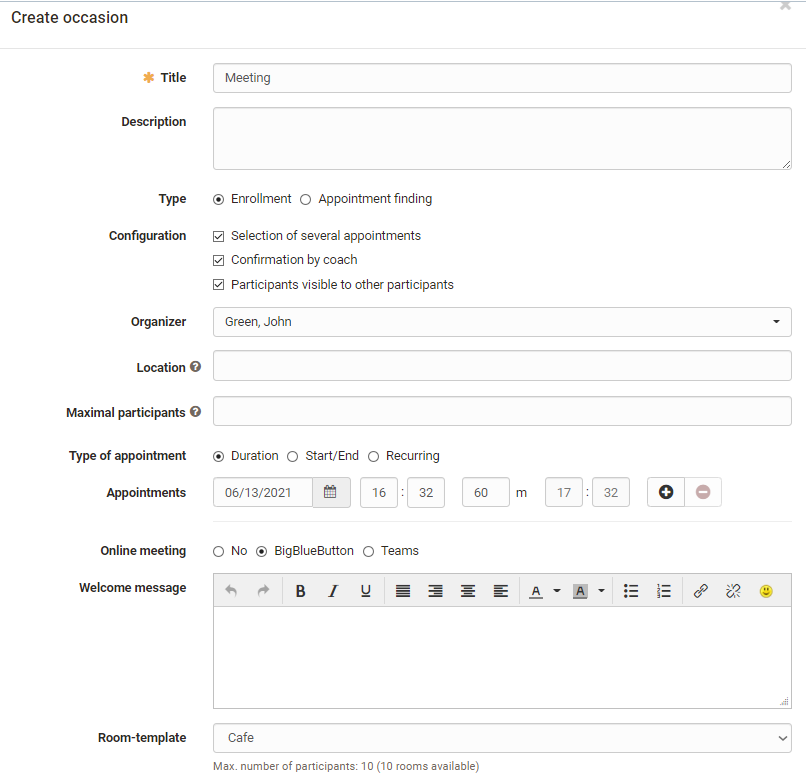

# Course Element "Appointment scheduling" {: #appointment_scheduling}

## Profile

Name | Appointment scheduling
---------|----------
Icon | { class=size24 }
Available since | 
Functional group | Administration and organisdation
Purpose | Scheduling and enrollment for specific joint appointments
Assessable | no
Specialty / Note |

The course element Appointment Scheduling can be used to organize enrollments
for specific appointments as well as to find appointments. In general, you can
configure whether multiple appointments can be selected, whether there is a
limit to the number of participants, whether participants can see who has
registered and whether a BigBlueButton room should be assigned.

In the course editor, the course element is added and it can be determined
whether coaches can also edit occasions and appointments or whether this is
only possible by the course owners. If the choice of appointments should only
be possible within a certain time window, the time specifications in the
course editor must be specified accordingly in the tab "Learning path" or, in
the case of conventional courses, the visibility or access must be configured
appropriately.

However, the actual configuration and setup of the dates is done in the course
run with the editor closed. For this purpose, a new enrollment or appointment
is first created via the button "Create occasion" and the basic configuration
is carried out as well as appointments are entered.

## Configure accasion 

Ein "Anlass" ist eine Zusammenstellung von mehreren Terminen die ausgewählt werden können.

How to configure an appointment booking or an appointment finding:

 **Title:** Enter the name of the appointment here, e.g. "Reconciliation
closing meeting", "Kick-off meeting" etc.. The entry is required (mandatory
field).

 **Description:** Explain the appointment selection in more detail.

 **Type:** Decide if it is a date determination for a common date or an
enrollment for one or more dates from a selection, e.g. lab dates.

 **Configuration:** Decide whether the participants are allowed to select only
one or several appointments and whether the names of the participants are
visible for other participants. In the case of "Appointment booking", you can also
define whether the organizer have to confirm the appointment.

 **Organizer:** Define here who will be displayed as the organizer of the
event.

 **Location:** Enter the location of the event here.

 **Max. Participants:** You can limit the number of members for an appointment
(only for "Enrollment").

**Type of appointment:** You can create appointments based on duration, based
on a start and end date, or recurring by specific days of the week. The
selection makes it easier for you to create additional appointments.

!!! info ""

    If "Duration" is selected, when adding further appointments, the appointments will be preconfigured on the same day and the clock times will be adjusted according to the duration.

    If Start/End is selected, the selected times are retained and you only need to adjust the date for new entries.

 **Appointments:**  The concrete election dates are entered here. Click on the
"+ sign" to add new dates. By clicking on the "- sign", dates are deleted
again.

 **Online meeting:** The options are: No, no online appointment or one
directly selects the desired tool BigBlueButton or Teams, provided that
Virtual Classrooms have been activated by the administrator.

!!! tip "Tip"

    If BigBlueButton or Teams is activated, a BigBlueButton or Teams room can be added and further configured for the selected appointments. In this case, "online" is automatically displayed for the location.

A created "occasion" can later be edited, duplicated or deleted by clicking on
the cogwheel. The number of participants for the event can also be restricted
to certain groups. An export of the participants for an event is also
possible.

## Organize appointments

The specific dates of already created schedules/appointments can be viewed in more detail
via the "View appointments" link and edited by the course owner or coach. Here
you can add, delete, rebook participants, adjust the description, change appointments or confirm appointments.

## Participant view

By clicking on the course element, participants are shown all, future or selected dates and a selection is possible via the link "**Select**". Filtering for dates with free places can also be done via the filter function.

