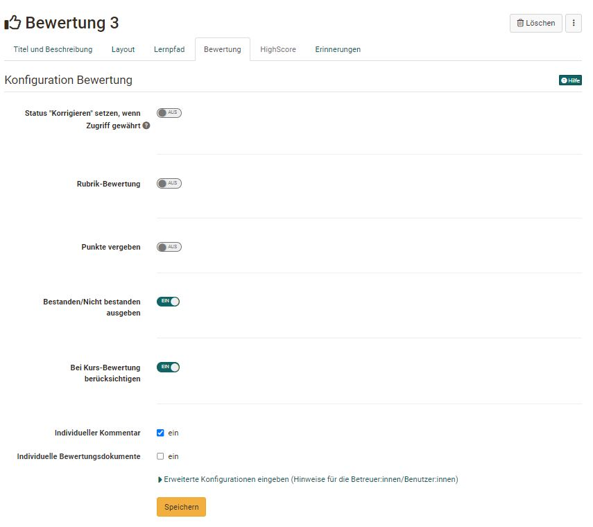
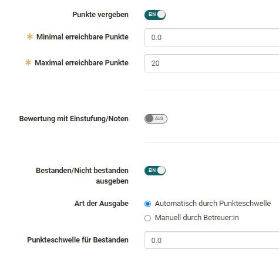
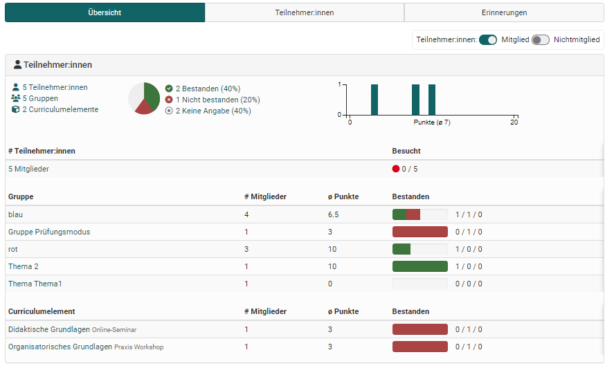

# Kursbaustein "Bewertung" {: #course_element_assessment}

## Steckbrief

Name | Bewertung
---------|----------
Icon | { class=size24  }
Verfügbar seit | 
Funktionsgruppe | Wissensüberprüfung
Verwendungszweck | Bewertung von Leistungen, auch wenn sie ausserhalb von OpenOlat erbracht wurden (z.B. Präsenz-Referate, praktische Arbeiten)
Bewertbar | ja
Spezialität / Hinweis |

Der Kursbaustein "Bewertung" eignet sich, um Leistungen zu bewerten, welche nicht explizit elektronisch abgegeben werden, z.B. Präsenz-Referate oder Online-Webseiten. 

## Bewertung im Kurseditor erstellen und einrichten

Die Konfiguration des Kursbausteins Bewertung erfolgt im Kurseditor im Tab „Bewertung“. Hier können Sie die Bewertung so konfigurieren, dass

  * ein [Rubrik](../learningresources/Rubric.de.md) als Basis für die Bewertung verwendet wird,
  * Punkte vergeben werden (oder nicht),
  * Bestanden/nicht bestanden angezeigt wird,
  * ein individueller Kommentar hinzugefügt werden kann,
  * ein individuelles Dokument hinzugefügt werden kann

Die Einstellungen haben Einfluss auf die späteren Bewertungsoptionen und den für die Teilnehmenden sichtbaren Informationen.

!!! warning "Achtung"

    Sobald eine Bewertung eines Kursteilnehmers stattgefunden hat, können Sie die Konfiguration im Kurseditor nicht mehr verändern. 

## Tab "Bewertung" konfigurieren

### Rubrik-Bewertung
Eine interessante Möglichkeit der Kriterien basierten Bewertung mit Hilfe des Kursbausteins "Bewertung" bietet die [Rubrik-Bewertung](../learningresources/Forms_in_Rubric_Scoring.de.md).

Dabei wird ein OpenOlat Formular mit dem Kursbaustein Bewertung verknüpft. Anschliessend kann die durch das Rubrik-Formular generierte Punktzahl automatisch als Summe oder Durchschnitt übernommen werden. Bei der Wahl der "Summe" werden die Punkte, die pro Zeile vergeben werden, aufaddiert. Bei der Wahl "Durchschnitt" wird die Durchschnittsumme aller Rubrik-Zeilen ermittelt. Alternativ kann auch eine manuelle Punktevergabe gewählt oder ganz auf Punkte verzichtet werden.

### Punkte vergeben

Sofern aktiviert können manuell durch die Betreuer und Kursbesitzer Punkte vergeben werden. Für die Punktevergabe müssen die minimalen und maximalen Punkte angegeben werden. 

Bei zusätzlicher Aktivierung der Rubrik-Bewertung können auch automatisiert Punkte aus dem Rubrik übernommen werden.   

### Bewertung mit Einstufung/Noten

Sobald "Punkte vergeben" eingeschaltet wurde, kann auch die Option "Bewertung mit Einstufung/Noten" eingeschaltet und weiter konfiguriert werden. 

Klicken sie auf "Bewertungsskala bearbeiten" um eine Skala auszuwählen und eventuell weitere Einstellungen vorzunehmen. In der Skala ist auch definiert ob bzw. ab wann eine Bewertungsskala mit einem bestanden/nicht bestanden verbunden ist. 

Anschliessend definieren Sie noch ab die Zuweisung zur gewählten Bewertungsskala manuell durch die Betreuenden oder automatisch durch die Zuordnung der erreichten Punktzahl erfolgen soll. 

### Bestanden / Nicht bestanden ausgeben

Schalten Sie die Option ein, wenn den Lernenden angezeigt werden soll, ob der Kursbaustein bestanden wurde oder nicht. 

Sofern aktiviert kann bei Lernpfad Kursen im nächsten Schritt auch definiert werden ob der Kursbaustein bei der Bewertung des Kurses berücksichtigt werden soll oder nicht. Bei herkömmlichen Kursen wird dies im Tab "Punkte" des obersten Kursbausteins definiert. 

Wenn zusätzlich zu Bestanden/Nicht bestanden auch Punkte aktiviert wurden kann neben der standardmässigen manuellen Bewertung durch die Betreuer noch eine automatische, punkteabhängige Bewertung aktiviert werden. 

Auch kann das Bestehen durch die ausgewählte Bewertungsskala erfolgen. 

Sofern Punkte und/oder bestanden aktiviert wurde gibt es bei Lernpfad Kursen noch eine weitere Option: **„Bei Kurs-Bewertung berücksichtigen“**.  Ist die Option aktiviert, werden die vom User erreichten Punkte auf die in der Administration -> Einstellungen -> Bewertung definierten Punktschwelle, die für das Bestehendes Kurses notwendig ist, angerechnet bzw. der Kursbaustein als Teil der notwendigen Kursbausteine, die für das Bestehen des gesamten Kurses dienen, berücksichtigt. 

### Individuelle Kommentare, Dokumente und Infos

Aktivieren Sie die gewünschte Checkbox. um den Lernenden individuelle Kommentare und/oder Dokumente z.B. als Feedback bereitzustellen. Unter "Erweiterte Konfigurationen ..." können Sie auch zusätzlich noch generelle Informationen für Betreuer und/oder Lernende hinterlegen.

### Status "Korrigieren" setzen 
Bei aktivierter Option erscheint für den Lehrenden beim Status "Korrigieren" und für den Teilnehmer "in Korrektur" bzw. bei nicht Auswahl "Nicht gestartet" und für den User "Information nicht verfügbar". Aktivieren Sie die Option nur, wenn Sie die Info auch wirklich haben möchten. 

## Bewertung im Kursrun durchführen

Die Bewertung der Kursteilnehmenden wird vom Kursbesitzer oder Kursbetreuer entweder im Kursrun bei geschlossenem Kurseditor oder im [Bewertungswerkzeug](../learningresources/Assessment_tool_overview.de.md) durchgeführt. 

Im **Tab "Übersicht"** erscheint eine Gesamtübersicht zum Kursbaustein 

Im **Tab "Teilnehmer:innen"** werden alle Kursteilnehmenden angezeigt. Je nach Konfiguration der Spalten werden weitere Informationen wie die erreichte Punktzahl, der Status usw. für die jeweilige Person sichtbar. Ferner kann im Tab auch eine Massenbewertung erfolgen oder die Daten aller Teilnehmenden zurückgesetzt werden.

Um eine Bewertung vorzunehmen wird der entsprechende Kursteilnehmer ausgewählt und die angezeigten Felder ausgefüllt bzw. bei Rubrikbewertungen die Rubrik-Felder ausgefüllt. Die Bewertung kann zwischengespeichert oder direkt abgeschlossen und freigegeben werden. 

Der User hat nach der Freigabe Zugriff auf seine Bewertung inklusive Bewertungsrubrik und sonstiger Feedbacks.  

Im **"Tab Erinnerungen"** erscheinen die  für den Kursbaustein im Kurseditor angelegten [Erinnerungen](../learningresources/Course_Reminders.de.md). Auch neue Erinnerungen können hier erstellt oder vorhandene bearbeitet und gelöscht werden. 