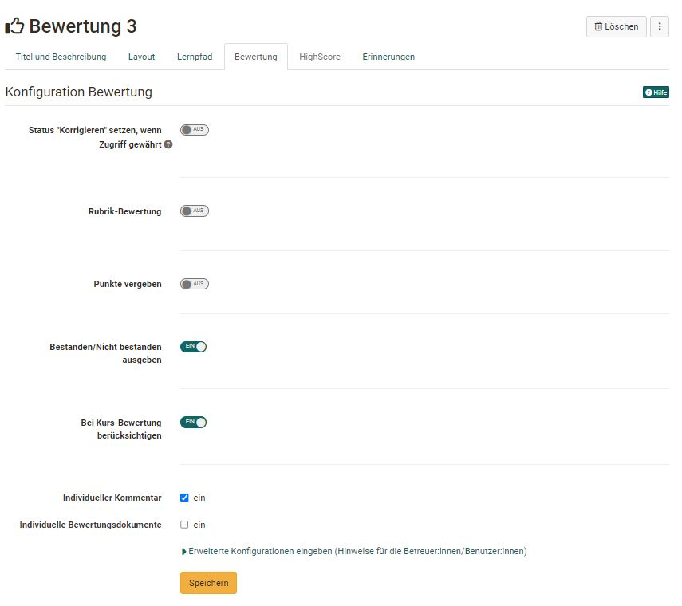
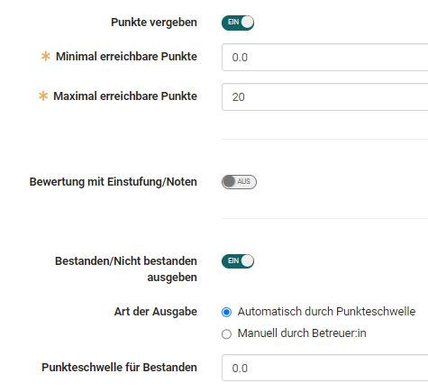

# Kursbaustein "Bewertung" {: #course_element_assessment}

## Steckbrief

Name | Bewertung
---------|----------
Icon | :o_icon_o_ms_icon:
Verfügbar seit | 
Funktionsgruppe | Wissensüberprüfung
Verwendungszweck | Bewertung von Leistungen, auch wenn sie ausserhalb von OpenOlat erbracht wurden (z.B. Präsenz-Referate, praktische Arbeiten)
Bewertbar | ja
Spezialität / Hinweis |

Der Kursbaustein "Bewertung" eignet sich, um Leistungen zu bewerten, welche nicht explizit elektronisch abgegeben werden, z.B. Präsenz-Referate oder Online-Webseiten.

## Bewertung im Kurseditor erstellen und einrichten

Kursbesitzer:innen konfigurieren den Kursbaustein Bewertung im Kurseditor im Tab "Bewertung". Hier können Sie die Bewertung so konfigurieren, dass

  * eine [Rubrik](../learningresources/Form_Element_Rubric.de.md) als Basis für die Bewertung verwendet wird,
  * Punkte vergeben werden (oder nicht),
  * die Punkte in eine Note umgerechnet werden,
  * Bestanden/nicht bestanden angezeigt wird,
  * ein individueller Kommentar hinzugefügt werden kann,
  * ein individuelles Dokument hinzugefügt werden kann.

{ class="shadow lightbox" title="Tab Bewertung im Kurseditor" }

Die Einstellungen haben Einfluss auf die späteren Bewertungsoptionen und auf die Informationen, die die Teilnehmenden sehen.

!!! warning "Achtung"

    Sobald eine Bewertung eines Teilnehmenden stattgefunden hat, können Sie die Konfiguration im Kurseditor nicht mehr verändern.

## Tab "Bewertung" konfigurieren

### Rubrik-Bewertung
Für eine kriterienbasierte Bewertung verknüpfen Sie den Kursbaustein "Bewertung" mit einem [Rubrik-Formular](../learningresources/Forms_in_Rubric_Scoring.de.md), also einem OpenOlat-Formular mit mindestens einem Rubrik-Element.

Ist zusätzlich "Punkte vergeben" eingeschaltet, wählen Sie unter "Punkte", wie die Punkte entstehen: "Summe aus Rubrik-Formular übernehmen" addiert die Punkte aller Rubrik-Zeilen, "Durchschnitt aus Rubrik-Formular übernehmen" bildet den Durchschnitt aller Rubrik-Zeilen, und mit "Punkte manuell vergeben" setzen die Betreuenden die Punkte selbst. Übernimmt OpenOlat die Punkte aus dem Rubrik-Formular, passen Sie sie mit dem "Skalierungsfaktor" an. Alternativ verzichten Sie ganz auf Punkte.

### Punkte vergeben

Ist "Punkte vergeben" eingeschaltet, vergeben Betreuer:innen und Besitzer:innen Punkte. Dafür geben Sie die "Minimal erreichbare Punkte" und die "Maximal erreichbare Punkte" an.

Ist zusätzlich die Rubrik-Bewertung eingeschaltet, kann OpenOlat die Punkte aus dem Rubrik-Formular übernehmen. Die minimalen und maximalen Punkte ergeben sich dann aus dem Formular.

### Bewertung mit Einstufung/Noten [:octicons-tag-16:{ title="ab Release 16.2 (OO-6009)" }](https://track.frentix.com/issue/OO-6009)

Sobald "Punkte vergeben" eingeschaltet ist, kann auch die Option "Bewertung mit Einstufung/Noten" eingeschaltet und weiter konfiguriert werden. OpenOlat rechnet die Punkte dann in eine Note um.

Klicken Sie auf "Bewertungsskala bearbeiten", um eine Skala auszuwählen und eventuell weitere Einstellungen vorzunehmen. In der Skala ist auch definiert, ob bzw. ab wann eine Bewertungsskala mit einem bestanden/nicht bestanden verbunden ist. Mit eingeschalteter Option bestimmt die Bewertungsskala das Bestehen: Die Option "Bestanden/Nicht bestanden ausgeben" entfällt, und das Formular zeigt stattdessen das "Erfolgskriterium" der Skala, sofern sie eines festlegt.

Unter "Zuweisung" legen Sie fest, ob die Betreuenden die Note manuell zuweisen ("Manuell") oder ob OpenOlat sie automatisch zuweist ("Automatisch bei Punktänderungen"). Mehr dazu auf der Seite [Einstufung/Noten](../learningresources/Assessment_translate_points_in_grades.de.md).

### Bestanden/Nicht bestanden ausgeben

Schalten Sie die Option ein, wenn den Lernenden angezeigt werden soll, ob der Kursbaustein bestanden wurde oder nicht.

Ist zusätzlich "Punkte vergeben" eingeschaltet, wählen Sie unter "Art der Ausgabe" zwischen "Manuell durch Betreuer:in" und "Automatisch durch Punkteschwelle". Bei der automatischen Ausgabe geben Sie die "Punkteschwelle für Bestanden" an.

{ class="shadow lightbox" title="Punkte und Bestanden im Tab Bewertung" }

### Bei Kurs-Bewertung berücksichtigen

In Lernpfadkursen erscheint die Option **"Bei Kurs-Bewertung berücksichtigen"**, sobald "Punkte vergeben" oder "Bestanden/Nicht bestanden ausgeben" eingeschaltet ist. Ist die Option eingeschaltet, werden die von den Teilnehmenden erreichten Punkte auf die in `Kurs > Administration > Einstellungen > Bewertung` definierte Punkteschwelle angerechnet, die für das Bestehen des Kurses notwendig ist, bzw. der Kursbaustein zählt zu den Kursbausteinen, die für das Bestehen des gesamten Kurses notwendig sind.

In herkömmlichen Kursen legen Sie das im Tab "Punkte" des obersten Kursbausteins fest.

### Individuelle Kommentare, Dokumente und Infos

Aktivieren Sie die Checkbox "Individueller Kommentar" oder "Individuelle Bewertungsdokumente", um den Lernenden individuelle Kommentare oder Dokumente bereitzustellen, z.B. als Feedback.

### Status "Korrigieren" setzen [:octicons-tag-16:{ title="ab Release 16.0 (OO-5564)" }](https://track.frentix.com/issue/OO-5564)

Damit die Betreuenden sehen, wo eine Bewertung ansteht, setzt OpenOlat in Lernpfadkursen den Status auf Wunsch automatisch. Ist die Option "Status "Korrigieren" setzen, wenn Zugriff gewährt" eingeschaltet, erhält die teilnehmende Person den Status "Korrigieren", sobald sie Zugriff auf den Kursbaustein hat. Die Teilnehmenden sehen dann "In Korrektur". Ist die Option ausgeschaltet, steht der Status zunächst auf "Nicht gestartet". Bei einem neu eingefügten Kursbaustein ist die Option eingeschaltet.

## Bewertung im Kursrun durchführen

Die Bewertung der Teilnehmenden wird von den Besitzer:innen oder Betreuer:innen entweder im Kursrun bei geschlossenem Kurseditor oder im [Bewertungswerkzeug](../learningresources/Assessment_tool_overview.de.md) durchgeführt.

Im **Tab "Übersicht"** erscheint eine Gesamtübersicht zum Kursbaustein.

{ class="shadow lightbox" title="Tab Übersicht im Kursbaustein Bewertung" }

Im **Tab "Teilnehmer:innen"** werden alle Teilnehmenden angezeigt. Je nach Konfiguration der Spalten werden weitere Informationen wie die erreichte Punktzahl, der Status usw. für die jeweilige Person sichtbar. Ferner kann im Tab auch eine Massenbewertung erfolgen oder die Daten aller Teilnehmenden zurückgesetzt werden.

Um eine Bewertung vorzunehmen, wird der/die entsprechende Teilnehmer:in ausgewählt und die angezeigten Felder ausgefüllt bzw. bei Rubrikbewertungen die Rubrik-Felder ausgefüllt. Die Bewertung kann zwischengespeichert oder direkt abgeschlossen und freigegeben werden.

Die Teilnehmenden haben nach der Freigabe Zugriff auf ihre Bewertung inklusive Bewertungsrubrik und sonstiger Feedbacks.

Im **Tab "Erinnerungen"** erscheinen die für den Kursbaustein im Kurseditor angelegten [Erinnerungen](../learningresources/Course_Reminders.de.md). Auch neue Erinnerungen können hier erstellt oder vorhandene bearbeitet und gelöscht werden.

### Tab Badges
Wurde von dem/der Kursbesitzer:in unter [`Kurs > Administration > Einstellungen > Bewertung > Badges`](../learningresources/Course_Settings_Assessment.de.md#section_badges) die Vergabe von Badges aktiviert, wird im Kurseditor zu diesem Kursbaustein der Tab "Badges" angezeigt und es kann ein spezifischer Badge für diesen Kursbaustein erstellt werden.

## Weiterführende Informationen {: #further_information}

**Auf dieser Seite erwähnt** 
[Rubrik](../learningresources/Form_Element_Rubric.de.md) 
[Rubrik-Formular](../learningresources/Forms_in_Rubric_Scoring.de.md) 
[Einstufung/Noten](../learningresources/Assessment_translate_points_in_grades.de.md) 
[Bewertungswerkzeug](../learningresources/Assessment_tool_overview.de.md) 
[Erinnerungen](../learningresources/Course_Reminders.de.md) 
[Kurseinstellungen - Tab Bewertung](../learningresources/Course_Settings_Assessment.de.md)

**Weiterführend** 
[Das Bewertungsformular](../learningresources/The_assessment_form.de.md) 
[Bewertung von Kursbausteinen](../learningresources/Assessment_of_course_modules.de.md) 
[Wie protokolliere ich eine mündliche Prüfung in OpenOlat?](../../manual_how-to/oral_exam/oral_exam.de.md)

[Zum Seitenanfang ^](#course_element_assessment)
