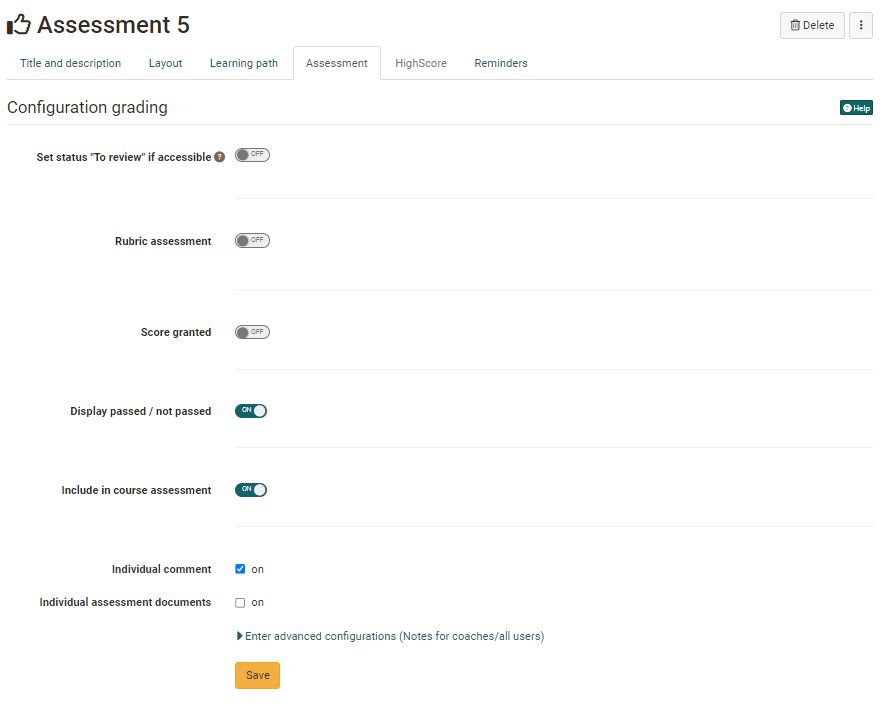
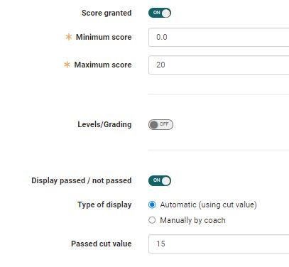
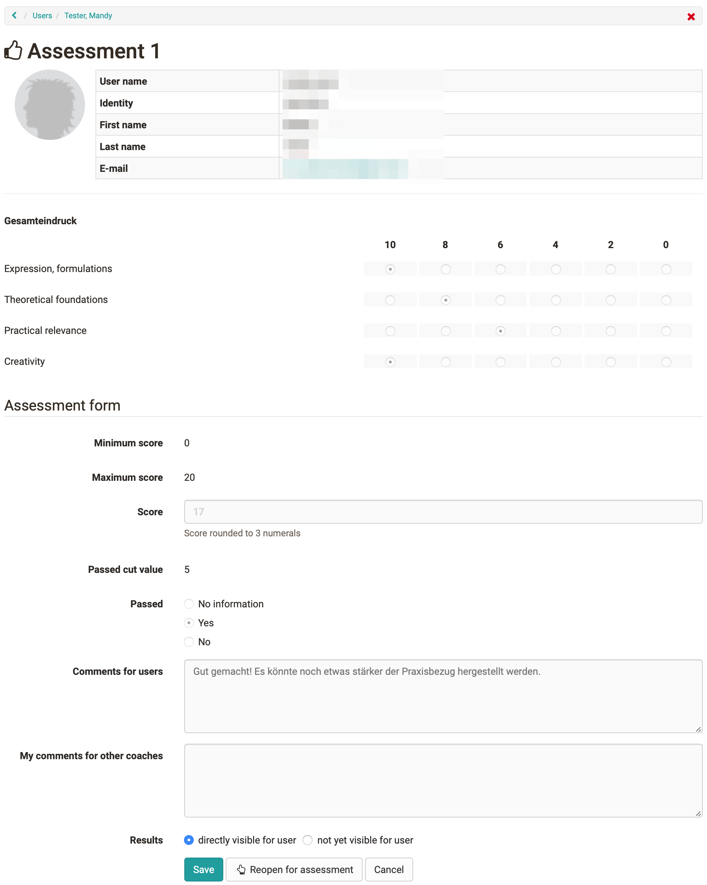

# Course Element "Assessment" {: #course_element_assessment}

## Profile

Name | Assessment
---------|----------
Icon | { class=size24 }
Available since | 
Functional group | Assessment
Purpose | Assessment of performances, even if they were performed outside OpenOlat (e.g. presence presentations, practical work)
Assessable | yes
Specialty / Note |

The course element "Assessment" is suitable for assessing performances that are not explicitly delivered electronically, e.g. classroom presentations or online websites. 

## Create and set up Assessment in the course editor

You configure the assessment module in the course editor in the tab "Assessment". Here you can configure the evaluation in such a way that

  * A [rubric](../learningresources/Rubric.md) is used as the basis for the evaluation
  * Points are awarded (or not)
  * Pass/Fail is displayed
  * An individual comment can be added to
  * An individual document can be added

The settings influence the subsequent evaluation options and the information visible to the participants.

!!! warning

    As soon as an assessment has taken place, you will not be able to change that configuration anymore.

## Tab "Assessment" - Configuration

### Rubric assessment

An interesting possibility of criteria-based assessment with the help of the course element "Assessment" is offered by the [rubric assessment](../learningresources/Forms_in_Rubric_Scoring.md).

To do this, select a previously created learning resource form (containing a rubric element) or create a new form using the button "Choose form" -> Create, to which you can sensibly add a rubric element. Select in the configuration of the items "Transfer sum from rubric form" or "Transfer average from rubric form", the items resulting from the rubric structure will then be automatically transferred. If you choose the "Sum" option, the points awarded per line will be added together. If "Average" is selected, the average sum of all column lines is determined. Alternatively, a manual scoring system can be selected or no points at all can be awarded.

### Assigning points

If activated, points can be awarded manually by the supervisors and course owners. The minimum and maximum points must be specified for the awarding of points. 

If the rubric evaluation is also activated, points can also be automatically transferred from the rubric.

### Bewertung mit Einstufung/Noten

Sobald "Punkte vergeben" eingeschaltet wurde, kann auch die Option "Bewertung mit Einstufung/Noten" eingeschaltet und weiter konfiguriert werden. 

Klicken sie auf "Bewertungsskala bearbeiten" um eine Skala auszuwählen und eventuell weitere Einstellungen vorzunehmen. In der Skala ist auch definiert ob bzw. ab wann eine Bewertungsskala mit einem bestanden/nicht bestanden verbunden ist. 

Anschliessend definieren Sie noch ab die Zuweisung zur gewählten Bewertungsskala manuell durch die Betreuenden oder automatisch durch die Zuordnung der erreichten Punktzahl erfolgen soll. 

### Display Passed / Failed:

Activate this option if you want learners to see whether the course element has been passed or not. 

Sofern aktiviert kann bei Lernpfad Kursen im nächsten Schritt auch definiert werden ob der Kursbaustein bei der Bewertung des Kurses berücksichtigt werden soll oder nicht. Bei herkömmlichen Kursen wird dies im Tab "Punkte" des obersten Kursbausteins definiert. 

Wenn zusätzlich zu Bestanden/Nicht bestanden auch Punkte aktiviert wurden kann neben der standardmässigen manuellen Bewertung durch die Betreuer noch eine automatische, punkteabhängige Bewertung aktiviert werden. 

Auch kann das Bestehen durch die ausgewählte Bewertungsskala erfolgen. 

Sofern Punkte und/oder bestanden aktiviert wurde gibt es bei Lernpfad Kursen noch eine weitere Option: **„Bei Kurs-Bewertung berücksichtigen“**.  Ist die Option aktiviert, werden die vom User erreichten Punkte auf die in der Administration -> Einstellungen -> Bewertung definierten Punktschwelle, die für das Bestehendes Kurses notwendig ist, angerechnet bzw. der Kursbaustein als Teil der notwendigen Kursbausteine, die für das Bestehen des gesamten Kurses dienen, berücksichtigt. 

### Individual comments, documents and information

Activate the desired checkbox to provide learners with individual comments and/or documents, e.g. as feedback. Under "Enter advanced configurations" you can also store general information for coaches and/or all users.

### Set "To review" status 
If this option is activated, the status "to review" appears for the teacher and "Status" for the participant or, if not selected, "Not started" and "Information not available" for the user. Only activate the option if you really want to have the information. 

## Perform assessment 

The assessment of course participants is carried out by the course owner or course coach either in the course run with the course editor closed or in the [assessment tool](../learningresources/Assessment_tool_overview.md). 

A complete overview of the course element appears in the **"Overview "** tab. 

All course participants are displayed in the "Participants" tab. Depending on the configuration of the columns, further information such as the number of points achieved, the status etc. will be visible for the respective person. Furthermore, a bulk assessment can also be carried out here or the data of all participants can be reset.
 
To make an assessment, select the relevant course participant and fill in the displayed fields or, in the case of rubric assessments, fill in the rubric fields. The evaluation can be saved temporarily or completed and released directly. 

The user now has direct access to his assessment including the assessment rubrics.

Im **"Tab Erinnerungen"** erscheinen die  für den Kursbaustein im Kurseditor angelegten [Erinnerungen](../learningresources/Course_Reminders.md). Auch neue Erinnerungen können hier erstellt oder vorhandene bearbeitet und gelöscht werden.

### Tab Badges

If the course owner has activated the assignment of badges under **Administration > Settings > Assessment tab > Badges section**, the ‘Badges’ tab is displayed in the course editor for this course element and a specific badge can be created for this course element.

[To the top of the page ^](#course_element_assessment)

