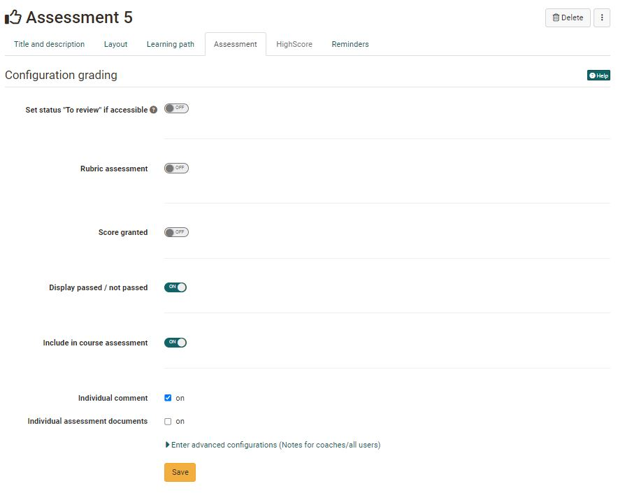
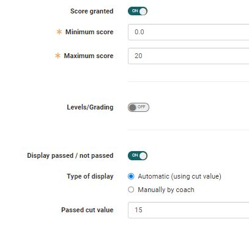
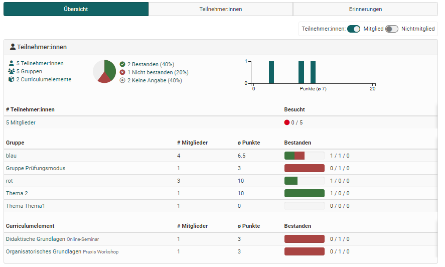

# Course Element "Assessment" {: #course_element_assessment}

## Profile

Name | Assessment
---------|----------
Icon | :o_icon_o_ms_icon:
Available since | 
Functional group | Assessment
Purpose | Assessment of performances, even if they were performed outside OpenOlat (e.g. presence presentations, practical work)
Assessable | yes
Specialty / Note |

The course element "Assessment" is suitable for assessing performances that are not explicitly delivered electronically, e.g. classroom presentations or online websites. 

## Create and set up Assessment in the course editor

You configure the assessment module in the course editor in the tab "Assessment". Here you can configure the evaluation in such a way that

  * A [rubric](../learningresources/Form_Element_Rubric.md) is used as the basis for the evaluation
  * Points are awarded (or not)
  * Pass/Fail is displayed
  * An individual comment can be added to
  * An individual document can be added

{ class="shadow lightbox" }

The settings influence the subsequent evaluation options and the information visible to the participants.

!!! warning "Attention"

    As soon as an assessment has taken place, you will not be able to change that configuration anymore.

## Tab "Assessment" - Configuration

### Rubric assessment

An interesting possibility of criteria-based assessment with the help of the course element "Assessment" is offered by the [rubric assessment](../learningresources/Forms_in_Rubric_Scoring.md).

To do this, an OpenOlat form containing at least one rubric element is linked to the course element "Assessment". The score generated by the rubric form can then be transferred automatically as a sum or an average. If you choose "Sum", the points awarded per row are added together. If you choose "Average", the average of all rubric rows is calculated. Alternatively, a manual scoring system can be selected, or points can be omitted entirely.

### Assigning points

If activated, points can be awarded manually by the coaches and course owners. The minimum and maximum points must be specified for the awarding of points. 

If the rubric assessment is also activated, points can also be automatically transferred from the rubric.

### Assessment with Levels/Grading

Once "Award points" has been activated, the option "Levels/Grading" can also be activated and further configured. 

Click on "Edit rating scale" to select a scale and make any further settings. The scale also defines whether and from when a rating scale is linked to a pass/fail result. 

Then you define whether the assignment to the selected grading scale should be done manually by the coaches or automatically by assigning the points achieved. 

### Display Passed / Failed

Activate this option if you want learners to see whether the course element has been passed or not. 

If activated, the next step in learning path courses is to define whether or not the course element should be included in the course assessment. For conventional courses, this is defined in the "Points" tab of the top course element. 

If points have been activated in addition to Pass/Fail, an automatic, point-based assessment can be activated in addition to the standard manual assessment by the coaches. 

{ class="shadow lightbox" }

Passing can also be achieved through the selected grading scale. 

If points and/or passing grades have been activated, there is another option for learning path courses: **"Include in course evaluation"**. If this option is enabled, the points achieved by the participants are credited to the point threshold defined in `Course > Administration > Settings > Assessment`, which is necessary for passing the course, or the course element is taken into account as part of the necessary course elements that serve to pass the entire course. 

### Individual comments, documents and information

Activate the desired checkbox to provide learners with individual comments and/or documents, e.g. as feedback.

### Set "To review" status 
If this option is activated, the status "to review" appears for the coaches and "in review" for the participants or, if not selected, "Not started" and "Information not available" for the participants. Only activate the option if you really want to have the information. 

## Perform assessment 

The assessment of participants is carried out by the course owner or course coach either in the course run with the course editor closed or in the [assessment tool](../learningresources/Assessment_tool_overview.md). 

A complete overview of the course element appears in the **"Overview"** tab. 

{ class="shadow lightbox" }

All participants are displayed in the "Participants" tab. Depending on the configuration of the columns, further information such as the number of points achieved, the status etc. will be visible for the respective person. Furthermore, a bulk assessment can also be carried out here or the data of all participants can be reset.

To make an assessment, select the relevant participant and fill in the displayed fields or, in the case of rubric assessments, fill in the rubric fields. The evaluation can be saved temporarily or completed and released directly. 

After release, the participants have access to their assessment, including the assessment rubric and any other feedback.

The **"Reminders" tab** displays the [reminders](../learningresources/Course_Reminders.md) created for the course element in the course editor. New reminders can also be created here, or existing ones can be edited and deleted.

### Tab Badges

If the course owner has activated the assignment of badges under [`Course > Administration > Settings > Assessment > Badges`](../learningresources/Course_Settings_Assessment.md#section_badges), the "Badges" tab is displayed in the course editor for this course element and a specific badge can be created for this course element.

## Further information {: #further_information}

**Mentioned on this page** 
[Rubric](../learningresources/Form_Element_Rubric.md) 
[Rubric form](../learningresources/Forms_in_Rubric_Scoring.md) 
[Assessment tool](../learningresources/Assessment_tool_overview.md) 
[Reminders](../learningresources/Course_Reminders.md) 
[Course Settings - Tab Assessment](../learningresources/Course_Settings_Assessment.md)

**Further reading** 
[Levels/Grading](../learningresources/Assessment_translate_points_in_grades.md) 
[The assessment form](../learningresources/The_assessment_form.md)

[To the top of the page ^](#course_element_assessment)

