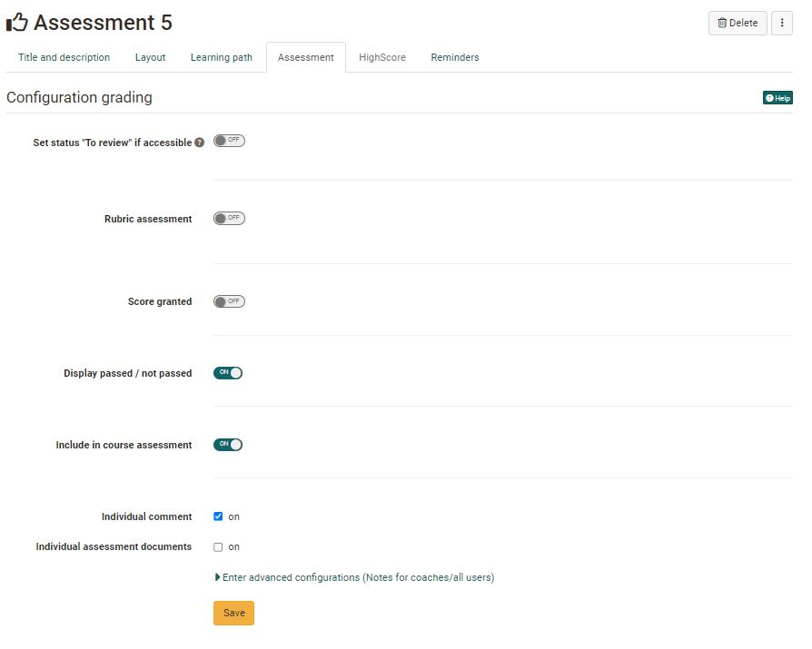
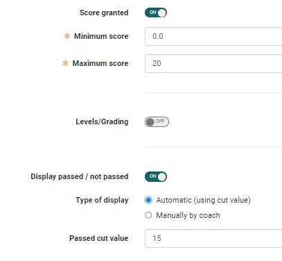
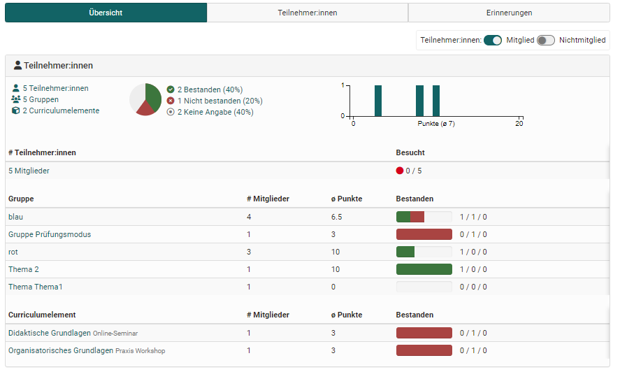

# Course Element "Assessment" {: #course_element_assessment}

## Profile

Name | Assessment
---------|----------
Icon | :o_icon_o_ms_icon:
Available since | 
Functional group | Assessment
Purpose | Assessment of performances, even if they were performed outside OpenOlat (e.g. presence presentations, practical work)
Assessable | yes
Specialty / Note |

The course element "Assessment" is suitable for assessing performances that are not explicitly delivered electronically, e.g. classroom presentations or online websites.

## Create and set up Assessment in the course editor

Course owners configure the course element Assessment in the course editor in the tab "Assessment". Here you can configure the assessment in such a way that

  * a [rubric](../learningresources/Form_Element_Rubric.md) is used as the basis for the assessment,
  * points are awarded (or not),
  * the points are converted into a grade,
  * passed/not passed is displayed,
  * an individual comment can be added,
  * an individual document can be added.

{ class="shadow lightbox" title="Tab Assessment in the course editor" }

The settings influence the subsequent assessment options and the information the participants see.

!!! warning "Attention"

    As soon as a participant has been assessed, you can no longer change the configuration in the course editor.

## Tab "Assessment" - Configuration

### Rubric assessment

For a criteria-based assessment, you link the course element "Assessment" with a [rubric form](../learningresources/Forms_in_Rubric_Scoring.md), i.e. an OpenOlat form with at least one rubric element.

If "Score granted" is also switched on, you choose under "Score" how the points are created: "Transfer sum from rubric form" adds up the points of all rubric rows, "Transfer average from rubric form" calculates the average of all rubric rows, and with "Set score manually" the coaches set the points themselves. If OpenOlat transfers the points from the rubric form, you adjust them with the "Scaling factor". Alternatively, you do without points entirely.

### Score granted

If "Score granted" is switched on, coaches and owners award points. For this, you enter the "Minimum score" and the "Maximum score".

If the rubric assessment is also switched on, OpenOlat can transfer the points from the rubric form. The minimum and maximum score then result from the form.

### Levels/Grading [:octicons-tag-16:{ title="from Release 16.2 (OO-6009)" }](https://track.frentix.com/issue/OO-6009)

As soon as "Score granted" is switched on, the option "Levels/Grading" can also be switched on and further configured. OpenOlat then converts the points into a grade.

Click "Edit rating scale" to select a scale and make any further settings. The scale also defines whether and from when a rating scale is linked to a passed/not passed result. With the option switched on, the rating scale determines the passing: the option "Display passed / not passed" is not shown, and the form instead shows the "Success criterion" of the scale, provided it defines one.

Under "Assignment" you define whether the coaches assign the grade manually ("Manually by coach") or whether OpenOlat assigns it automatically ("Automatically on score change"). More about this on the page [Levels/Grading](../learningresources/Assessment_translate_points_in_grades.md).

### Display passed / not passed

Switch on this option if you want learners to see whether the course element has been passed or not.

If "Score granted" is also switched on, you choose under "Type of display" between "Manually by coach" and "Automatic (using cut value)". With the automatic display, you enter the "Passed cut value".

{ class="shadow lightbox" title="Score and passed in the tab Assessment" }

### Include in course assessment

In learning path courses, the option **"Include in course assessment"** appears as soon as "Score granted" or "Display passed / not passed" is switched on. If the option is switched on, the points achieved by the participants are credited to the score threshold defined in `Course > Administration > Settings > Assessment`, which is necessary for passing the course, or the course element counts as one of the course elements that are necessary for passing the entire course.

In conventional courses, you define this in the tab "Score" of the top course element.

### Individual comments, documents and information

Activate the checkbox "Individual comment" or "Individual assessment documents" to provide learners with individual comments or documents, e.g. as feedback.

### Set status "To review" [:octicons-tag-16:{ title="from Release 16.0 (OO-5564)" }](https://track.frentix.com/issue/OO-5564)

So that the coaches see where an assessment is pending, OpenOlat sets the status automatically in learning path courses on request. If the option "Set status "To review" if accessible" is switched on, the participant gets the status "To review" as soon as they have access to the course element. The participants then see "In review". If the option is switched off, the status is initially "Not started". In a newly inserted course element, the option is switched on.

## Perform assessment

The assessment of participants is carried out by the owners or coaches either in the course run with the course editor closed or in the [assessment tool](../learningresources/Assessment_tool_overview.md).

A complete overview of the course element appears in the **tab "Overview"**.

{ class="shadow lightbox" title="Tab Overview in the course element Assessment" }

All participants are displayed in the **tab "Participants"**. Depending on the configuration of the columns, further information such as the number of points achieved, the status etc. will be visible for the respective person. Furthermore, a bulk assessment can also be carried out here or the data of all participants can be reset.

To make an assessment, select the relevant participant and fill in the displayed fields or, in the case of rubric assessments, fill in the rubric fields. The assessment can be saved temporarily or completed and released directly.

After release, the participants have access to their assessment, including the assessment rubric and any other feedback.

The **tab "Reminders"** displays the [reminders](../learningresources/Course_Reminders.md) created for the course element in the course editor. New reminders can also be created here, or existing ones can be edited and deleted.

### Tab Badges

If the course owner has activated the assignment of badges under [`Course > Administration > Settings > Assessment > Badges`](../learningresources/Course_Settings_Assessment.md#section_badges), the "Badges" tab is displayed in the course editor for this course element and a specific badge can be created for this course element.

## Further information {: #further_information}

**Mentioned on this page** 
[Rubric](../learningresources/Form_Element_Rubric.md) 
[Rubric form](../learningresources/Forms_in_Rubric_Scoring.md) 
[Levels/Grading](../learningresources/Assessment_translate_points_in_grades.md) 
[Assessment tool](../learningresources/Assessment_tool_overview.md) 
[Reminders](../learningresources/Course_Reminders.md) 
[Course Settings - Tab Assessment](../learningresources/Course_Settings_Assessment.md)

**Further reading** 
[The assessment form](../learningresources/The_assessment_form.md) 
[Assessment of course modules](../learningresources/Assessment_of_course_modules.md) 
[How do I record an oral exam in OpenOlat?](../../manual_how-to/oral_exam/oral_exam.md)

[To the top of the page ^](#course_element_assessment)
