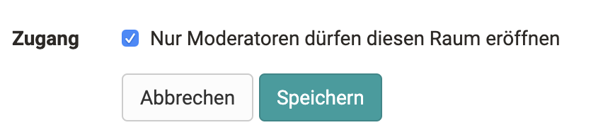
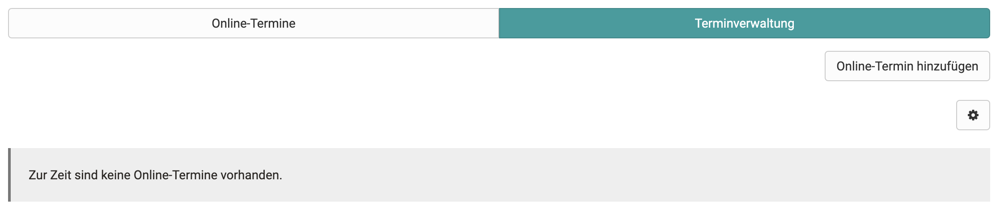
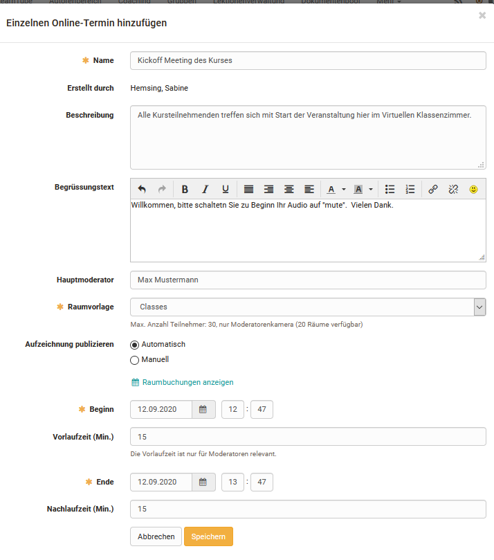
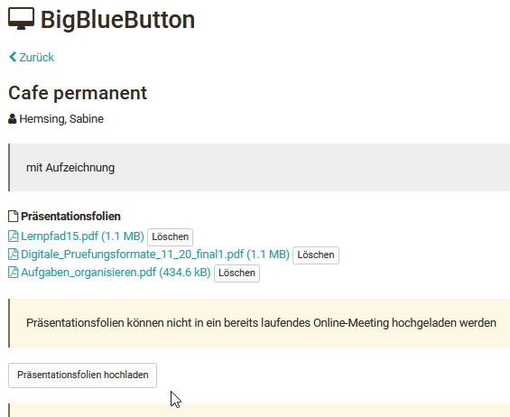
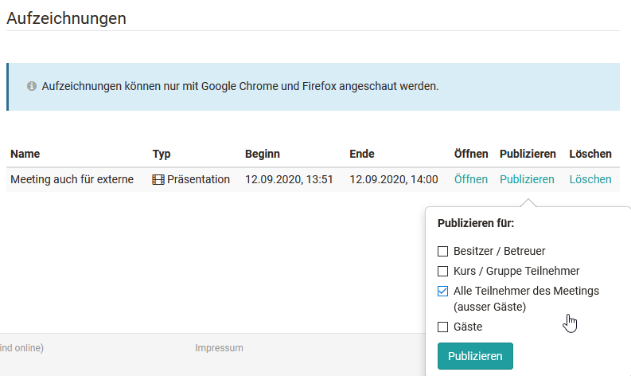
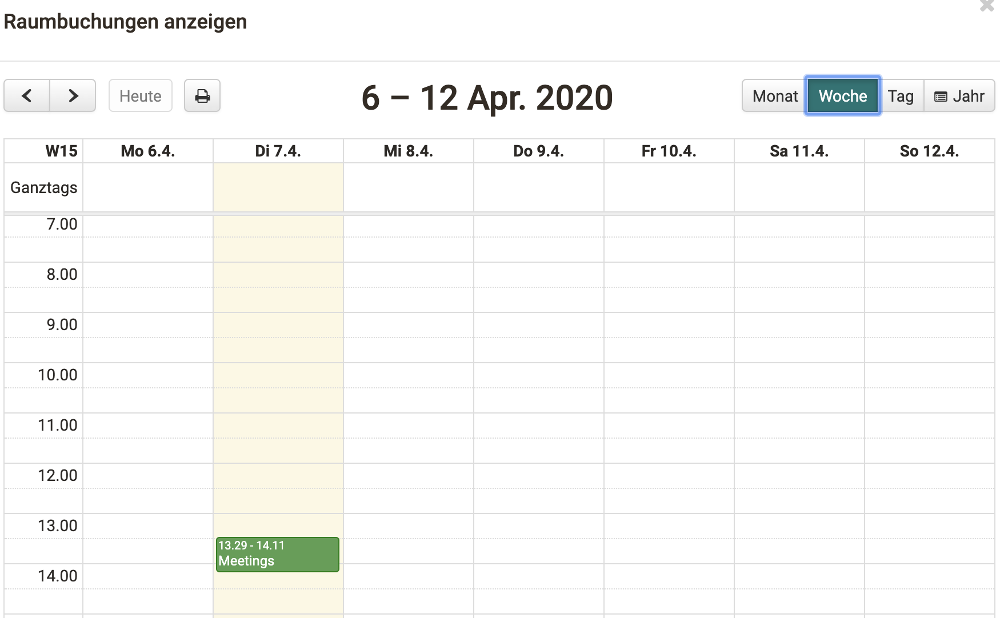
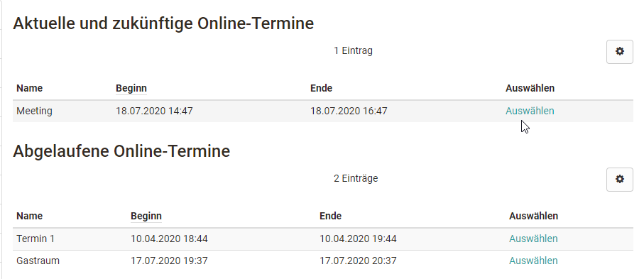
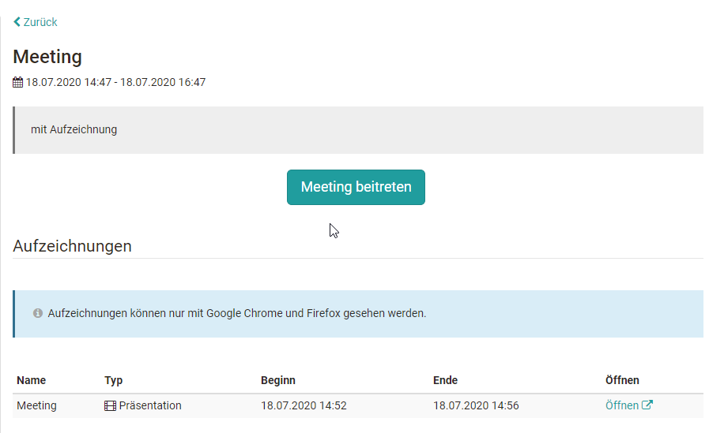
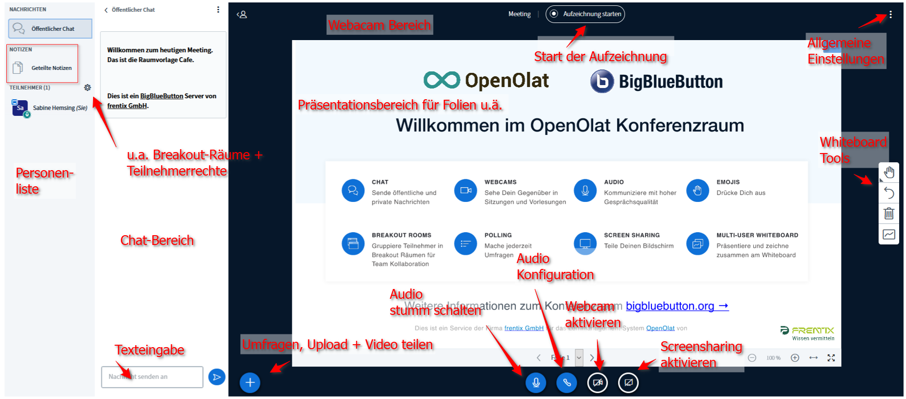
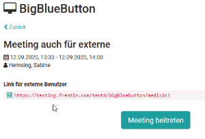

# Kursbaustein "BigBlueButton"

## Steckbrief

Name | BigBlueButton
---------|----------
Icon | { class=size24  }
Verfügbar seit | 
Funktionsgruppe | Kommunikation und Kollaboration
Verwendungszweck | Integration der Webkonferenz-Software BigBlueButton
Bewertbar | nein
Spezialität / Hinweis | BigBlueButton ist eine Open Source Software (LPGL Lizenz). Um den Kursbaustein zu nutzen ist ein separates Serverhosting erforderlich.

## Allgemeines

!!! info "Hinweis"

    BigBlueButton ist eine Open Source Software (LPGL Lizenz). Um den Kursbaustein zu nutzen ist ein separates Serverhosting erforderlich. BigBlueButton Anbieter-Webseite: <https://bigbluebutton.org/>

:octicons-device-camera-video-24: **Video-Einführung**: [BigBlueButton](<https://www.youtube.com/embed/yVZ4V4rXUJQ>){:target="_blank”}

### Funktionen der Software  

BigBlueButton ermöglicht virtuelle Klassenräume mit folgenden Funktionalitäten:

  * Webcam- und Audio-Unterstützung
  * Folienpräsentation z.B. PDF
  * Screensharing
  * Multi-User Whiteboard
  * Umfrage-Funktionen
  * Gruppenräume, Gruppenchat
  * Privater Chat 
  * Gemeinsame Notizen
  
### Systemvoraussetzungen

BigBlueButton ist eine browserbasierte Software-Lösung und benötigt keine zusätzlichen Plugins oder Installationen durch den User. Für den vollen Funktionsumfang (für Betreuer und Teilnehmende) wird **Google Chrome** oder **Mozilla Firefox** empfohlen. Unter Windows kann die neue Version von **Edge** **mit Chromium Engine** ebenfalls verwendet werden. Für das Teilen des eigenen Bildschirms empfiehlt sich die Verwendung von **Google Chrome**.  
  
## Konfiguration im Kurseditor

Bei der Einbindung von BigBlueButton im Kurs kann entschieden werden, ob die Meetings, die mit dem Kursbaustein eingerichtet werden, nur durch die Moderatoren (entspricht den Kursbesitzern und Betreuern des Kurses) oder auch durch Teilnehmende gestartet werden kann. Bei aktivierter Option können Teilnehmende das Meeting erst betreten, wenn der Moderator das Meeting gestartet hat.

 

## Räume erstellen, konfigurieren und betreten 

Folgende Einstellungen erfolgen bei geschlossenem Editor. 

### Tab "Terminverwaltung"

Im Tab "Terminverwaltung" können vom Kursbesitzer neue Räume angelegt und konfiguriert werden. Auch können bereits angelegte Termine kopiert oder gelöscht werden.

Folgende Varianten (Räume bzw. Termine) können erstellt werden:  

* **Einzelnen Online-Termin hinzufügen**
  Bietet sich z.B. an, wenn es nur einen konkreten Termin für den Kursbaustein geben soll
* **Permanente Reservierung hinzufügen**
  Sollte verwendet werden, wenn man einen BBB-Raum haben möchte, der permanent zur Verfügung steht und mehrfach genutzt werden soll.
* **Täglich wiederkehrende Online-Termine hinzufügen**
  Um schnell tägliche Termine zu erstellen.
* **Wöchentlich wiederkehrende Online-Termine hinzufügen**
  Um schnell wöchentliche Termine, z.B. für Webinar-Serien oder ein Semester zu erstellen.

Die Varianten unterscheiden sich nur in der Erstellung der Termine. Es werden separate Online-Termine/Reservierungen erstellt, welche anschliessend einzeln bearbeitet werden können. Je nach Konfiguration des Servers können hier auch unterschiedliche Auswahlmöglichkeiten bereitstehen.  

Folgende Detaileinstellungen können dabei vorgenommen werden: Die Einstellungen im Detail:

**Konfiguration Online-Termin**

  *  **Name**: Bezeichnung des Termins
  *  **Erstellt durch**: Der Name des Erstellers wird automatisch angezeigt.
  *  **Beschreibung**: Beschreibung des Termins, was ist der Inhalt bzw. das Thema der synchronen Session?
  *  **Begrüssungstext**: Der Text wird im BigBlueButton-Raum als Willkommensnachricht im Chatbereich für alle Teilnehmenden angezeigt
  *  **Hauptmoderator**: Hier kann der Name einer Person eingetragen werden.
  *  **Präsentationsfolien hochladen**: Laden Sie Ihre Folien bereits im Vorfeld des Meetings hier hoch oder löschen Sie bereits hochgeladene Folien.
  *  **Raumvorlage**: Auswahl der konfigurierten Raumvorlagen (bestimmt Anzahl Teilnehmende und diverse Voreinstellungen im Online-Meeting). Die Details hängen von der Konfiguration des BigBlueButton Servers ab.
  *  **Bevorzugter Server**: Wird in der Regel automatisch gewählt.
  *  **Aufzeichnungen des Online-Termins zulassen**: ja oder nein
  *  **Aufnahme automatisch veröffentlichen für**: Wählen Sie hier die Benutzergruppen denen Sie die Aufzeichnung später bereitstellen möchten.
  *  **Benutzer bei Eintritt akzeptieren (Warteraum)**: Hier kann entschieden werden ob Personen zunächst in einem Warteraum landen und nicht sofort in den Meeting-Raum gelangen. Wählt man "abgeschaltet" gelangen alle Personen direkt im Meeting-Raum. Alternativ kann hier auch konfiguriert werden, dass jeder (alle Benutzer) im Warteraum landet oder nur Gäste und externe Personen und die Kursteilnehmenden dagegen direkt in den Meeting-Raum gelangen können.
  *  **Darstellung**: Standard oder Webcam Termin (abhängig von der Konfiguration durch den BBB Administrator)
  *  **Zugang externe Benutzer**: Sofern diese Option vom Administrator erlaubt wurde kann hier die URL angepasst werden, die Sie an die externen Benutzer versenden können. Der Link erscheint anschließend auch für Kursbesitzer und Betreuer bevor der Raum betreten wird. Teilnehmende sehen den Link nicht.
  *  **Passwort für externe Benutzer**: Hinterlegen Sie hier ein Passwort, das Gäste, also Personen ohne OpenOlat Account, eingeben müssen um in den Raum zu gelangen.
  *  **Raumbuchungen anzeigen**: Kalenderansicht zur Prüfung von belegten Online-Meetings

Nur bei termingebundenen Räumen:

  *  **Beginn**: Geben Sie den Starttermin ein.
  *  **Vorlaufzeit (Min.)**: 0 bis 15 Minuten konfigurierbare Vorlaufzeit, in der das Meeting bereits von den Kursbetreuern und Besitzern, nicht aber von Teilnehmenden, gestartet werden kann z.B. um eine Präsentation bereitzustellen.
  *  **Ende**: Ende des Meetings - die maximale Laufzeit eines Meetings ist abhängig von der gewählten Raumvorlage
  *  **Nachlaufzeit (Min.)**: 0 bis 30 Minuten konfigurierbare Nachlaufzeit. Das Meeting wird nach Erreichen der Endzeit automatisch für alle Personen um die Nachlaufzeit verlängert, es erscheint eine Anzeige mit der verbleibenden Konferenzzeit.

Nur bei wiederkehrenden Terminen:

  * **Start wiederkehrendes Datum**: 1. Online-Termin (bei wöchentlicher Wiederholung entspricht dies dem Wochentag der Serie)
  * **Ende wiederkehrendes Datum**: Ende der wiederkehrenden Termine

Bei wiederkehrenden Terminen können im zweiten Prozessschritt "Datum" die
Termine vor der Erstellung bearbeitet/gelöscht oder mit freien Daten ergänzt
werden.

!!! warning "Achtung" 

    Sobald ein BigBlueButton-Meeting gestartet, d.h. der Online-Raum geöffnet wurde, können die Einstellungen am Meeting-Termin nicht mehr bearbeitet werden!

### Tab "Online-Termine"

Über den Tab "Online-Termine" erhält man Zugang zu einem bestimmten Termin bzw. Raum.

Kursbesitzer und Kursbetreuer können bereits im Vorfeld ihre Präsentation(en) hochladen, so dass sie bei Beginn des Meetings zur Verfügung stehen. Direkt angezeigt wird das oberste Dokument der Liste.

#### Aufzeichnungen

Die Aufzeichnungen eines Meetings findet man ebenfalls im Tab **"Online-Termine"**. Automatisch
bereitgestellte Meetings sind hier direkt wählbar. Erfolgt die Bereitstellung manuell, können zunächst nur Besitzer und Betreuer nun die Aufzeichnungen sehen und definieren, für welche Zielgruppe die Aufzeichnung bereitgestellt werden soll. Je nach Server Konfiguration kann auch ein Download einer Aufzeichnung angeboten werden.

!!! warning "Achtung"

    Die vorgenommenen Einstellungen unter "publizieren" als auch unter "löschen" gelten grundsätzlich sowohl für die Aufzeichnung als auch den Download! Löscht man also einen Eintrag wird die gesamte Aufzeichnung gelöscht.

  

## Kalender Anzeige

Sofern es einen Kalender im Kurs gibt, erscheinen die BigBlueButton Termine ebenfalls im Kalender.

In der Konfiguration eines Raums kann sowohl während der Erstellung als auch
später beim editieren über den Link "Raumbuchungen anzeigen", eine Übersicht
über alle gebuchten BigBlueButton Räume der Instanz eingesehen werden. Das
erleichtert es zeitliche Engpässe bzw. eine starke Auslastung des Systems
frühzeitig zu erkennen und gegebenenfalls einen anderen Termin zu wählen.

Zusätzlich werden die in BigBlueButton erstellten Online-Termine automatisch
in den kursspezifischen Kalender eingetragen. Von hier aus gelangen alle
Kursmitglieder rasch in den entsprechend verlinkten BigBlueButton Raum.

  
  
## Teilnehmerperspektive

Ruft ein Kursteilnehmer einen BigBlueButton Kursbaustein auf, sieht er eine
Übersicht der aktuellen, der abgelaufenen und der permanenten Räume, sofern
vorhanden. Ein Klick auf "Auswählen" führt zum Login-Bereich des jeweiligen
Raums.

Aktuelle Sessions können durch "Meeting beitreten" gestartet und der konkrete
BigBlueButton Raum aufgerufen werden.

Bei abgelaufenen Meetings können die Räume nicht mehr betreten werden, aber
man erhält hier Zugriff auf eventuelle Aufzeichnungen des Meetings. Betreuer
und Kursbesitzer können hier auch Aufzeichnungen löschen.  
  
## BigBlueButton Meeting Raum

Der angezeigte Willkommen Text kann bei der Einrichtung des Raums angepasst
werden. Sofern die User ein Profilbild hinterlegt haben, wird dieses auch in
der Personenliste angezeigt.

Je nach Raumeinstellung stehen unterschiedliche Möglichkeiten im Raum zur
Verfügung.

## BigBlueButton für Gäste 

Je nach Konfiguration der BigBlueButton Vorlage können Konferenz-Räume auch für nicht in OpenOlat registrierte Personen, also Externe bzw. Gäste (siehe
[Gastzugang](https://confluence.openolat.org/display/OO152DE/Gastzugang)), zugänglich gemacht werden. Voraussetzung dafür ist, dass es sich um einen herkömmlichen Kurs (keinen Lernpfad Kurs) handelt und der Kurs selbst auch für Gäste freigeschaltet wurde. Gäste können dann bei der Einwahl in den Raum einen beliebigen Namen eingeben.

Der Gastlink erscheint dann ebenfalls für Kursbesitzer und Betreuer bevor sie den Raum beteten.
Zusätzlich kann während der Konfiguration des Raums ein Passwort für Gäste generiert werden.

