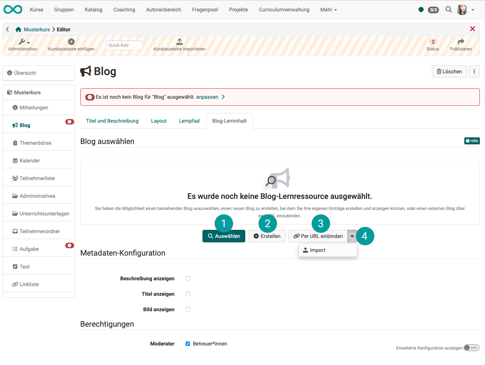
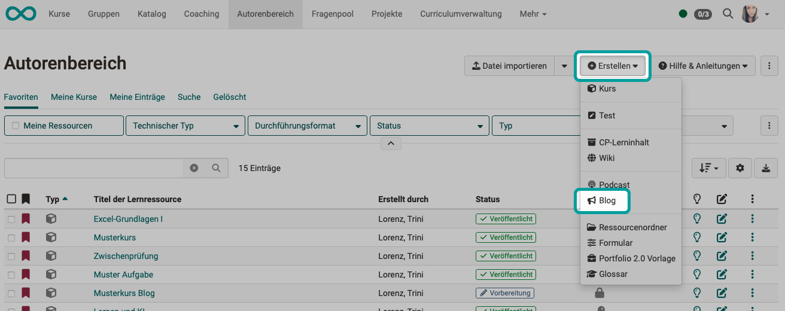

# Kursbaustein "Blog" {: #course_element_blog}

## Steckbrief

Name | Blog
---------|----------
Icon | { class=size24  }
Verfügbar seit | 
Funktionsgruppe | Wissensvermittlung
Verwendungszweck | Information von Kursteilnehmer:innen über aktuelle Themen
Bewertbar | nein
Spezialität / Hinweis |

Ähnlich wie der Podcast dient auch der Blog dazu, aktuelle neue Inhalte zur Verfügung zu stellen. In den Beiträgen können neben Text auch Bilder oder Filme eingebunden sein und in Kommentaren können auch Dateien angehängt (hochgeladen) werden. 

Als Kursbesitzer:innen / Betreuer:innen eines Kurses können Sie so z.B. in einem Blog die Teilnehmer:innen Ihres Kurses über aktuelle Themen informieren. Sie können auch mehr oder weniger regelmäßig einen inhaltlichen Blog führen und so die Kursteilnehmenden über neue Aspekte zum Veranstaltungsthema informieren.

## Kursbaustein und Lernressource

In einen Blog-Kursbaustein muss jeweils eine Blog-Lernressource eingebunden werden.

Wurde der Kursbaustein eingefügt, kann im **Tab "Blog-Lerninhalt"**

* **1:** eine bereits **vorhandene Blog-Lernressource** aus dem Autorenbereich ausgewählt werden.
* **2:** eine **neue Blog-Lernressource** direkt vom Kursbaustein aus erstellt werden. (Die Blog-Lernressource wird im Autorenbereich abgelegt und kann danach von dort auch in anderen Kursbausteinen verwendet werden.)
* **3:** ein **externer Blog** als Lernressource **via URL** eingebunden werden.
* **4:** ein **als Datei vorhandener Blog importiert** werden.

{ class="shadow lightbox" } 

!!! info "Hinweis"

    Eine Blog-Lernressource kann auch im Autorenbereich unter dem Button "Erstellen" neu erstellt werden. Wird sie so erstellt, kann sie anschliessend im Kurseditor in einen Kursbaustein "Blog" eingebunden werden.  
    { class="shadow lightbox" } 

!!! hint "Tipp"

    Abonnieren Sie den RSS-Feed des Blogs, um keine neuen Einträge zu verpassen. Eine Anleitung dazu finden Sie hier: [Abonnements einrichten (Video-Einführung)](https://www.youtube.com/embed/h9gOqt7TR7Q)

## Weitere Informationen

[Blog erstellen](../learningresources/Blog_Create.de.md) 
[Schritt-für-Schritt-Anleitung: Wie erstelle ich einen Blog?](../../manual_how-to/blog/blog.de.md) 
[Blog konfigurieren](../learningresources/Blog_Configuration.de.md) 
[Bloggen](../learningresources/Blog_Blogging.de.md) 
[Abonnements einrichten (Video-Einführung)](https://www.youtube.com/embed/h9gOqt7TR7Q)

