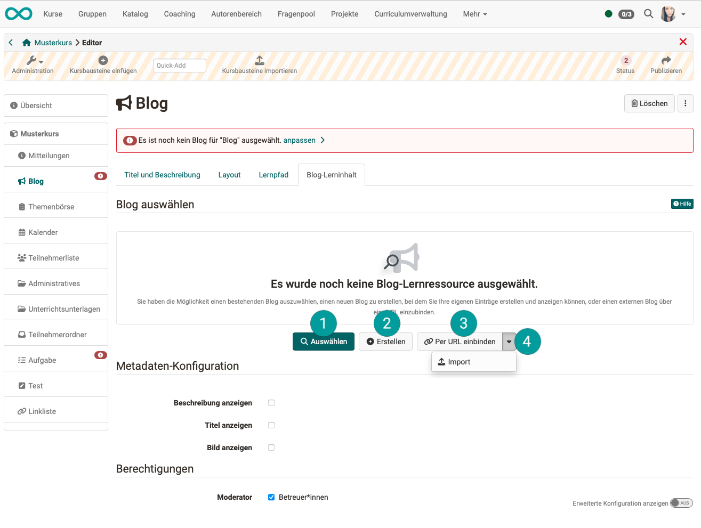
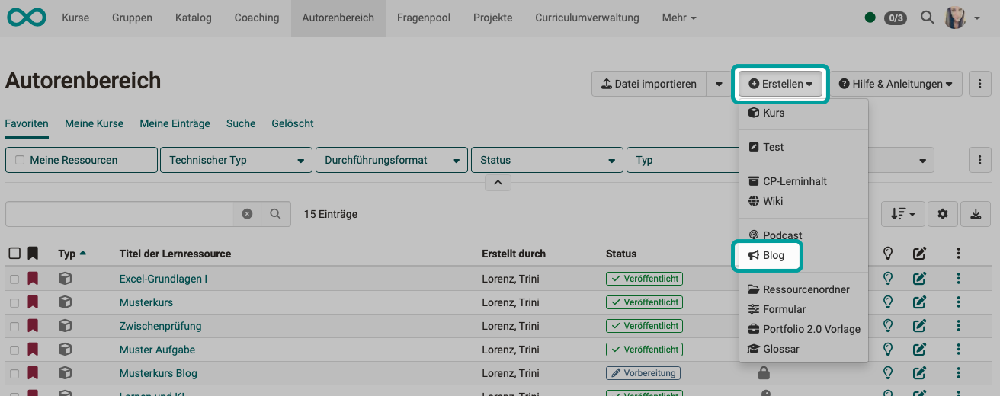

#  Course Element "Blog" {: #blog}

## Profile

Name | Blog
---------|----------
Icon | { class=size24 }
Available since | 
Functional group | Knowledge transfer
Purpose | Information of course participants about current topics
Assessable | no
Specialty / Note | 

Similar to the podcast, the blog also serves to provide the latest new content. In addition to text, posts can also include images or films and files can also be attached (uploaded) in comments.

As the course owner / coach of a course, you can, for example, inform the participants of your course about current topics in a blog. You can also keep a more or less regular content blog and thus inform course participants about new aspects of the course topic.

## Course element and learning resource

A blog learning resource must be integrated into each blog course element.

Once the course element has been inserted, the **"Blog learning content"** tab can be used to

* **1:** select an **already existing blog learning resource** from the authoring area.
* **2:** create a **new blog learning resource** directly in the course element. (The blog learning resource will be stored in the authoring area. Then, it can also be used in other course elements.)
* **3:** integrate an **external blog** as a learning resource **via URL**.
* **4:** import a **blog, which is available as a file**.

{ class="shadow lightbox" } 

!!! info "Note"

    A blog learning resource can also be created in the authoring area under the "Create" button. If it is created in this way, it can then be integrated into a "Blog" course element in the course editor.  
    { class="shadow lightbox" }

!!! hint "Hint"

    Subscribe to the blog's RSS feed to make sure you don't miss any new entries. 
    You can find instructions here (German): [Set up subscriptions (video instruction)](https://www.youtube.com/embed/h9gOqt7TR7Q)

## Further information

[Create blogs](../learningresources/Blog_Create.md) 
[Step-by-step instructions: How do I create a blog?](../../manual_how-to/blog/blog.md) 
[Configure blog](../learningresources/Blog_Configuration.md) 
[Blogging](../learningresources/Blog_Blogging.md) 

