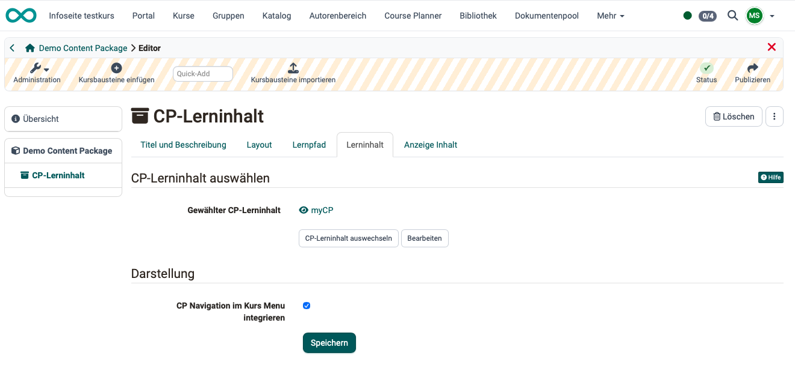
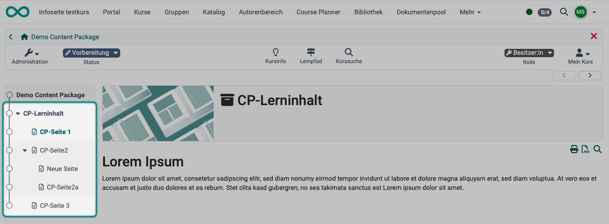
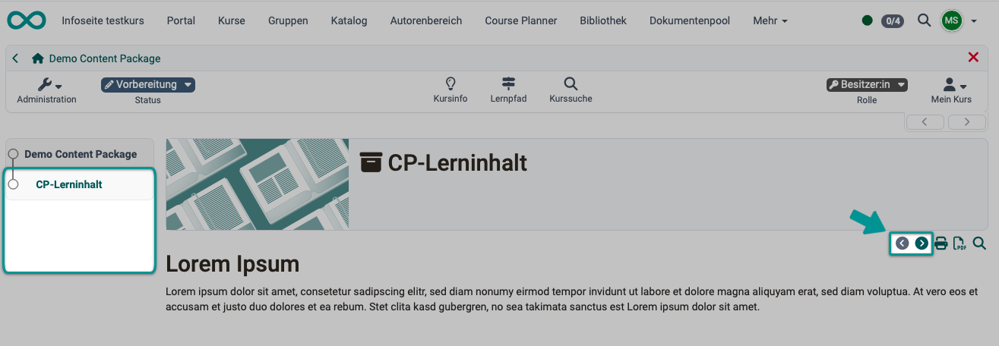

# Kursbaustein "CP-Lerninhalt" {: #CP_learning_content}

## Steckbrief

Name | CP-Lerninhalt
---------|----------
Icon | { class=size24  }
Verfügbar seit | Neuauflage mit Release 16.2
Funktionsgruppe | Wissensvermittlung
Verwendungszweck | Anzeige von Lerninhalt im IMS-CP-Format
Bewertbar | nein
Spezialität / Hinweis |

Nutzen Sie den Kursbaustein "CP-Lerninhalt", um einen Lerninhalt im IMS-CP-Format (IMS-CP Version 1.1.2) in Ihren Kurs einzubinden. Das CP können Sie entweder direkt in OpenOlat erstellen, was im Kapitel "[Wie erstelle ich ein Content Package?](../../manual_how-to/content_package/content_package.de.md)" erklärt wird. Oder Sie erstellen das CP extern.

## Tab Lerninhalt

Im Kurseditor wird der Kursbaustein "CP-Lerninhalt" als einzelner Kursbaustein angezeigt, dessen Inhalt (das Content Package) erstellt, bearbeitet oder ausgetauscht werden kann.

{ class="lightbox" }

Das Content Package selbst besteht jedoch in der Regel dann aus mehreren Seiten. Die Struktur dieses Inhalt wird direkt im OpenOlat-Menü angezeigt, wenn die Option **"CP-Navigation ins Kurs-Menü integrieren"** aktiviert ist. 
Ansonsten ist die Struktur für Teilnehmer:innen nicht sichtbar. Sie können dann nach Aufruf des Kursbausteins mit separaten Buttons rechts oben im Content durch die Inhaltsseiten des CP navigieren. 

{ class="lightbox" }

{ class="lightbox" }

## Weiterführende Informationen

[Erstellen und Bearbeiten eines Content Packages >](../learningresources/CP_Editor.de.md) 
[Wie erstelle ich ein Content Package? (Schritt-für-Schritt-Anleitung) >](../../manual_how-to/content_package/content_package.de.md)