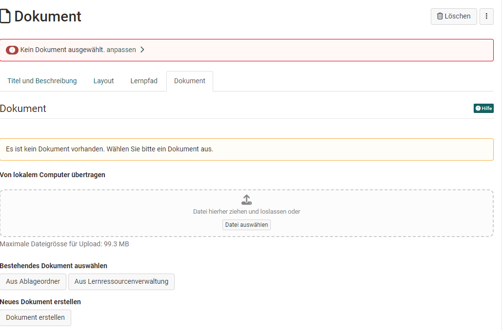
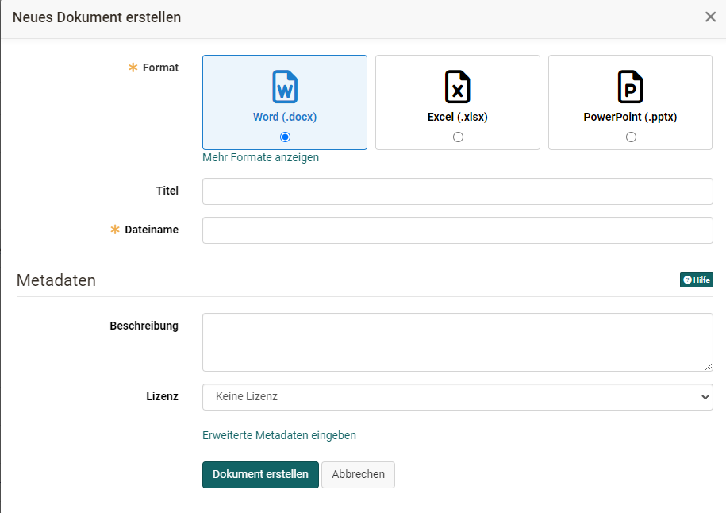
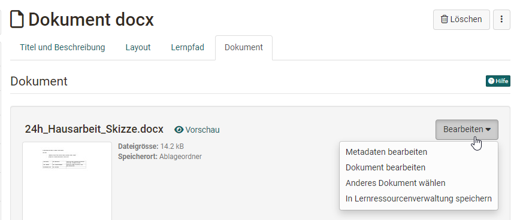

# Kursbaustein "Dokument" {: #document}

## Steckbrief

Name | Dokument
---------|----------
Icon | { class=size24  }
Verfügbar seit | Release 15.3
Funktionsgruppe | Wissensvermittlung
Verwendungszweck | Bereitstellung verschiedener Dokumente, auch zur gemeinsamen Bearbeitung
Bewertbar | nein
Spezialität / Hinweis | Für Office-Dokumente sind entsprechende Lizenzen zur Bearbeitung erforderlich

Mit dem Kursbaustein "Dokument" können verschiedene Dokumentformate in den Kurs eingebunden werden. Typisch für die Dokumente in diesem Kursbaustein ist, dass der Inhalt für die User *direkt* angezeigt wird. 

### Für welche Dateitypen ist der Kursbaustein gedacht? 

Der Kursbaustein ist gut geeignet für die Anzeige von PDF- und auch JPG- und PNG-Dateien. Darüber hinaus können auch, sofern vom OpenOlat Administrator aktiviert, Office-Dokumente (Word, Excel, PoperPoint) und draw.io Diagramme eingebunden werden. 

!!! warning "Hinweis"

    Für Video-Dateien sollte der [Kursbaustein "Video"](../learningresources/Course_Element_Video.de.md) und für HTML-Seiten der [Kursbaustein "HTML-Seite"](../learningresources/Course_Element_HTML_Page.de.md) anstatt des Kursbaustein "Dokument" verwendet werden.

### Wie kommen die Dateien in den Kursbaustein?

Die Konfiguration erfolgt im Kurseditor im Tab "Dokument". Es gibt viele Möglichkeiten, wie die Dateien in den Kursbaustein gelangen können. Sie können grundsätzlich hochgeladen, verknüpft oder neu erstellt werden. Als Ablageorte für die Dateien dienen entweder der [Ablageordner](../learningresources/Storage_folder.de.md) im Kurs oder der Lernressourcenbereich ausserhalb des Kurses im Autorenbereich. 

{ class="lightbox" }

#### Datei hochladen
Es kann ...
*  eine Datei **"Vom lokalen Computer übertragen".** werden. Wählen Sie "Datei auswählen" oder laden Sie die Datei per Drag& Drop hoch. Die so hochgeladene Datei wird  im Ablageordner abgelegt.
* eine Datei als Lernressource hochgeladen und in den Kurs importiert werden: -> **"Aus Lernressourcenverwaltung" -> "Datei importieren"**. Die auf diesen Weg importierte Datei landet bei den Lernressourcen im Autorenbereich. Es kann auch zusätzlich eine Kopie der Datei im Ablageordner des Kurses hinterlegt werden.  

#### Datei verknüpfen

Es kann ...

* eine bereits im Vorfeld in den Ablageordner des Kurses abgelegte Datei ausgewählt werden:  -> **"Aus Ablageordner"**. 
Das macht Sinn, wenn Kursersteller:innen ihre Inhalte bereits vorbereitet haben und diese nun nur noch mit den passenden Kursbausteinen verknüpft werden sollen.  
* eine bereits im Vorfeld als Lernressource hochgeladene Datei auswählen -> **"Aus Lernressourcenverwaltung"**  

#### Datei erstellen
Um eine Datei für den Kursbaustein neu zu erstellen wählen Sie **"Dokument erstellen"** und markieren das gewünschte Datei-Format. Welche Formate Ihnen hier zur Verfügung stehen ist davon abhängig welche Formate in der OpenOlat Instanz Ihrer Installation von den Administrator:innen aktiviert wurden.

{ class="lightbox" }

Alternativ kann auch eine neue Datei als Lernressource erstellt werden. Wählen Sie hierfür: **"Aus Lernressourcenverwaltung" -> "Erstellen"**. Eine auf diesem Weg erstellte Datei wird im Autorenbereich als Lernressource abgelegt. Zusätzlich kann eine Kopie der Datei für den Ablageordner erstellt werden. 

Sofern **draw.io Diagramme** von den OpenOlat Administrator:innen aktiviert wurde können im Kursbaustein Dokument auch draw.io Diagramme erstellt und für die User bereitgestellt werden. Wählen sie hierfür die Option "Dokument erstellen" -> "Mehr Formate anzeigen" -> "Diagramm" oder "Whiteboard". Es startet der Flow Chart Maker und Sie können Elemente auf der Diagramm Fläche einfügen und so Diagramme, Flow-Charts und sonstige Visualisierungen gestalten.

Wenn Sie das so erstellte Dokument mit der Berechtigung verbinden, dass auch Teilnehmende das Dokument bearbeiten dürfen (siehe unten), können Sie über den Kursbaustein Datei ein Diagramm einbinden, an dem alle Teilnehmenden gemeinsam arbeiten können. 

### Änderungen vornehmen

Eingebundene Dokumente können bei Bedarf später auch bearbeitet und Metadaten geändert werden. Auch ein kompletter Austausch des Dokuments ist möglich. Was genau möglich ist, ist vom Dateityp abhängig. 

{ class="lightbox" }

### Berechtigungen konfigurieren 
Nachdem ein Dokument mit dem Kursbaustein verbunden wurde kann definiert werden welche Benutzer-Rollen das Dokument bearbeiten bzw. herunterladen dürfen. Nach dem Download eines entsprechenden Dokuments wird in den Metadaten angezeigt, wer das Dokument als letztes bearbeitet hat.

Durch diese Berechtigungen sind unterschiedliche, auch kollaborative Szenarien mit dem Kursbaustein umsetzbar.  

