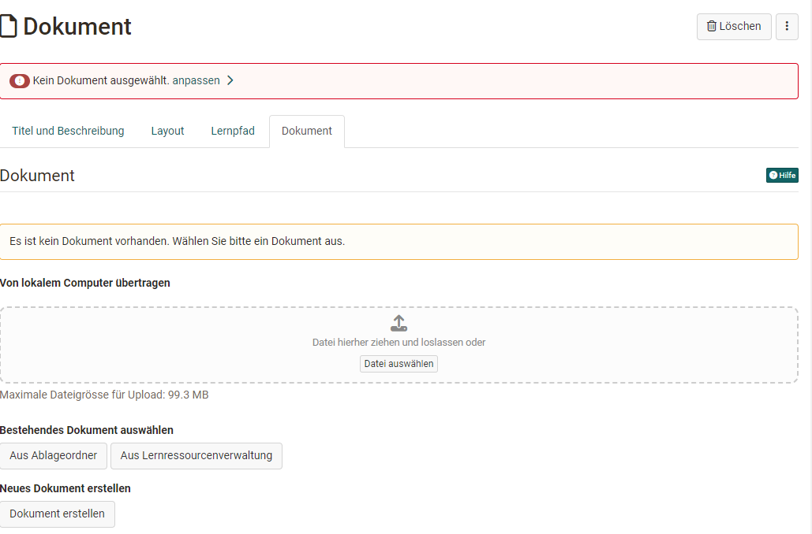
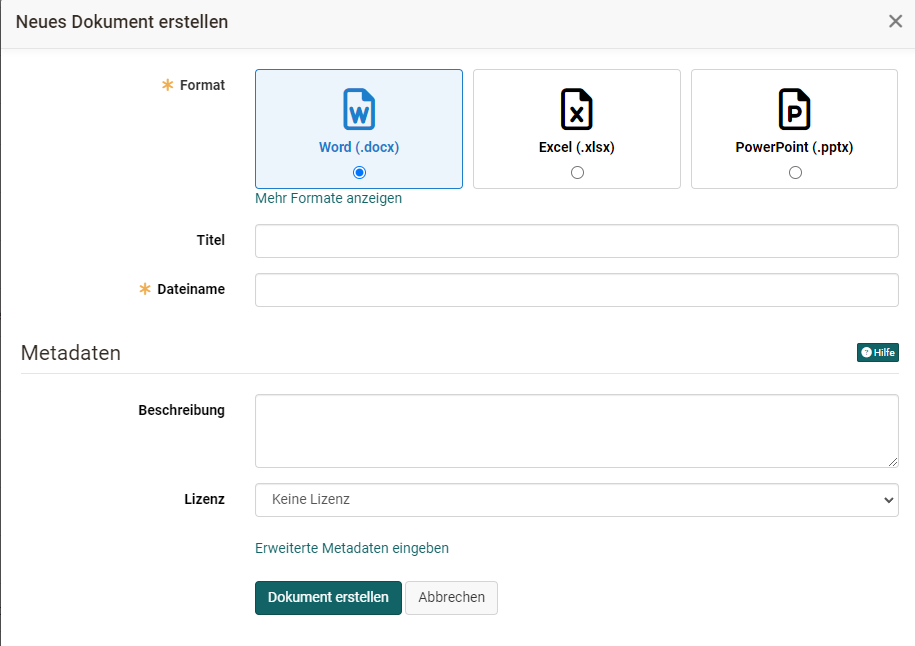
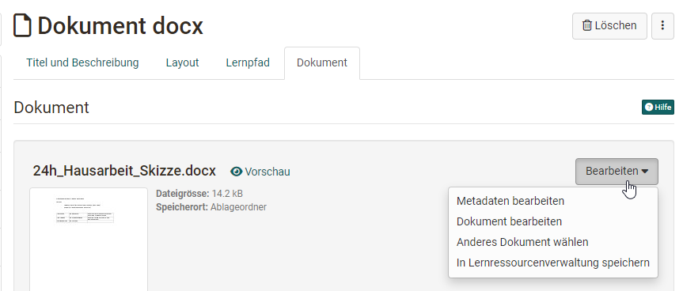

# Kursbaustein "Dokument" {: #document}

## Steckbrief

Name | Dokument
---------|----------
Icon | :fontawesome-regular-file:
Verfügbar seit | Release 15.3
Funktionsgruppe | Wissensvermittlung
Verwendungszweck | Bereitstellung verschiedener Dokumente, auch zur gemeinsamen Bearbeitung
Bewertbar | nein
Spezialität / Hinweis | Für Office-Dokumente sind entsprechende Lizenzen zur Bearbeitung erforderlich

Mit dem Kursbaustein "Dokument" können verschiedene Dokumentformate in den Kurs eingebunden werden. Typisch für die Dokumente in diesem Kursbaustein ist, dass der Inhalt für die User *direkt* angezeigt wird.

### Für welche Dateitypen ist der Kursbaustein gedacht? [:octicons-tag-16:{ title="ab Release 15.3 (OO-4801)" }](https://track.frentix.com/issue/OO-4801){:target="_blank"}

Der Kursbaustein ist gut geeignet für die Anzeige von PDF- und auch JPG- und PNG-Dateien. Darüber hinaus können auch, sofern vom OpenOlat Administrator aktiviert, Office-Dokumente (Word, Excel, PowerPoint) und draw.io Diagramme [:octicons-tag-16:{ title="ab Release 18.1 (OO-7090)" }](https://track.frentix.com/issue/OO-7090){:target="_blank"} eingebunden werden.

Ab Release 18.1 verwendet OpenOlat für PDF-Dateien einen integrierten PDF-Viewer (pdf.js) [:octicons-tag-16:{ title="ab Release 18.1 (OO-6996)" }](https://track.frentix.com/issue/OO-6996){:target="_blank"}, der eine deutlich bessere Darstellung als die frühere OnlyOffice-Ansicht bietet. Grosse PDF-Dateien werden dabei stufenweise geladen, sofern die Datei dies unterstützt. Der PDF-Viewer ist schreibgeschützt — zum Bearbeiten wird ein separater Editor benötigt.

!!! note "Hinweis"

    Für Video-Dateien sollte der [Kursbaustein "Video"](../learningresources/Course_Element_Video.de.md) und für HTML-Seiten der [Kursbaustein "HTML-Seite"](../learningresources/Course_Element_HTML_Page.de.md) anstatt des Kursbaustein "Dokument" verwendet werden.

### Wie kommen die Dateien in den Kursbaustein? [:octicons-tag-16:{ title="ab Release 15.3 (OO-4801)" }](https://track.frentix.com/issue/OO-4801){:target="_blank"}

Die Konfiguration erfolgt im Kurseditor im Tab "Dokument". Es gibt viele Möglichkeiten, wie die Dateien in den Kursbaustein gelangen können. Sie können grundsätzlich hochgeladen, verknüpft oder neu erstellt werden.

{ class="lightbox" }

#### Datei hochladen [:octicons-tag-16:{ title="ab Release 15.3 (OO-4801)" }](https://track.frentix.com/issue/OO-4801){:target="_blank"}

Es kann ...

* eine Datei **"Vom lokalen Computer übertragen"** werden. Wählen Sie "Datei auswählen" oder laden Sie die Datei per Drag & Drop hoch.
* eine Datei als Lernressource hochgeladen und in den Kurs importiert werden: → **"Aus Lernressourcenverwaltung" → "Datei importieren"**.

#### Datei verknüpfen [:octicons-tag-16:{ title="ab Release 15.3 (OO-4801)" }](https://track.frentix.com/issue/OO-4801){:target="_blank"}

Es kann ...

* eine bereits im Vorfeld in den Ablageordner des Kurses abgelegte Datei ausgewählt werden: → **"Aus Ablageordner"**.
* eine bereits als Lernressource hochgeladene Datei ausgewählt werden: → **"Aus Lernressourcenverwaltung"**

#### Datei erstellen [:octicons-tag-16:{ title="ab Release 15.3 (OO-4801)" }](https://track.frentix.com/issue/OO-4801){:target="_blank"}

Um eine Datei für den Kursbaustein neu zu erstellen wählen Sie **"Dokument erstellen"** und markieren das gewünschte Datei-Format.

{ class="lightbox" }

Alternativ kann auch eine neue Datei als Lernressource erstellt werden. Wählen Sie hierfür: **"Aus Lernressourcenverwaltung" → "Erstellen"**.

Sofern **draw.io Diagramme** [:octicons-tag-16:{ title="ab Release 18.1 (OO-7090)" }](https://track.frentix.com/issue/OO-7090){:target="_blank"} von den OpenOlat Administrator:innen aktiviert wurde, können im Kursbaustein Dokument auch draw.io Diagramme erstellt und für die User bereitgestellt werden. Wählen Sie hierfür die Option "Dokument erstellen" → "Mehr Formate anzeigen" → "Diagramm" oder "Whiteboard".

draw.io Diagramme unterstützen das gleichzeitige Bearbeiten durch mehrere Personen [:octicons-tag-16:{ title="ab Release 18.1 (OO-7091)" }](https://track.frentix.com/issue/OO-7091){:target="_blank"}. Mehrere Teilnehmende können ein Diagramm gleichzeitig öffnen und bearbeiten. Änderungen werden in Echtzeit synchronisiert. Damit eignet sich der Kursbaustein Dokument mit draw.io für kollaborative Gruppenarbeiten.

!!! note "Hinweis"

    Bei intensiver gleichzeitiger Nutzung kann die Synchronisation kurzzeitig unterbrochen werden. Ein Neuladen des Dokuments stellt die Verbindung wieder her.

### Höhe der Vorschau konfigurieren [:octicons-tag-16:{ title="ab Release 15.4 (OO-5116)" }](https://track.frentix.com/issue/OO-5116){:target="_blank"}

Im Tab "Dokument" des Kurseditors kann die Höhe der Dokumentvorschau festgelegt werden. Standardmässig ist **«Automatisch»** eingestellt, das Dokument nutzt den verfügbaren Seitenraum. Bei bestimmten Formaten (z.B. PowerPoint) kann es dabei zu schwarzen Rändern kommen. Mit einer fixen Höhe lässt sich die Darstellung gezielt anpassen.

### Dokument-Anzeige im Lightbox-Modus [:octicons-tag-16:{ title="ab Release 18.1 (OO-6957)" }](https://track.frentix.com/issue/OO-6957){:target="_blank"}

Dokumente, Bilder und Videos werden ab Release 18.1 standardmässig im **Lightbox-Modus** angezeigt — als Overlay über der aktuellen Seite, ohne dass ein neues Browser-Fenster geöffnet wird. Beim Wechsel in den Bearbeitungsmodus öffnet sich das Dokument weiterhin in einem separaten Fenster.

### Änderungen vornehmen [:octicons-tag-16:{ title="ab Release 15.3 (OO-4801)" }](https://track.frentix.com/issue/OO-4801){:target="_blank"}

Eingebundene Dokumente können bei Bedarf später auch bearbeitet und Metadaten geändert werden. Auch ein kompletter Austausch des Dokuments ist möglich. Was genau möglich ist, ist vom Dateityp abhängig.

{ class="lightbox" }

### Berechtigungen konfigurieren [:octicons-tag-16:{ title="ab Release 15.3 (OO-4801)" }](https://track.frentix.com/issue/OO-4801){:target="_blank"}

Nachdem ein Dokument mit dem Kursbaustein verbunden wurde kann definiert werden welche Benutzer-Rollen das Dokument bearbeiten bzw. herunterladen dürfen. Nach dem Download eines entsprechenden Dokuments wird in den Metadaten angezeigt, wer das Dokument als letztes bearbeitet hat.

Durch diese Berechtigungen sind unterschiedliche, auch kollaborative Szenarien mit dem Kursbaustein umsetzbar.
